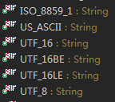

Lang工具包
==========

本章是针对commons-lang3-3.4.jar包进行的分析。commons-lang是Apache提供的对Java
API的扩充，使用起来非常方便。

| Package         | Description                                                                                                                                            |
|-----------------|--------------------------------------------------------------------------------------------------------------------------------------------------------|
| .               | Provides highly reusable static utility methods, chiefly concerned with adding value to the java.lang classes.                                         |
| .arch           | Provides classes to work with the values of the os.arch system property. 处理器属性的辅助工具类。                                                      |
| .builder        | Assists in creating consistent equals(Object), toString(), hashCode(), and compareTo(Object) methods. 建造者模式工具，用于辅助一些方法的具体实现过程。 |
| .concurrent     | Provides support classes for multi-threaded programming.                                                                                               |
| .event          | Provides some useful event-based utilities.                                                                                                            |
| .exception      | Provides functionality for Exceptions.                                                                                                                 |
| .math           | Extends java.math for business mathematical classes.                                                                                                   |
| .mutable        | Provides typed mutable wrappers to primitive values and Object.                                                                                        |
| .reflect        | Accumulates common high-level uses of the java.lang.reflect APIs.                                                                                      |
| .text           | Provides classes for handling and manipulating text, partly as an extension to java.text.                                                              |
| .text.translate | An API for creating text translation routines from a set of smaller building blocks.                                                                   |
| .time           | Provides classes and methods to work with dates and durations.                                                                                         |
| .tuple          | Tuple classes, starting with a Pair class in version 3.0.                                                                                              |

**说明：**

-   Commons lang是对java lang的扩充，提供了一写有用的API；

-   提供了有用的String操作、数值操作、对象反射、并发、创建模式、序列化、系统属性操作、日期操作等；

1 常用工具类A
-------------

### 1.1 Validate

**说明**

-   Validate是一个辅助类，用于进行参数校验。

-   该类是线程安全ThreadSafe的。

-   isTrue：判断表达式是否为真；

-   notNull：对Null值进行处理；

-   notEmpty：对数组、容器、字符串进行空处理；

-   notBlank：对空格字符串进行处理；

-   validIndex：对数组索引的判别；

-   matchesPattern：字符序列的模式匹配；

-   finite：特殊数值的判别；

-   inclusiveBetween：判断value是否在给定的区间中，通过Comparable进行判定；

-   isInstanceOf：类型的判定；

### 1.2 ObjectUtils

**说明**

-   线程安全ThreadSafe。

-   提供的工具方法有Null值的处理、最小值、最大值、对象的比较、中间值、出现频次最高的值和对象克隆。

**测试样例**

下面是一个使用样例：

| **public class** ObjectUtilTest **extends** TestCase{ **class** Person **implements** Comparable\<Person\>{ **public** String name; **public** Date birthday; **public** Person(String name, Date birthday) { **super**(); **this**.name = name; **this**.birthday = birthday; } \@Override **public int** compareTo(Person o) { **if**(**this**.birthday.before(o.birthday)) **return** 1; **if**(**this**.birthday.after(o.birthday)) **return** -1; **return** 0; } **public** String toString(){ **return** "name=" + **this**.name; } } **public** Person[] people = **new** Person[7]; // *Bian Jiao* Sun *Yang Xu* **public** Person yang = **new** Person("Yang", **new** *Date(1991, 2, 23)*); **public** Person guan = **new** Person("Yang", **new** *Date(1991, 2, 23)*); **public** Person jiao = **new** Person("Jiao", **new** *Date(1990, 2, 23)*); **public** Person xu = **new** Person("Xu", **new** *Date(1991, 3, 23)*); **public** Person bian = **new** Person("Bian", **new** *Date(1988, 2, 23)*); **public** Person sun = **new** Person("Sun", **new** *Date(1990, 5, 23)*); \@Override **public void** setUp(){ people[0] = yang; people[1] = guan; people[2] = jiao; people[3] = xu; people[4] = bian; people[5] = sun; people[6] = yang; } \@Test **public void** testMin() { Person rlt = ObjectUtils.*min*(people); *assertEquals*(xu, rlt); } \@Test **public void** testMax() { Person rlt = ObjectUtils.*max*(people); *assertEquals*(bian, rlt); } \@Test **public void** testMedian() { Person rlt = ObjectUtils.*median*(people); *assertEquals*(sun, rlt); } \@Test **public void** testMode() { Person rlt = ObjectUtils.*mode*(people); *assertEquals*(yang, rlt); } } |
|-----------------------------------------------------------------------------------------------------------------------------------------------------------------------------------------------------------------------------------------------------------------------------------------------------------------------------------------------------------------------------------------------------------------------------------------------------------------------------------------------------------------------------------------------------------------------------------------------------------------------------------------------------------------------------------------------------------------------------------------------------------------------------------------------------------------------------------------------------------------------------------------------------------------------------------------------------------------------------------------------------------------------------------------------------------------------------------------------------------------------------------------------------------------------------------------------------------------------------------------------------------------------------------------------------------------------------------------------------------------------------------------------------------------------------------------------------------------------------------------------------------------------------------------------------------------------------------------------------------------------------------------------------------------------------------------------------------------|

注意：

-   Null的处理：defaultIfNull方法在null时给出缺省值；firstNonNull给出数组中的第一个非null值；

-   identityToString方法用于获取一个对象的toString表示，如java.lang.String\@1e23；

-   对象的比较是基于Comparable接口的实现；

-   Median方法的实现是基于TreeSet的，也就是说，获取一个数组对象的中间值的实现方法是先构建一个TreeSet，根据二叉树的特性来获取中间值；这里需要注意的是，由于树中的对象实现了Comparable接口，因此比较结果相同的对象只会在树中出现一次；

-   Mode方法会找出数组中出现次数最多的那个对象，如果所有对象出现次数相同，则返回null；

-   Clone方法要求对象实现Cloneable接口，否则返回null；而cloneIfPossible则在克隆不成功时返回原始对象；

-   CONST方法用于解决jar包间的常量依赖，具体请参考源码；

### 1.3 EnumUtils

**说明**

-   枚举的工具类；

-   线程安全；

**API说明**

API如下：

| public class EnumUtils { // 将枚举转换成枚举名字和枚举实例的映射Map **public static** \<E **extends** Enum\<E\>\> Map\<String, E\> getEnumMap(**final** Class\<E\> enumClass) // 将枚举转换成枚举实例的列表 **public static** \<E **extends** Enum\<E\>\> List\<E\> getEnumList(**final** Class\<E\> enumClass) // 判断给定的枚举名是否是有效的枚举 **public static** \<E **extends** Enum\<E\>\> **boolean** isValidEnum(**final** Class\<E\> enumClass, **final** String enumName) // 给定枚举名获取枚举实例 **public static** \<E **extends** Enum\<E\>\> E getEnum(**final** Class\<E\> enumClass, **final** String enumName) // 枚举到位值 **public static** \<E **extends** Enum\<E\>\> **long** generateBitVector(**final** Class\<E\> enumClass, **final** Iterable\<? **extends** E\> values) **public static** \<E **extends** Enum\<E\>\> **long**[] generateBitVectors(**final** Class\<E\> enumClass, **final** Iterable\<? **extends** E\> values) **public static** \<E **extends** Enum\<E\>\> **long** generateBitVector(**final** Class\<E\> enumClass, **final** E... values) **public static** \<E **extends** Enum\<E\>\> **long**[] generateBitVectors(**final** Class\<E\> enumClass, **final** E... values) // 位值到枚举 **public static** \<E **extends** Enum\<E\>\> EnumSet\<E\> processBitVector(**final** Class\<E\> enumClass, **final long** value) **public static** \<E **extends** Enum\<E\>\> EnumSet\<E\> processBitVectors(**final** Class\<E\> enumClass, **final long**... values) } |
|------------------------------------------------------------------------------------------------------------------------------------------------------------------------------------------------------------------------------------------------------------------------------------------------------------------------------------------------------------------------------------------------------------------------------------------------------------------------------------------------------------------------------------------------------------------------------------------------------------------------------------------------------------------------------------------------------------------------------------------------------------------------------------------------------------------------------------------------------------------------------------------------------------------------------------------------------------------------------------------------------------------------------------------------------------------------------------------------------------------------------------------------------------------------------------------------------------------------------------------------------------------------------------------------------------------------------------------------------------------------------------------------------------------------------------------------------------------------------------------------------------------------------|

**使用样例**

| **public class** EnumUtilTest **extends** TestCase{ **enum** Person { *AAA*,*BBB*,*CCC*,*DDD*; } \@Override **public void** setUp(){ } \@Test **public void** testGetEnumMap() { Map\<String, Person\> map = EnumUtils.*getEnumMap*(Person.**class**); System.*out*.println(map.toString()); } \@Test **public void** testGetEnumList() { List\<Person\> map = EnumUtils.*getEnumList*(Person.**class**); System.*out*.println(map.toString()); } \@Test **public void** testIsValidEnum() { **boolean** map = EnumUtils.*isValidEnum*(Person.**class**, "EEE"); System.*out*.println(map); } \@Test **public void** testGetEnum() { Person map = EnumUtils.*getEnum*(Person.**class**, "AAA"); System.*out*.println(map.toString()); } \@Test **public void** testGenerateBitVector() { **long** map = EnumUtils.*generateBitVector*(Person.**class**, Person.*AAA*, Person.*BBB*, Person.*DDD*); System.*out*.println(Long.*toBinaryString*(map)); } \@Test **public void** testGenerateBitVectors() { **long**[] map = EnumUtils.*generateBitVectors*(Person.**class**, Person.*AAA*, Person.*BBB*, Person.*DDD*); **for**(**long** temp: map) { System.*out*.println(Long.*toBinaryString*(temp)); } } } |
|--------------------------------------------------------------------------------------------------------------------------------------------------------------------------------------------------------------------------------------------------------------------------------------------------------------------------------------------------------------------------------------------------------------------------------------------------------------------------------------------------------------------------------------------------------------------------------------------------------------------------------------------------------------------------------------------------------------------------------------------------------------------------------------------------------------------------------------------------------------------------------------------------------------------------------------------------------------------------------------------------------------------------------------------------------------------------------------------------------------------------------------------------------------------------------------------------------------|

输出：

| {AAA=AAA, BBB=BBB, CCC=CCC, DDD=DDD} [AAA, BBB, CCC, DDD] false AAA 1011 1011 |
|-------------------------------------------------------------------------------|

注意：

-   getEnumMap的返回值是Map\<String, Person\>，是枚举名字到其枚举的映射；

-   generateBitVector方法是给定枚举到对应位向量BitVector的映射，其对应关系是从右至左的；如上面的1011，第一个1是Person.DDD，从右边数其序号是3，，该枚举的顺序同样是3；

-   generateBitVectors方法用于解决枚举值超过64的情况；

-   processBitVector(s)的作用是从位向量BitVector到枚举的转换；

**拓展**

| **public static** \<E **extends** Enum\<E\>\> **long** generateBitVector(**final** Class\<E\> enumClass, **final** E... values) { Validate.*noNullElements*(values); **return** *generateBitVector*(enumClass, *Arrays.\<E\> asList(values)*); } |
|--------------------------------------------------------------------------------------------------------------------------------------------------------------------------------------------------------------------------------------------------|

注意：

参数化的用法。

### 1.4 ArrayUtils

**说明**

-   线程安全，是基本类型及其包装器类型数组的工具类。

-   toString，数组的字符串表示；

-   toMap，将二维数组转换为HashMap，其中第二个维度有两个元素，第一个作Key，第二个作Value；

-   clone，数组的拷贝；

-   nullToEmpty，将null值转化为对应类型的空数组；

-   subarray，获取一个子数组；

-   isSameLength，数组长度是否相等；

-   getLength，获取数组的长度；

-   isSameType，判断两个数组的类型是否相同；

-   reverse，反转数组中的元素，有两类，全部反转和部分反转；

-   indexOf，数组中某个元素第一次出现的位置，有两类，从头搜索和从指定位置搜索；

-   lastIndexOf，数组中某个元素最后一次出现的位置，有两类，从尾部搜索和从指定位置开始倒序搜索；

-   contains，用于确定某数组中是否包含某个元素；

-   toPrimitive，将包装类型的数组转化为对应的基本类型数组；由于包装类型是一个对象，因此可能是null值，因此toPrimitive还提供了另外一个方法用默认值来替换null值；

-   toObject，将基本类型数组转换为对应的包装器类型数组；

-   isEmpty，判断一个数组是否为空，null值和长度为0的数组都是空的；

-   isNotEmpty，判断是否不空；

-   addAll，该方法返回参数的合集，添加多个；

-   add，该方法返回参数的合集，添加一个；

-   add，在数组的指定位置插入一个元素，原来的元素逐个右移；

-   remove，移除数组中某个位置的元素，后面元素左移；

-   removeElement，移除数组中的第一个匹配元素，后面元素左移；

-   removeAll，移除数组中多个位置的元素，后面元素左移；

-   removeElements，移除数组中的多个匹配元素，后面元素左移；

-   isSorted，判断数组中的元素是否有序；

### 1.5 BitField

**说明**

-   该类是位操作的工具类，可以方便的将一个int值的多个位域BitField分开进行处理；

-   原理：在创建BitField时指定了掩码，即使用的int中的位置；使用时需要提供一个int变量来存储整体的变化；对某个BitField的操作会造成int中部分的变化；

-   getValue：获取匹配掩码的值；

-   getRawValue：与上面不同，获取的是匹配掩码的原生值，如掩码为0x06，int值为00001111b，则该方法获取的值为00000110，而上面方法获取到的是00000011，即进行了移位操作；

-   isSet：判断该BitField是否进行了设置；

-   clear：清除所有的设置；

-   set：设置BitField；

**使用样例**

| // blue, green and red are 1 byte values (0-255) stored in the three least // significant bytes BitField blue = new BitField(0xFF); BitField green = new BitField(0xFF00); BitField red = new BitField(0xFF0000); // anyColor is a flag triggered if any color is used BitField anyColor = new BitField(0xFFFFFF); // isMetallic is a single bit flag BitField isMetallic = new BitField(0x1000000); |
|------------------------------------------------------------------------------------------------------------------------------------------------------------------------------------------------------------------------------------------------------------------------------------------------------------------------------------------------------------------------------------------------------|

Using these BitField instances, a paint instruction can be encoded into an
integer:

| int paintInstruction = 0; paintInstruction = red.setValue(paintInstruction, 35); paintInstruction = green.setValue(paintInstruction, 100); paintInstruction = blue.setValue(paintInstruction, 255); |
|-----------------------------------------------------------------------------------------------------------------------------------------------------------------------------------------------------|

Flags and data can be retrieved from the integer:

| // Prints true if red, green or blue is non-zero System.out.println(anyColor.isSet(paintInstruction)); // prints true // Prints value of red, green and blue System.out.println(red.getValue(paintInstruction)); // prints 35 System.out.println(green.getValue(paintInstruction)); // prints 100 System.out.println(blue.getValue(paintInstruction)); // prints 255 // Prints true if isMetallic was set System.out.println(isMetallic.isSet(paintInstruction)); // prints false |
|-----------------------------------------------------------------------------------------------------------------------------------------------------------------------------------------------------------------------------------------------------------------------------------------------------------------------------------------------------------------------------------------------------------------------------------------------------------------------------------|

### 1.6 序列化工具

**说明**

-   回忆，序列化操作需要实现Serializable接口，并借助对象操作流实现序列化操作；

-   clone：通过序列化实现深度拷贝；

-   roundtrip：进行一次序列化和反序列化操作，在测试时非常有用；

-   serialize：序列化；

-   deserialize：反序列化；

### 1.7 ClassPathUtils

**说明**

-   对类路径的处理，主要是两个方法；

-   toFullyQualifiedName，用点号分割的类名；

-   toFullyQualifiedPath，用斜线（/）分割的类路径；

-   样例：com.sumavision.checking.HelloWorld

-   样例：com/sumavision/checking/HelloWorld

### 1.8 ClassUtils

**说明**

-   对Class类的扩展，不使用反射；

-   getName，获取类的名字，如java.util.HashMap\$Entry；

-   getShortClassName，短类名，如HashMap.Entry；

-   getSimpleName，简单类名，如Entry；

-   getPackageName，获取包名，如java.util；

-   getAbbreviatedName，名字的简写，如j.u.HashMap\$Entry；

-   getCanonicalName，获取规范的类名；

-   getShortCanonicalName，获取规范的短类名；

-   getPackageCanonicalName，获取规范的包名；

-   getAllSuperclasses

-   getAllInterfaces

-   isAssignable/…，判断类的某些特性；

-   getClass，通过加载器进行类的加载；

### 1.9 LocaleUtils

**说明**

-   Locale的String表示为：language + "_" + country + "_" + (variant + "_\#" \|
    "\#") + script + "-" + extensions

-   样例：

>   en

>   de_DE

>   \_GB

>   en_US_WIN

>   de__POSIX

>   zh_CN_\#Hans

>   zh_TW_\#Hant-x-java

>   th_TH_TH_\#u-nu-thai

-   toLocale，将格式字符串解析成Locale类；

-   localeLookupList，查询复合条件的Locale；

-   …

2 常用工具类B
-------------

### 2.1 Conversion

**说明**

-   Conversion类提供了一些有用的转换操作；

-   hexDigitToInt，实际上是十六进制字符到数值的转换；

-   提供十六进制字符和二进制的互转；

-   提供整形到十六进制字符的转换；

-   intArrayToXxx，不同类型数组之间的互转；

-   提供十六进制字符串到基本数据类型的转换；

-   提供长类型到短类型的数组转换，如long转为两个int的数组；

**使用样例**

| **public class** Test { **public static void main**(String[] args) { **int** t = Conversion.*hexToInt*("34", 0, 0, 0, 2); System.out.println(t); } } 测试结果： 67 |
|--------------------------------------------------------------------------------------------------------------------------------------------------------------------|

说明：

hexToInt方法将十六进制字符串转换成整形数据，且按照低字节优先的策略进行解析；如0x43-\>67；

### 2.2 ThreadUtils

**说明**

-   Thread和ThreadGroup的工具类，线程安全；

-   getSystemThreadGroup：获取当前线程所在的线程组，是遍历到Root的线程组；

-   getAllThreads：获取当前线程所在线程组中的所有线程；

-   findThreadGroups：获取指定线程组下的符合条件的子线程组；

-   findThreads：获取指定线程组下符合条件的线程；

-   findThreadById：根据线程的ID获取线程；

-   findThreadsByName：根据线程的名字获取线程；

Tips：

一个线程可以属于一个线程组，线程组可以用于父线程组，根线程组没有父线程组；

### 2.3 RandomUtils

**说明**

-   提供基本类型及其数组的随机生成；

### 2.4 AnnotationUtils

**说明**

-   提供注解对象的比较、hashCode等方法；

-   解决动态代理对方法感知的一些问题；

### 2.5 BooleanUtils

**说明**

-   提供字符串到Boolean的转换；

-   提供包装器和基本类型之间的转换；

-   提供整形到Boolean的转换；

-   提供Boolean的逻辑运算操作；

-   提供比较运算；

### 2.6 JavaVersion

**说明**

-   是Java当前的所有版本信息；

3 字符串辅助工具
----------------

### 3.1 StringUtils

**功能**

-   是Null safe的操作；

-   IsEmpty/IsBlank用于检测字符串是否为空字符串，Blank认为空格也是空字符串；

-   isAnyEmpty/isNoneEmpty，用于检测字符串数组是否有空字符串/都为非空字符串；

-   Trim/Strip，去掉字符串头尾的空格字符；Strip在不指定移除字符集的情况下默认移除空白字符，在指定的时候移除指定的字符；

-   trimToNull，经过trim后，如果字符串为空，则返回null值；

-   truncate，截断字符，可以指定截断的起始位置和截断的宽度；

-   stripStart/stripStop，在字符串的开始/结束处移除指定的字符；

-   stripAll，对字符串数组进行处理；

-   Equals/Compare，比较两个字符串是否相等，可以指定null比较时将其作为小值处理，还是大值处理；缺省是小值；

-   compareIgnoreCase，可以忽略字符大小的比较；

-   equalsAny，判断某字符串是否和字符串数组中的某个一样；

-   IndexOf/LastIndexOf/Contains，字符/字符串在字符串中的位置，以0为偏移量；

-   ordinalIndexOf，第N个匹配的字符串的位置；

-   IndexOfAny/LastIndexOfAny/IndexOfAnyBut/LastIndexOfAnyBut，字符串中匹配到给定查询集合的字符串的位置；

-   ContainsOnly/ContainsNone/ContainsAny，包含/不包含/包含任意给定的字符串；

-   Substring/Left/Right/Mid，字符串截取，可以从开始、结束或中间截取；

-   SubstringBefore/SubstringAfter/SubstringBetween，截取某个字符串之前、之后、或中间的字符串；

-   Split/Join，字符串分割和连接；

-   joinWith，用某个分隔符来连接给定的字符串；

-   Remove/Delete，从字符串中移除部分字符串；

-   Replace/Overlay，Replace是从字符串中替换匹配的字符，Overlay是覆盖字符串；两个都修改了原始的字符串；

-   Chomp/Chop，移除字符串结尾的换行符；

-   LeftPad/RightPad/Center/Repeat，给字符串打补丁，在开始、结束或中间位置添加字符；

-   repeat，将一个字符/字符串重复N遍；

-   UpperCase/LowerCase/SwapCase/Capitalize/Uncapitalize，修改字符串的大小写；

-   Capitalize，首字符大写；

-   CountMatches，字符匹配计数；

-   IsAlpha/IsNumeric/IsWhitespace/IsAsciiPrintable，字符串检查；

-   getDigits，从字符串中提取数字；

-   DefaultString，用于消除null字符串；

-   Rotate，反转一个字符串，可以指定反转次数；

-   Reverse/ReverseDelimited，反转一个字符串；

-   Abbreviate，给出字符串的短写形式；

-   Difference，字符串比较，并给出不同之处；

-   startsWith，判断字符串是否以某个字符串开始；

-   endsWith，判断字符串是否以某个字符串结束；

-   AppendIfMissing，如果字符串不是以给定的字符串结尾的，则在原始字符串上连接给定的字符串；

-   PrependIfMissing，同上，只不过是在开始处添加；

-   wrap，将字符串用给定的字符/字符串包裹起来；

-   unwrap，将包裹的字符串解出来；

-   toCodePoints，将一个字符串转换成代码点；

**说明**

-   null，即null

-   empty，指的是空字符("")

-   space，指空格字符(' ', char 32)

-   trim，字符值\<= 32的都会被截掉；

### 3.2 StringEscapeUtils

**说明**

-   该类的作用是将字符串转义成某种格式的字符串，如Java, Java Script, HTML 和
    XML.

-   该类已经被移动到Commong-text中，详细请移步查看；

### 3.3 RandomStringUtils

**功能**

-   提供简单的随机字符串生成；

-   注意，这个生成方法不处理代码点字符，如果想生成更加复杂的字符可以使用commons-text
    RandomStringGenerator方法；

-   random，生成随机字符串；

-   randomAscii，生成32-127之间的ASCII字符串；

-   randomAlphabetic，生成仅包含字母的字符串；

-   randomAlphanumeric，生成包含字母和数字的字符串；

-   randomNumeric，生成包含数字的字符串；

4 字符处理工具类
----------------

### 4.1 CharRange

**说明**

-   CharRange构建了一个字符范围，如字符A-C；成员变量negated说明了你想要的字符是在这个范围内还是范围外，false范围外；

-   该类的用法：先构造一个字符范围，然后判断某字符是否在该范围内；如negated=true，起始字符为A-C，则字符B不在该范围内，而字符Z在该字符范围内；

-   线程安全；

### 4.2 CharSequenceUtils

**说明**

-   CharSequenceUtils用于对CharSequence进行处理，是字符序列的工具类；

-   subSequence，获取子字符序列；

-   indexOf/ lastIndexOf，字符/字符序列检索；

-   toCharArray，字符序列转成字符数组；

-   regionMatches，两个字符序列之间的匹配；

### 4.3 CharSet

**说明**

-   CharSet是一个字符集合，是基于CharRange的字符集合；

-   使用方法：通过getInstance构造字符集合，通过contains方法来判断某字符是否在字符集中；

-   注意在字符集中添加"\^"字符的方法；

**字符集构造语法**

-   null or empty string ("") - set containing no characters

-   Single character, such as "a" - set containing just that character

-   Multi character, such as "a-e" - set containing characters from one
    character to the other

-   Negated, such as "\^a" or "\^a-e" - set containing all characters except
    those defined

-   Combinations, such as "abe-g" - set containing all the characters from the
    individual sets

**字符集构造过程**

The matching order is:

-   Negated multi character range, such as "\^a-e"

-   Ordinary multi character range, such as "a-e"

-   Negated single character, such as "\^a"

-   Ordinary single character, such as "a"

-   Matching works left to right. Once a match is found the search starts again
    from the next character.

注意：

-   If the same range is defined twice using the same syntax, only one range
    will be kept. Thus, "a-ca-c" creates only one range of "a-c".

-   If the start and end of a range are in the wrong order, they are reversed.
    Thus "a-e" is the same as "e-a". As a result, "a-ee-a" would create only one
    range, as the "a-e" and "e-a" are the same.

-   The set of characters represented is the union of the specified ranges.

-   There are two ways to add a literal negation character (\^):

>   As the last character in a string, e.g. CharSet.getInstance("a-z\^")

>   As a separate element, e.g. CharSet.getInstance("\^","a-z")

### 4.4 CharSetUtils

**说明**

-   字符串/集上的一些工具操作；

-   squeeze，字符串去重操作，如CharSetUtils.squeeze("hello", "k-p") = "helo"；

-   containsAny，字符串中是否包含指定的字符集；

-   count，字符串中匹配指定字符集的计数操作；

-   keep，保留字符串中在指定字符集中的字符；

-   delete，删除字符串中在指定字符集中的字符；

备注：

squeeze [skwiːz] vt. 挤；紧握；勒索

### 4.5 CharUtils

**说明**

-   toCharacterObject，提供char到Character的转换；

-   toChar，提供Character到char的转换；

-   toIntValue，提供数值字符到数值的转换，如字符2转为数字2；

-   toString，字符到字符串的转换；

-   isAsciiXxx，判断字符的类型；

5 虚拟机交互工具
----------------

### 5.1 SystemUtils

**说明**

-   SystemUtils是System的辅助类，用于获取各种系统属性；

**使用样例**

| **public static void main**(String[] args) { System.out.println(SystemUtils.*getHostName*()); System.out.println(SystemUtils.*getJavaHome*()); System.out.println(SystemUtils.*getJavaIoTmpDir*()); System.out.println(SystemUtils.*getUserDir*()); System.out.println(SystemUtils.*getUserHome*()); } 测试结果： 主机名：ADMIN-PC Java的Home目录：D:\\maysoft\\Softwares\\MyEclipse Professional 2014\\binary\\com.sun.java.jdk7.win32.x86_64_1.7.0.u45\\jre 用户IO的临时目录：C:\\Users\\admin\\AppData\\Local\\Temp 工程目录：E:\\TenderCheckingSystem\\CheckingWeb 用户目录：C:\\Users\\admin |
|---------------------------------------------------------------------------------------------------------------------------------------------------------------------------------------------------------------------------------------------------------------------------------------------------------------------------------------------------------------------------------------------------------------------------------------------------------------------------------------------------------------------------------------------------------------------------------------------------|

### 5.2 ArchUtils

**说明**

-   是对os.arch属性的辅助工具；

-   可以感知JVM运行的架构Architecture，即处理器型号，操作系统位数等；

### 5.3 CharEncoding

**说明**

-   指明Java平台必须实现的字符集类型；

-   已经用java.nio.charset.StandardCharsets进行了替代；

-   Java平台必须实现字符集如下所示：

6 处理器辅助工具
----------------

该包下只有一个类，Processor，表明了处理器的架构和处理器的类型。

| **public Processor**(**final** Arch arch, **final** Type type) { **this**.arch = arch; **this**.type = type; } |
|----------------------------------------------------------------------------------------------------------------|

**架构**指明处理器是32位系统还是64位的；

**类型**指明了处理器的系列，如：

-   x86

-   ia64

-   ppc

-   unknown

注意，这里给出的架构和类型可能并不全，必要时可自行扩展。

7 元组工具类
------------

元组工具类有两种（二元组和三元组），每种又分为两类（可变元组和不可变元组）。

### 7.1 Pair\<L, R\>

**说明**

-   Pair是一个二元组；

-   Pair实现了Map.Entry接口，元组的L元素是Key，R元素是Value；

-   虽然元组工具类有可变和不可变之分，但是对存储在元组中的对象没有要求；如果元组存储的对象是不可变的，那么元组自动是不可变的。

**两个具体的实现类为：**

-   ImmutablePair

-   MutablePair

前者是数据不可变的元组；后者是可变的。二元组同时实现了Map.Entry，其中左侧元素是键，右侧元素是值。

其API如下所示：

| **public abstract class** Pair\<L, R\> **implements** Map.Entry\<L, R\>, Comparable\<Pair\<L, R\>\>, Serializable { **public static** \<L, R\> Pair\<L, R\> of(**final** L left, **final** R right) **public abstract** L getLeft(); **public abstract** R getRight(); **public final** L getKey() **public** R getValue() **public int** compareTo(**final** Pair\<L, R\> other) **public boolean** equals(**final** Object obj) **public int** hashCode() **public** String toString() **public** String toString(**final** String format) } |
|------------------------------------------------------------------------------------------------------------------------------------------------------------------------------------------------------------------------------------------------------------------------------------------------------------------------------------------------------------------------------------------------------------------------------------------------------------------------------------------------------------------------------------------------|

### 7.2 Triple\<L, M, R\>

**说明**

-   Triple是一个三元组；

**两个具体的实现类为：**

-   ImmutableTriple

-   MutableTriple

前者是数据不可变的元组；后者是可变的。

其API如下所示：

| **public abstract class** Triple\<L, M, R\> **implements** Comparable\<Triple\<L, M, R\>\>, Serializable { **public static** \<L, M, R\> Triple\<L, M, R\> of(**final** L left, **final** M middle, **final** R right) **public abstract** L getLeft(); **public abstract** M getMiddle(); **public abstract** R getRight(); **public int** compareTo(**final** Triple\<L, M, R\> other) { **public boolean** equals(**final** Object obj) **public int** hashCode() **public** String toString() **public** String toString(**final** String format) } |
|---------------------------------------------------------------------------------------------------------------------------------------------------------------------------------------------------------------------------------------------------------------------------------------------------------------------------------------------------------------------------------------------------------------------------------------------------------------------------------------------------------------------------------------------------------|

8 数值操作工具类
----------------

### 8.1 NumberUtils

**说明**

-   提供String到数值类型的转换；

-   min/max，对数值类型提供比较方法；包括整形和浮点型；

### 8.2 IEEE754rUtils

**说明**

-   min/max，仅提供浮点数据的最大值和最小值方法；

### 8.3 Fraction

**说明**

-   Fraction是一个分数的表示，分为两个部分：分子和分母；

-   可以通过指定分子、分母来创建一个分数；通过浮点值来创建分数；

-   提供分数的加减乘除、指数操作等；

-   可以实现分数的约分；

9 时间处理工具
--------------

### 9.1 DateUtils

**说明**

-   该类是Date和Calendar的工具类；

-   isSameDay，判断两个时间的日期是否一致；

-   isSameInstant，判断两个时间是否一致，即毫秒值是否一致；

-   parseDate，用于时间字符串的解析，处于宽松模式；

-   parseDateStrictly，严格解析时间字符串，如13月是错误的时间；

-   addXxx，时间的计算；

-   setXxx，修改时间；

-   round，在某个级别，如小时，上对时间进行四舍五入；

-   truncate，时间截断，即忽略掉某个级别之后的时间，如13:24:24，经过在小时上截断后为13:00:00；

-   ceiling，向上舍入，即直接进位；

-   iterator，获取在某个级别上的迭代器；

-   getFragmentInXxx，获取某个级别上的分数值，如针对秒，如果时间为7:15:10.538，获取日上的秒值为26110
    (7\*3600 + 15\*60 + 10)；

-   truncatedEquals，时间截断后再比较；

### 9.2 DateFormatUtils

**说明**

-   时间的格式化依赖于时间、时区、Locale和模式；

-   format，通用格式化方法；

-   formatUTC，使用UTC时区（默认的Locale）对时间进行格式化；

### 9.3 DurationFormatUtils

**说明**

-   DurationFormatUtils用于将一个时间段进行格式化；

-   formatDuration，将毫秒值进行格式化；

-   formatPeriod，指定开始/结束时间的时间段格式化；

-   注意使用格式化模式，和SimpleDateFormat的一致；

**使用样例**

| **public static void main**(String[] args) { System.out.println(DurationFormatUtils.*formatDurationHMS*(300000)); System.out.println(DurationFormatUtils.*formatDurationISO*(300000)); String format = "HH:mm:ss.SSS"; System.out.println(DurationFormatUtils.*formatDuration*(300000, format, **true**)); System.out.println(DurationFormatUtils.*formatDuration*(300000, format, **false**)); } 测试结果： 00:05:00.000 P0Y0M0DT0H5M0.000S 00:05:00.000 0:5:0.000 |
|---------------------------------------------------------------------------------------------------------------------------------------------------------------------------------------------------------------------------------------------------------------------------------------------------------------------------------------------------------------------------------------------------------------------------------------------------------------------|

### 9.4 GmtTimeZone

**说明**

-   GmtTimeZone用于辅助自定义时区的创建；

-   不支持夏令时；

-   不支持RawOffset的设置；

### 9.5 FastTimeZone

**说明**

-   FastTimeZone会创建一个GMT时区，使用GmtTimeZone类；通过GMT格式解析得到一个TimeZone，指明一个时区；

-   getGmtTimeZone，获取一个GMT时区；

-   GMT的Pattern格式为：'Z'、'UTC'、[GMT] (+\|-) Hours [[:] Minutes]

### 9.6 FastDateFormat

**说明**

-   FastDateFormat是SimpleDateFormat的一个替代，FastDateFormat可以用于多线程环境，是线程安全的；而SimpleDateFormat不是；

-   FastDateFormat继承和实现了三个类：Format、DateParser、DatePrinter，因此具有格式化、解析、打印的功能；

-   DateParser用于字符串到时间的解析，其实现类是FastDateParser；

-   DatePrinter实际上是时间的格式化，其实现类是FastDatePrinter；

-   FormatCache是一个很好的功能类，用于缓存格式化模式类，使用线程安全的ConcurrentMap进行存储；

### 9.7 StopWatch

**说明**

-   StopWatch是一个计时器；

-   split方法用于记录计时器中的某个时刻，该方法不会影响计时器的计时功能，相当于对某个时间点拍了一个快照；

-   suspend用于暂停计时，当resume时会从停止的时间点继续计时；

**使用注意事项**

-   split(), suspend(), or stop() cannot be invoked twice

-   unsplit() may only be called if the watch has been split()

-   resume() may only be called if the watch has been suspend()

-   start() cannot be called twice without calling reset()

-   It is intended that the output methods toString() and getTime() should only
    be called after stop, split or suspend, however a suitable result will be
    returned at other points.

A 反射处理工具
--------------

### A.1 ConstructorUtils

**说明**

-   ConstructorUtils是对构造函数的反射支持；

-   invokeConstructor和invokeExactConstructor的区别是前者输出的构造函数的参数可以是可进行类型转换的参数，后者需要类型一致；

### A.2 InheritanceUtils

**说明**

-   给出了继承关系之间的工具方法；

-   distance，指明了两个父类和子类之间的继承深度；

### A.3 其他略

B 多线程辅助工具
----------------

**说明**

-   是java.util.concurrent包的扩展；

-   ConcurrentInitializer接口的含义是，在并发情况下的对象的创建和初始化，可以保证并发情况的数据安全性，具体和实现相关；

-   ConstantInitializer用于处理常量对象，在创建之后不能对值/引用进行修改；

-   LazyInitializer是一种延时初始化，在通过get方法获取对象的时候才进行初始化，并且get方法使用了双重检查的策略来保证线程的安全性；

-   AtomicInitializer和LazyInitializer功能类似，不同之处是，前者通过原子引用AtomicReference来保存对象，并保证线程的安全性；后者通过关键字volatile来修饰，降低了同步操作花费的时间，并通过双重检查策略来保证线程的安全性；

-   AtomicSafeInitializer，和AtomicInitializer、LazyInitializer功能类似，延时初始化，并且通过内部的标兵实现同步控制，确保变量只会初始化一次；

-   说明：

>   上面三个延时初始化类具有一些不同。AtomicInitializer性能最好，其次是AtomicSafeInitializer，最差是LazyInitializer；

>   另外，只有AtomicSafeInitializer可以保证数据仅初始化一次；

-   BackgroundInitializer，通过线程进行异步的初始化；

-   MultiBackgroundInitializer，是对多个初始化过程的多线程操作，使用的时候是添加多个BackgroundInitializer
    分别进行初始化，在所有初始化完成后返回初始化结果MultiBackgroundInitializerResults；

-   CallableBackgroundInitializer，包装了一个Callable对象，实现Callable的call方法在另外一个线程中调用；

### B.1 LazyInitializer

**说明**

-   LazyInitializer是一个抽象类；

-   LazyInitializer是一种延时初始化，在通过get方法获取对象的时候才进行初始化，并且get方法使用了双重检查的策略来保证线程的安全性；

**使用样例**

| **public class MessagingServiceInitializer extends LazyInitializer\<MessagingService\> { protected MessagingService initialize() throws ConcurrentException { // Do all necessary steps to create and initialize the service object MessagingService service = ... return service; } } public class ServerThread implements Runnable { // The initializer for obtaining the messaging service. private final ConcurrentInitializer\<MessagingService\> initializer; public ServerThread(ConcurrentInitializer\<MessagingService\> init) { initializer = init; } public void run() { while (true) { try { // wait for request // process request } catch (FatalServerException ex) { // get messaging service try { MessagingService svc = initializer.get(); // 获取单一的实例，延时初始化 svc.notifyAdministrator(ex); } catch (ConcurrentException cex) { cex.printStackTrace(); } } } } }** |
|------------------------------------------------------------------------------------------------------------------------------------------------------------------------------------------------------------------------------------------------------------------------------------------------------------------------------------------------------------------------------------------------------------------------------------------------------------------------------------------------------------------------------------------------------------------------------------------------------------------------------------------------------------------------------------------------------------------------------------------------------------------------------------------------------------------------------------------------------------------------------------------------|

### B.2 AtomicSafeInitializer

**源码**

| **public abstract class** AtomicSafeInitializer\<**T**\> **implements** ConcurrentInitializer\<**T**\> { /\*\* A guard which ensures that initialize() is called only once. \*/ **private final** AtomicReference\<AtomicSafeInitializer\<**T**\>\> factory = **new** AtomicReference\<\>(); /\*\* Holds the reference to the managed object. \*/ **private final** AtomicReference\<**T**\> reference = **new** AtomicReference\<\>(); \@Override **public final T get**() **throws** ConcurrentException { **T** result; **while** ((result = reference.get()) == **null**) { **if** (factory.compareAndSet(**null**, **this**)) { reference.set(initialize()); } } **return** result; } **protected abstract T initialize**() **throws** ConcurrentException; } |
|--------------------------------------------------------------------------------------------------------------------------------------------------------------------------------------------------------------------------------------------------------------------------------------------------------------------------------------------------------------------------------------------------------------------------------------------------------------------------------------------------------------------------------------------------------------------------------------------------------------------------------------------------------------------------------------------------------------------------------------------------------------------|

注意：

factory的用法是一个标兵，确保数据只会初始化一次。

### B.3 BackgroundInitializer

**说明**

-   BackgroundInitializer，通过线程进行异步的初始化，即初始化过程是在另外一个线程中完成的，使用了Future模式；

-   当需要初始化数据的时候调用get方法，如果未完成初始化，则线程阻塞，直到初始化完成；

**使用样例**

| public class URLLoader extends BackgroundInitializer\<String\> { // The URL to be loaded. private final URL url; public URLLoader(URL u) { url = u; } protected String initialize() throws ConcurrentException { try { InputStream in = url.openStream(); // read content into string ... return content; } catch (IOException ioex) { throw new ConcurrentException(ioex); } } } // 使用方法 URL url = new URL("http://www.application-home-page.com/"); URLLoader loader = new URLLoader(url); loader.start(); // this starts the background initialization // do other stuff ... // now obtain the content of the URL String content; try { content = loader.get(); // this may block，在这里调用 } catch (ConcurrentException cex) { content = "Error when loading URL " + url; } // display content |
|----------------------------------------------------------------------------------------------------------------------------------------------------------------------------------------------------------------------------------------------------------------------------------------------------------------------------------------------------------------------------------------------------------------------------------------------------------------------------------------------------------------------------------------------------------------------------------------------------------------------------------------------------------------------------------------------------------------------------------------------------------------------------------------------------------|

### B.4 ConcurrentUtils

**说明**

-   extractCause，对ExecutionException进行分析，对运行时异常直接抛出，对检查的异常则转换成ConcurrentException进行抛出；

-   对于异常，在并发编程的时候通常并不希望时刻对异常进行检查，而是将异常抛出到某个异常处理中心再进行处理，因此对检查的异常进行重新封装可能很有必要；

-   extractCauseUnchecked，将异常转为ConcurrentRuntimeException未检查的异常；

-   对应的，handleCause将ExecutionException异常转为ConcurrentException；这是一个检查的异常；

-   initialize是对变量进行初始化，同时对异常进行处理；

-   putIfAbsent是对并发情况下的Map操作；

-   constantFuture，对常量Future的封装；

### B.5 BasicThreadFactory

**说明**

-   该类实现了ThreadFactory接口，ThreadFactory是生成线程的工厂，线程池通过该接口来创建线程；

-   该类通过内部的Builder实现来构造线程工厂；

**使用样例**

BasicThreadFactory factory = new BasicThreadFactory.Builder()

.namingPattern("worker-thread-%d")

.daemon(true)

.uncaughtExceptionHandler(myHandler)

.build();

ExecutorService exec = Executors.newSingleThreadExecutor(factory);

### B.6 TimedSemaphore

**说明**

-   TimedSemaphore是一个特殊的信号量，除了和并发包中信号量相同的功能之外还对等待信号量的线程执行的时间进行了控制；

-   线程获取信号量时会执行一定的时间，若在该时间段内没有执行完，则该线程会被挂起，需要重新获取信号量才能继续执行；

-   线程获取信号量后不是由线程释放的信号量，而是由定时机制实现信号量的释放；

**使用样例**

| public class StatisticsThread extends Thread { // The semaphore for limiting database load. private final TimedSemaphore semaphore; // Create an instance and set the semaphore public StatisticsThread(TimedSemaphore timedSemaphore) { semaphore = timedSemaphore; } // Gather statistics public void run() { try { while(true) { semaphore.acquire(); // limit database load performQuery(); // issue a query } } catch(InterruptedException) { // fall through } } ... } // The following code fragment shows how a TimedSemaphore is created that allows // only 10 operations per second and passed to the statistics thread: TimedSemaphore sem = new TimedSemaphore(1, TimeUnit.SECOND, 10); StatisticsThread thread = new StatisticsThread(sem); thread.start(); |
|---------------------------------------------------------------------------------------------------------------------------------------------------------------------------------------------------------------------------------------------------------------------------------------------------------------------------------------------------------------------------------------------------------------------------------------------------------------------------------------------------------------------------------------------------------------------------------------------------------------------------------------------------------------------------------------------------------------------------------------------------------------------------|

### B.7 结果缓存器

**说明**

-   Computable是一个计算过程；

-   Memoizer缓存耗时的计算过程的结果，如果输入还没有经过计算则用一个Computable进行计算并缓存，以便下次取用；

### B.8 熔断器的实现

**说明**

org.apache.commons.lang3.concurrent.EventCountCircuitBreaker

A simple implementation of the Circuit Breaker pattern that counts specific
events.

A circuit breaker can be used to protect an application against unreliable
services or unexpected load. A newly created EventCountCircuitBreaker object is
initially in state closed meaning that no problem has been detected. When the
application encounters specific events (like errors or service timeouts), it
tells the circuit breaker to increment an internal counter. If the number of
events reported in a specific time interval exceeds a configurable threshold,
the circuit breaker changes into state open. This means that there is a problem
with the associated sub system; the application should no longer call it, but
give it some time to settle down. The circuit breaker can be configured to
switch back to closed state after a certain time frame if the number of events
received goes below a threshold.

When a EventCountCircuitBreaker object is constructed the following parameters
can be provided:

A threshold for the number of events that causes a state transition to open
state. If more events are received in the configured check interval, the circuit
breaker switches to open state.

The interval for checks whether the circuit breaker should open. So it is
possible to specify something like "The circuit breaker should open if more than
10 errors are encountered in a minute."

The same parameters can be specified for automatically closing the circuit
breaker again, as in "If the number of requests goes down to 100 per minute, the
circuit breaker should close itself again". Depending on the use case, it may
make sense to use a slightly lower threshold for closing the circuit breaker
than for opening it to avoid continuously flipping when the number of events
received is close to the threshold.

This class supports the following typical use cases:

Protecting against load peaks

Imagine you have a server which can handle a certain number of requests per
minute. Suddenly, the number of requests increases significantly - maybe because
a connected partner system is going mad or due to a denial of service attack. A
EventCountCircuitBreaker can be configured to stop the application from
processing requests when a sudden peak load is detected and to start request
processing again when things calm down. The following code fragment shows a
typical example of such a scenario. Here the EventCountCircuitBreaker allows up
to 1000 requests per minute before it interferes. When the load goes down again
to 800 requests per second it switches back to state closed:

EventCountCircuitBreaker breaker = new EventCountCircuitBreaker(1000, 1,
TimeUnit.MINUTE, 800);

...

public void handleRequest(Request request) {

if (breaker.incrementAndCheckState()) {

// actually handle this request

} else {

// do something else, e.g. send an error code

}

}

Deal with an unreliable service

In this scenario, an application uses an external service which may fail from
time to time. If there are too many errors, the service is considered down and
should not be called for a while. This can be achieved using the following
pattern - in this concrete example we accept up to 5 errors in 2 minutes; if
this limit is reached, the service is given a rest time of 10 minutes:

EventCountCircuitBreaker breaker = new EventCountCircuitBreaker(5, 2,
TimeUnit.MINUTE, 5, 10, TimeUnit.MINUTE);

...

public void handleRequest(Request request) {

if (breaker.checkState()) {

try {

service.doSomething();

} catch (ServiceException ex) {

breaker.incrementAndCheckState();

}

} else {

// return an error code, use an alternative service, etc.

}

}

In addition to automatic state transitions, the state of a circuit breaker can
be changed manually using the methods open() and close(). It is also possible to
register PropertyChangeListener objects that get notified whenever a state
transition occurs. This is useful, for instance to directly react on a freshly
detected error condition.

Implementation notes:

This implementation uses non-blocking algorithms to update the internal counter
and state. This should be pretty efficient if there is not too much contention.

This implementation is not intended to operate as a high-precision timer in very
short check intervals. It is deliberately kept simple to avoid complex and
time-consuming state checks. It should work well in time intervals from a few
seconds up to minutes and longer. If the intervals become too short, there might
be race conditions causing spurious state transitions.

The handling of check intervals is a bit simplistic. Therefore, there is no
guarantee that the circuit breaker is triggered at a specific point in time;
there may be some delay (less than a check interval).

Since:

3.5

3 建造者模式工具
----------------

### 3.1 Builder接口

**说明**

-   Builder接口是Builder设计模式的实现，该接口指明了其创建的结果是一个对象，一个你希望创建的对象。

-   建造者模式适用于创建和配置需要经过多个步骤构造或非常复杂推导的对象。

-   Builder接口中只有一个方法，用于建造产品并进行返回。建造的产品是参数T。

| **public interface** Builder\<**T**\> { /\*\* \* Returns a reference to the object being constructed or result being \* calculated by the builder. \* \* **\@return** the object constructed or result calculated by the builder. \*/ **T build**(); } |
|--------------------------------------------------------------------------------------------------------------------------------------------------------------------------------------------------------------------------------------------------------|

**使用样例**

| class FontBuilder implements Builder\<Font\> { private Font font; public FontBuilder(String fontName) { this.font = new Font(fontName, Font.PLAIN, 12); } public FontBuilder bold() { this.font = this.font.deriveFont(Font.BOLD); return this; // Reference returned so calls can be chained } public FontBuilder size(float pointSize) { this.font = this.font.deriveFont(pointSize); return this; // Reference returned so calls can be chained } // Other Font construction methods \@Override public Font build() { return this.font; } } // Example Builder Usage: Font bold14ptSansSerifFont = new FontBuilder(Font.SANS_SERIF).bold() .size(14.0f) .build(); |
|----------------------------------------------------------------------------------------------------------------------------------------------------------------------------------------------------------------------------------------------------------------------------------------------------------------------------------------------------------------------------------------------------------------------------------------------------------------------------------------------------------------------------------------------------------------------------------------------------------------------------------------------------------------------|

-   Builder接口的使用方法如上面的例子所示。build()方法是必须实现的方法，且该方法需要在最后调用。

-   实现Builder接口类中其他的方法都是为了构造某个类提供的参数，每个方法可以返回this值，这样可以链式调用来进行构造的设置，

-   最后返回构造的结果。

-   Builder\<T\>是泛化的接口，构造的结果是就是泛化参数T。

### 3.2 CompareToBuilder

**说明**

-   CompareToBuilder类是为可比较的类（即实现了接口Comparable的类）提供比较方法具体实现的辅助工具类。

-   其工作原理是由comparison来保存当前的对比状态，如果该状态为0，则表示相同，继续比较下去；否则，已经有了比较结果直接返回。

-   提供两种策略来进行对比：通过反射，通过Append；

-   Append时的比较顺序是调用顺序；

-   其建造者模式的参数是Interger，因此符合Comparable接口的语义，结果为0，表明两者大小一样。

| **public class** CompareToBuilder **implements** Builder\<Integer\> { /\*\* \* Current state of the comparison as appended fields are checked. \*/ **private int** comparison; // 方法略 . . . } |
|--------------------------------------------------------------------------------------------------------------------------------------------------------------------------------------------------|

**使用样例：**

| public class MyClass { String field1; int field2; boolean field3; ... public int compareTo(Object o) { MyClass myClass = (MyClass) o; return new CompareToBuilder() .appendSuper(super.compareTo(o) .append(this.field1, myClass.field1) .append(this.field2, myClass.field2) .append(this.field3, myClass.field3) .toComparison(); // 该方法也也可以换成build方法； } } |
|--------------------------------------------------------------------------------------------------------------------------------------------------------------------------------------------------------------------------------------------------------------------------------------------------------------------------------------------------------------------------|

**反射实现**

| **/**/ 使用样例 **public int compareTo(Object o) { return CompareToBuilder.reflectionCompare(this, o); }** // 方法介绍 **private static void reflectionAppend**( **final** Object lhs, **final** Object rhs, **final** Class\<?\> clazz, **final** CompareToBuilder builder, **final boolean** useTransients, **final** String[] excludeFields) { // 方法体略. . . **}** |
|--------------------------------------------------------------------------------------------------------------------------------------------------------------------------------------------------------------------------------------------------------------------------------------------------------------------------------------------------------------------------|

基于反射方法中的参数的含义：

-   lhs left-hand object

-   rhs right-hand object

-   clazz Class that defines fields to be compared，对比的具体类型，用于反射；

-   builder CompareToBuilder to append to

-   useTransients whether to compare transient fields，是否对比transient变量；

-   excludeFields fields to exclude，不对比的变量；

默认对比所有成员变量，可以通过上面的参数进行控制和例外处理。

### 3.3 DiffBuilder

**说明**

-   DiffBuilder的作用是帮助有差异的对象，即Diffable对象，生成DiffResult！！！！！

-   Diffable表明是可以进行差异化比较的类。它可以辅助Diffable接口中diff方法的实现；

-   实际上，DiffResult最终保存的是对比结果的二元组Diff集合，集合中每个元素都是一个对比结果，包含了对比的属性名和对比双方的属性值；

-   相同的属性值不会进行展示；

**使用样例**

| public class Person implements Diffable\<Person\> { String name; int age; boolean smoker; ... public DiffResult diff(Person obj) { // No need for null check, as NullPointerException correct if obj is null return new DiffBuilder(this, obj, ToStringStyle.SHORT_PREFIX_STYLE) .append("name", this.name, obj.name) .append("age", this.age, obj.age) .append("smoker", this.smoker, obj.smoker) .build(); } } |
|------------------------------------------------------------------------------------------------------------------------------------------------------------------------------------------------------------------------------------------------------------------------------------------------------------------------------------------------------------------------------------------------------------------|

**DiffBuilder**

| **public class** DiffBuilder **implements** Builder\<DiffResult\> { **private final** List\<Diff\<?\>\> diffs; **private final boolean** objectsTriviallyEqual; // 控制对比双方相同时是否对比 **private final** Object left; // 对比的左右对象 **private final** Object right; // **private final** ToStringStyle style; // 结果展示风格 // 略 .. . } |
|-------------------------------------------------------------------------------------------------------------------------------------------------------------------------------------------------------------------------------------------------------------------------------------------------------------------------------------------------------|

这里需要注意objectsTriviallyEqual的作用，缺省情况下如果两个对象==或者equals，则不再进行对比；如果将该值设为false，则两个对比的对象一样时还要对内容进行对比。

**Diffable\<T\>**

| **public interface** Diffable\<**T**\> { /\*\* \* \<p\>Retrieves a list of the differences between \* this object and the supplied object.\</p\> \* \* **\@param** obj the object to diff against, can be {\@code null} \* **\@return** a list of differences \* **\@throws** NullPointerException if the specified object is {\@code null} \*/ *DiffResult* **diff**(**T** obj); } |
|-------------------------------------------------------------------------------------------------------------------------------------------------------------------------------------------------------------------------------------------------------------------------------------------------------------------------------------------------------------------------------------|

**Diff\<T\>**

| **public abstract class** Diff\<**T**\> **extends** Pair\<**T**, **T**\> { **private static final long** serialVersionUID = 1L; **private final** Type type; // 对比的成员变量的类型 **private final** String fieldName; // 对比的成员变量的名字 // 略… } |
|-----------------------------------------------------------------------------------------------------------------------------------------------------------------------------------------------------------------------------------------------------------|

Diff是一个成员变量的不同之处，如果一个类的成员变量有多个不同之处，应该有多个Diff，详细见使用样例。

注意：

成员变量的类型是通过Java的反射获取的。

| /\*\* \* \<p\> \* Constructs a new {\@code Diff} for the given field name. \* \</p\> \* \* **\@param** fieldName \* the name of the field \*/ **protected Diff**(**final** String fieldName) { **this**.type = ObjectUtils.*defaultIfNull*( TypeUtils.*getTypeArguments*(getClass(), Diff.**class**).get( Diff.**class**.getTypeParameters()[0]), Object.**class**); **this**.fieldName = fieldName; } |
|--------------------------------------------------------------------------------------------------------------------------------------------------------------------------------------------------------------------------------------------------------------------------------------------------------------------------------------------------------------------------------------------------------|

**DiffResult**

| **public class** DiffResult **implements** Iterable\<Diff\<?\>\> { /\*\* \* \<p\> \* The {\@code String} returned when the objects have no differences: \* {\@value} \* \</p\> \*/ **public static final** String OBJECTS_SAME_STRING = ""; **private static final** String DIFFERS_STRING = "differs from"; **private final** List\<Diff\<?\>\> diffs; **private final** Object lhs; **private final** Object rhs; **private final** ToStringStyle style; // 略 … } |
|----------------------------------------------------------------------------------------------------------------------------------------------------------------------------------------------------------------------------------------------------------------------------------------------------------------------------------------------------------------------------------------------------------------------------------------------------------------------|

说明：

-   DiffResult是可迭代的；

-   包含了对比对象的双方；

-   包含了对比结果的输出风格；

-   通过ToStringBuilder，在Diff集上进行迭代输出；

**使用样例**

| **public class** Person **implements** Diffable\<Person\>{ String name; **int** age; **boolean** smoker; **public Person**(String name, **int** age, **boolean** smoker) { **super**(); **this**.name = name; **this**.age = age; **this**.smoker = smoker; } **public** String **toString**() { **return new** ToStringBuilder(**this**).append("name", name) .append("age", age).append("smoker", smoker).toString(); } \@Override **public** DiffResult **diff**(Person obj) { **return new** DiffBuilder(**this**, obj, ToStringStyle.SHORT_PREFIX_STYLE, **false**) .append("name", **this**.name, obj.name) .append("age", **this**.age, obj.age) .append("smoker", **this**.smoker, obj.smoker) .build(); } } 测试程序： **public class** AAA { **public static void main**(String[] args) { Person pa = **new** Person("Yang", 25, **false**); Person pb = **new** Person("Shan", 2224, **false**); Person pc = **new** Person("Shan", 2224, **false**); System.out.println("测试ToStringBuilder："); System.out.println(pa); System.out.println("测试DiffResult："); DiffResult drlt = pa.diff(pb); **for**(Iterator\<Diff\<?\>\> itr = drlt.iterator(); itr.hasNext(); ){ Diff\<?\> diff = itr.next(); System.out.println(diff.getType()); System.out.println(diff); } System.out.println(pa.diff(pb)); System.out.println("测试DiffBuilder："); System.out.println(pc.equals(pb)); System.out.println(pc.diff(pb)); } } 测试结果： 测试ToStringBuilder： test.yang.Person\@5f92b8f5[name=Yang,age=25,smoker=false] 测试DiffResult： class java.lang.Object [name: Yang, Shan] class java.lang.Integer [age: 25, 2224] Person[name=Yang,age=25] differs from Person[name=Shan,age=2224] 测试DiffBuilder： false |
|---------------------------------------------------------------------------------------------------------------------------------------------------------------------------------------------------------------------------------------------------------------------------------------------------------------------------------------------------------------------------------------------------------------------------------------------------------------------------------------------------------------------------------------------------------------------------------------------------------------------------------------------------------------------------------------------------------------------------------------------------------------------------------------------------------------------------------------------------------------------------------------------------------------------------------------------------------------------------------------------------------------------------------------------------------------------------------------------------------------------------------------------------------------------------------------------------------------------------------------------------------------------------------------------------------------------------------------------------------------------------------------------------------------------------------------------------------------------------------------------------------------------------------------------------------------------------------------------------------------------------------------------------------------------------------------------------------------------------|

### 3.4 EqualsBuilder

**说明**

-   用于辅助equals方法的实现；

-   build的结果是一个Boolean值；

-   提供反射和Append两种操作方式；

-   提供EqualsExclude注解，在通过反射操作时，遇到使用该注解的成员变量，不进行比较；

### ToStringBuilder

Assists in implementing Object.toString() methods.

Tips:

ToStringBuilde用于辅助toString方法的实现，创建更加合理性的String表达。

This class enables a good and consistent toString() to be built for any class or
object. This class aims to simplify the process by:

-   allowing field names

-   handling all types consistently

-   handling nulls consistently

-   outputting arrays and multi-dimensional arrays

-   enabling the detail level to be controlled for Objects and Collections

-   handling class hierarchies

Tips：

该Builder可以控制字符串输出的细节，如是否显示变量名、变量类型、维度控制等；实际上是通过类ToStringStyle来控制的，内部的存储结构是StringBuffer，缺省Style是DefaultToStringStyle。

**使用样例**

To use this class write code as follows:

public class Person {

String name;

int age;

boolean smoker;

...

public String toString() {

return new ToStringBuilder(this).

append("name", name).

append("age", age).

append("smoker", smoker).

toString();

}

}

This will produce a toString of the format:

Person\@7f54[name=Stephen,age=29,smoker=false]

To add the superclass toString, use appendSuper. To append the toString from an
object that is delegated to (or any other object), use appendToString.

Tips：

在使用时，append方法有三个可选参数，分别用于变量名、变量值、变量名的详细程度的控制。

**反射方法使用**

Alternatively, there is a method that uses reflection to determine the fields to
test. Because these fields are usually private, the method, reflectionToString,
uses AccessibleObject.setAccessible to change the visibility of the fields. This
will fail under a security manager, unless the appropriate permissions are set
up correctly. It is also slower than testing explicitly.

A typical invocation for this method would look like:

public String toString() {

return ToStringBuilder.reflectionToString(this);

}

You can also use the builder to debug 3rd party objects:

System.out.println("An object: " +
ToStringBuilder.reflectionToString(anObject));

The exact format of the toString is determined by the *ToStringStyle* passed
into the constructor.

### ReflectionToStringBuilder

Assists in implementing Object.toString() methods using reflection.

This class uses reflection to determine the fields to append. Because these
fields are usually private, the class uses
java.lang.reflect.AccessibleObject.setAccessible(java.lang.reflect.AccessibleObject[],
boolean) to change the visibility of the fields. This will fail under a security
manager, unless the appropriate permissions are set up correctly.

Using reflection to access (private) fields circumvents any synchronization
protection guarding access to these fields. If a toString method cannot safely
read a field, you should exclude it from the toString method, or use
synchronization consistent with the class' lock management around the invocation
of the method. Take special care to exclude non-thread-safe collection classes,
because these classes may throw ConcurrentModificationException if modified
while the toString method is executing.

A typical invocation for this method would look like:

public String toString() {

return ReflectionToStringBuilder.toString(this);

}

You can also use the builder to debug 3rd party objects:

System.out.println("An object: " +
ReflectionToStringBuilder.toString(anObject));

A subclass can control field output by overriding the methods:

accept(java.lang.reflect.Field)

getValue(java.lang.reflect.Field)

For example, this method does not include the password field in the returned
String:

public String toString() {

return (new ReflectionToStringBuilder(this) {

protected boolean accept(Field f) {

return super.accept(f) && !f.getName().equals("password");

}

}).toString();

}

The exact format of the toString is determined by the ToStringStyle passed into
the constructor.

Note: the default ToStringStyle will only do a "shallow" formatting, i.e.
composed objects are not further traversed. To get "deep" formatting, use an
instance of RecursiveToStringStyle.

### 其他工具

-   EqualsBuilder：相等性判断；辅助equals方法；

-   HashCodeBuilder：帮助hashCode的生成；

-   IDKey，System.identityHashCode(_value)

字符串辅助工具类
----------------

### ToStringStyle

Controls String formatting for ToStringBuilder. The main public interface is
always via ToStringBuilder.

Tips：

ToStringStyle指明了字符串输出时的风格。

ToStringStyle提供的几种风格：

-   DefaultToStringStyle

-   MultiLineToStringStyle

-   NoFieldNameToStringStyle

-   ShortPrefixToStringStyle

-   SimpleToStringStyle

-   NoClassNameToStringStyle

-   JsonToStringStyle

样例：

| DefaultToStringStyle(); Person\@182f0db[name=John Doe,age=33,smoker=false] MultiLineToStringStyle(); Person\@182f0db[ name=John Doe age=33 smoker=false ] NoFieldNameToStringStyle(); Person\@182f0db[John Doe,33,false] ShortPrefixToStringStyle(); Person[name=John Doe,age=33,smoker=false] SimpleToStringStyle(); John Doe,33,false NoClassNameToStringStyle(); [name=John Doe,age=33,smoker=false] JsonToStringStyle(); {"name": "John Doe", "age": 33, "smoker": true} |
|------------------------------------------------------------------------------------------------------------------------------------------------------------------------------------------------------------------------------------------------------------------------------------------------------------------------------------------------------------------------------------------------------------------------------------------------------------------------------|

下面是该类的部分API：

These classes are intended to be used as Singletons. There is no need to
instantiate a new style each time. A program will generally use one of the
predefined constants on this class. Alternatively, the StandardToStringStyle
class can be used to set the individual settings. Thus most styles can be
achieved without subclassing.

| **public abstract class** ToStringStyle **implements** Serializable { /\*\* \* Whether to use the field names, the default is \<code\>true\</code\>. \*/ **private boolean** useFieldNames = **true**; /\*\* \* Whether to use the class name, the default is \<code\>true\</code\>. \*/ **private boolean** useClassName = **true**; /\*\* \* Whether to use short class names, the default is \<code\>false\</code\>. \*/ **private boolean** useShortClassName = **false**; /\*\* \* Whether to use the identity hash code, the default is \<code\>true\</code\>. \*/ **private boolean** useIdentityHashCode = **true**; /\*\* \* The content start \<code\>'['\</code\>. \*/ **private** String contentStart = "["; /\*\* \* The content end \<code\>']'\</code\>. \*/ **private** String contentEnd = "]"; /\*\* \* The field name value separator \<code\>'='\</code\>. \*/ **private** String fieldNameValueSeparator = "="; /\*\* \* Whether the field separator should be added before any other fields. \*/ **private boolean** fieldSeparatorAtStart = **false**; /\*\* \* Whether the field separator should be added after any other fields. \*/ **private boolean** fieldSeparatorAtEnd = **false**; /\*\* \* The field separator \<code\>','\</code\>. \*/ **private** String fieldSeparator = ","; /\*\* \* The array start \<code\>'{'\</code\>. \*/ **private** String arrayStart = "{"; /\*\* \* The array separator \<code\>','\</code\>. \*/ **private** String arraySeparator = ","; /\*\* \* The detail for array content. \*/ **private boolean** arrayContentDetail = **true**; /\*\* \* The array end \<code\>'}'\</code\>. \*/ **private** String arrayEnd = "}"; /\*\* \* The value to use when fullDetail is \<code\>null\</code\>, \* the default value is \<code\>true\</code\>. \*/ **private boolean** defaultFullDetail = **true**; /\*\* \* The \<code\>null\</code\> text \<code\>'\&lt;null&gt;'\</code\>. \*/ **private** String nullText = "\<null\>"; /\*\* \* The summary size text start \<code\>'\&lt;size'\</code\>. \*/ **private** String sizeStartText = "\<size="; /\*\* \* The summary size text start \<code\>'\&gt;'\</code\>. \*/ **private** String sizeEndText = "\>"; /\*\* \* The summary object text start \<code\>'\&lt;'\</code\>. \*/ **private** String summaryObjectStartText = "\<"; /\*\* \* The summary object text start \<code\>'\&gt;'\</code\>. \*/ **private** String summaryObjectEndText = "\>"; // 略 } |
|-----------------------------------------------------------------------------------------------------------------------------------------------------------------------------------------------------------------------------------------------------------------------------------------------------------------------------------------------------------------------------------------------------------------------------------------------------------------------------------------------------------------------------------------------------------------------------------------------------------------------------------------------------------------------------------------------------------------------------------------------------------------------------------------------------------------------------------------------------------------------------------------------------------------------------------------------------------------------------------------------------------------------------------------------------------------------------------------------------------------------------------------------------------------------------------------------------------------------------------------------------------------------------------------------------------------------------------------------------------------------------------------------------------------------------------------------------------------------------------------------------------------------------------------------------------------------------------------------------------------------------------------------------------------------------------------------------------------------------------------------------------------------------------------------------------------------------------------------------------------------------------------------------------------------------------------------------------------------------------------------------------------------------------------------------------------------------------------------------------------------------------------------------------------------------------------------------------------------------------------------------------------------------------------------------------------------------------------------------------------------------------------------------------------------------------------------------------------------------------|

Tips：

上面是ToStringStyle类给出的字符串输出时的格式化控制，这些控制可以通过StandardToStringStyle类进行修改。

If required, a subclass can override as many or as few of the methods as it
requires. Each object type (from boolean to long to Object to int[]) has its own
methods to output it. Most have two versions, detail and summary.

For example, the detail version of the array based methods will output the whole
array, whereas the summary method will just output the array length.

If you want to format the output of certain objects, such as dates, you must
create a subclass and override a method.

| public class MyStyle extends ToStringStyle { protected void appendDetail(StringBuffer buffer, String fieldName, Object value) { if (value instanceof Date) { value = new SimpleDateFormat("yyyy-MM-dd").format(value); } buffer.append(value); } } |
|----------------------------------------------------------------------------------------------------------------------------------------------------------------------------------------------------------------------------------------------------|

### StandardToStringStyle

StandardToStringStyle, Works with ToStringBuilder to create a toString.

This class is intended to be used as a singleton. There is no need to
instantiate a new style each time. Simply instantiate the class once, customize
the values as required, and store the result in a public static final variable
for the rest of the program to access.

**API如下：**

| **public class** StandardToStringStyle **extends** ToStringStyle { } |
|----------------------------------------------------------------------|

**用法**

-   继承StandardToStringStyle；

-   给出自己的格式化控制；

-   不能继承ToStringStyle中的内部类；

### RecursiveToStringStyle

RecursiveToStringStyle的作用：

-   对对象进行迭代输出的风格，即如果要输出的是不是一个基本类型，则进行迭代输出。

-   子类为：MultilineRecursiveToStringStyle

**API如下所示**

| **public class** RecursiveToStringStyle **extends** ToStringStyle { } |
|-----------------------------------------------------------------------|

**MultilineRecursiveToStringStyle**

Works with ToStringBuilder to create a "deep" toString. But instead a single
line like the RecursiveToStringStyle this creates a multiline String similar to
the ToStringStyle.MULTI_LINE_STYLE.

Tip:

MultilineRecursiveToStringStyle与其父类的不同之处是，迭代的输出是多行展示的，更加人性化。使用样例如下所示。

To use this class write code as follows:

public class Job {

String title;

...

}

public class Person {

String name;

int age;

boolean smoker;

Job job;

...

public String toString() {

return new ReflectionToStringBuilder(this, new
MultilineRecursiveToStringStyle()).toString();

}

}

This will produce a toString of the format:

Person\@7f54[

name=Stephen,

age=29,

smoker=false,

job=Job\@43cd2[

title=Manager

]

]

Mutable
-------

**说明**

-   Mutable是一个接口，是对某对象的Wrapper，用于表明该对象是一个可变对象；

-   在mutable包中，提供了八种基本类型的Mutable装饰类；

### 事件处理工具

**EventListenerSupport**

-   通过CopyOnWriteArrayList来存储所有的Listener；

-   可以维护某种类型的Listener；

### 异常处理工具

**ExceptionContext**

-   该接口用于存储异常发生时的上下文信息；

-   缺省的实现类是DefaultExceptionContext，它使用ArrayList存储了二元组来维护上下文信息；

-   使用时，通常只需要继承ContextedException即可，该类同时具有异常和上下文信息；

**ContextedException**

-   该类是Exception的子类，同时实现了ExceptionContext接口；

-   该类包含一个ExceptionContext的实现类来存储上下文信息，所有对上下文的操作都通过该实现类来代理完成；

**使用样例**

| try { ... } catch (Exception e) { throw new ContextedException("Error posting account transaction", e) .addContextValue("Account Number", accountNumber) .addContextValue("Amount Posted", amountPosted) .addContextValue("Previous Balance", previousBalance) } } or improve diagnose data at a higher level: try { ... } catch (ContextedException e) { throw e.setContextValue("Transaction Id", transactionId); } catch (Exception e) { if (e instanceof ExceptionContext) { e.setContextValue("Transaction Id", transactionId); } throw e; } } The output in a printStacktrace() (which often is written to a log) would look something like the following: org.apache.commons.lang3.exception.ContextedException: java.lang.Exception: Error posting account transaction Exception Context: [1:Account Number=null] [2:Amount Posted=100.00] [3:Previous Balance=-2.17] [4:Transaction Id=94ef1d15-d443-46c4-822b-637f26244899] --------------------------------- at org.apache.commons.lang3.exception.ContextedExceptionTest.testAddValue(ContextedExceptionTest.java:88) ..... (rest of trace) |
|---------------------------------------------------------------------------------------------------------------------------------------------------------------------------------------------------------------------------------------------------------------------------------------------------------------------------------------------------------------------------------------------------------------------------------------------------------------------------------------------------------------------------------------------------------------------------------------------------------------------------------------------------------------------------------------------------------------------------------------------------------------------------------------------------------------------------------------------------------------------------------------------------------------------------------------------------------------------------------------------------------------------------------------------------------------------------------------------------------|

**ExceptionUtils**

-   该类主要用于对Throwable进行处理；

-   提供异常的遍历、检索等功能；

-   …

-   该类已经被移动到Commong-text中，详细请移步查看；

参考文献
--------

1.  官方地址：<http://commons.apache.org/proper/commons-lang/>

2.  Java并发（具体实例）——
    构建高效且可伸缩的结果缓存，该博客给出了多种结果计算并进行缓存的实现机制，有助于理解Memoizer类。<https://www.cnblogs.com/timlearn/p/4014930.html>
