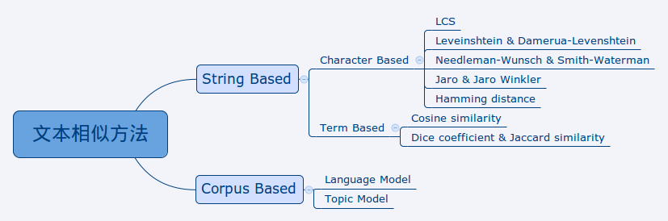
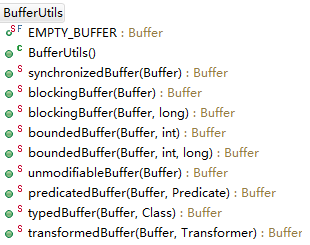
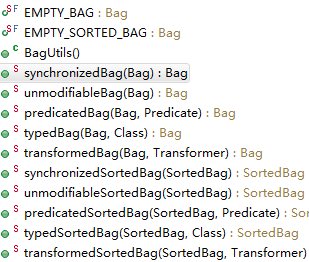

字符串工具包
============

Tips：

commons-text-1.2-src.zip包分析：

1 String的替代品
----------------

Originally the text package was added in Commons Lang 2.2. However, its new home
is here. It provides, amongst other classes, a replacement for StringBuffer
named StrBuilder, a class for substituting variables within a String named
StrSubstitutor and a replacement for StringTokenizer named StrTokenizer. While
somewhat ungainly, the Str prefix has been used to ensure we don't clash with
any current or future standard Java classes.

Beyond the text utilities ported over from lang, we have also included various
string similarity and distance functions. Lastly, there are also utilities for
addressing differences between bodies of text for the sake of viewing these
differences.

Tips：

StrBuilder是StringBuffer的替代品、StrSubstitutor是String的替代、StrTokenizer是StringTokenizer。

Port over，移植。

### 1.1 StrLookup

StrLookup从字面上看就是查找，StrLookup类有三个子类：

-   MapStrLookup：返回值是V；

-   ResourceBundleLookup：返回值是String；

-   SystemPropertiesStrLookup：返回值是String；

要点：

-   StrLookup\<V\>的参数是返回值类型，查询的参数lookup方法的参数固定是String的；

-   该类提供了几个静态方法，用于获取某种实现的StrLookup；

-   以MapStrLookup为例，其作用是以String作为Key在Map中查找，将找到的Value进行返回；

源码

| **public abstract class** StrLookup\<**V**\> { **public abstract** String **lookup**(String key); } |
|-----------------------------------------------------------------------------------------------------|

### 1.2 StrMatcher

**要点**

-   作用是看给定的字符串中是否有和给定的StrMatcher匹配的，此时StrMatcher类似于模板；

-   返回值说明，=0，表明成功匹配字符数为0，即没有匹配成功；\>0，匹配成功N个字符数；

**源码**

| **public abstract class** StrMatcher { **public abstract int isMatch**(**char**[] buffer, **int** pos, **int** bufferStart, **int** bufferEnd); **public int isMatch**(**final char**[] buffer, **final int** pos) } |
|----------------------------------------------------------------------------------------------------------------------------------------------------------------------------------------------------------------------|

**测试样例**

| **public class** AAA { **public static void main**(String[] args) { **char**[] str = "This is a hello world".toCharArray(); String testStr1 = "hello world"; String testStr2 = "This is a hello world"; **int** rlt; StrMatcher matcher = StrMatcher.*stringMatcher*(testStr1); **for**(**int** i=0; i\<str.length; i++){ **if**((rlt = matcher.isMatch(str, i)) \>0) System.out.println("匹配个数：" + rlt); } System.out.println(""); StrMatcher matcher2 = StrMatcher.*stringMatcher*(testStr2); System.out.println("匹配个数：" + matcher2.isMatch(str, 0)); System.out.println(); StrMatcher cmatcher = StrMatcher.*splitMatcher*(); **for**(**int** i=0; i\<2; i++) System.out.println("匹配个数：" + cmatcher.isMatch(**new char**[]{'\\n','\\r'}, i)); } } 测试结果： 匹配个数：11 匹配个数：21 匹配个数：1 匹配个数：1 |
|---------------------------------------------------------------------------------------------------------------------------------------------------------------------------------------------------------------------------------------------------------------------------------------------------------------------------------------------------------------------------------------------------------------------------------------------------------------------------------------------------------------------------------------------------------------------------------------------------------------------------------------------------------------------------------------------------------------------------------------------------------------------------------------------------------------------------------|

**子类介绍**

-   CharSetMatcher，判断给定字符数组中指定位置的字符是否在字符集中；

-   CharMatcher，判断给定字符数组中指定位置的字符与Matcher中的字符匹配；

-   StringMatcher，判断参数是否和字符串匹配；

-   NoMatcher，所有字符都不匹配；

-   TrimMatcher，判断参数是否是空格；

### 1.3 StrSubstitutor

**要点**

-   StrSubstitutor的作用是进行字符串的替换；

-   不是线程安全的类；

**使用介绍**

Substitutes variables within a string by values.

This class takes a piece of text and substitutes all the variables within it.
The default definition of a variable is \${variableName}. The prefix and suffix
can be changed via constructors and set methods.

Variable values are typically resolved from a map, but could also be resolved
from system properties, or by supplying a custom variable resolver.

The simplest example is to use this class to replace Java System properties. For
example:

StrSubstitutor.replaceSystemProperties(

"You are running with java.version = \${java.version} and os.name =
\${os.name}.");

Example：

| **public class** AAA { **public static void main**(String[] args) { String str = StrSubstitutor.*replaceSystemProperties*( "You are running with " + "java.version = \${java.version} and " + "os.name = \${os.name}."); System.out.println(str); } } 测试结果： You are running with java.version = 1.7.0_45 and os.name = Windows 7. |
|----------------------------------------------------------------------------------------------------------------------------------------------------------------------------------------------------------------------------------------------------------------------------------------------------------------------------------------|

Typical usage of this class follows the following pattern:

-   First an instance is created and initialized with the map that contains the
    values for the available variables. If a prefix and/or suffix for variables
    should be used other than the default ones, the appropriate settings can be
    performed.

-   After that the replace() method can be called passing in the source text for
    interpolation.

In the returned text all variable references (as long as their values are known)
will be resolved. The following example demonstrates this:

| Map valuesMap = HashMap(); valuesMap.put("animal", "quick brown fox"); valuesMap.put("target", "lazy dog"); String templateString = "The \${animal} jumped over the \${target}."; StrSubstitutor sub = new StrSubstitutor(valuesMap); String resolvedString = sub.replace(templateString); yielding: The quick brown fox jumped over the lazy dog. |
|----------------------------------------------------------------------------------------------------------------------------------------------------------------------------------------------------------------------------------------------------------------------------------------------------------------------------------------------------|

Tips：

使用分两个步骤。可以设置替换时的前缀和后缀匹配符。

Also, this class allows to set a default value for unresolved variables. The
default value for a variable can be appended to the variable name after the
variable default value delimiter. The default value of the variable default
value delimiter is ':-', as in bash and other \*nix shells, as those are
arguably where the default \${} delimiter set originated.

The variable default value delimiter can be manually set by calling
setValueDelimiterMatcher(StrMatcher), setValueDelimiter(char) or
setValueDelimiter(String). The following shows an example with variable default
value settings:

| Map valuesMap = HashMap(); valuesMap.put("animal", "quick brown fox"); valuesMap.put("target", "lazy dog"); String templateString = "The \${animal} jumped over the \${target}. \${undefined.number:-1234567890}."; StrSubstitutor sub = new StrSubstitutor(valuesMap); String resolvedString = sub.replace(templateString); yielding: The quick brown fox jumped over the lazy dog. 1234567890. |
|--------------------------------------------------------------------------------------------------------------------------------------------------------------------------------------------------------------------------------------------------------------------------------------------------------------------------------------------------------------------------------------------------|

Tips：

注意替换匹配失败情况下的缺省值的设置方法。

In addition to this usage pattern there are some static convenience methods that
cover the most common use cases. These methods can be used without the need of
manually creating an instance. However if multiple replace operations are to be
performed, creating and reusing an instance of this class will be more
efficient.

Variable replacement works in a recursive way. Thus, if a variable value
contains a variable then that variable will also be replaced. Cyclic
replacements are detected and will cause an exception to be thrown.

Sometimes the interpolation's result must contain a variable prefix. As an
example take the following source text:

The variable \${\${name}} must be used.

Here only the variable's name referred to in the text should be replaced
resulting in the text (assuming that the value of the name variable is x):

The variable \${x} must be used.

Tips：

字符串的替换是递归进行的。

To achieve this effect there are two possibilities: Either set a different
prefix and suffix for variables which do not conflict with the result text you
want to produce. The other possibility is to use the escape character, by
default '\$'. If this character is placed before a variable reference, this
reference is ignored and won't be replaced. For example:

The variable \$\${\${name}} must be used.

Tips：

通过转义字符\$\$，可以禁止替换操作。

In some complex scenarios you might even want to perform substitution in the
names of variables, for instance

\${jre-\${java.specification.version}}

StrSubstitutor supports this recursive substitution in variable names, but it
has to be enabled explicitly by setting the enableSubstitutionInVariables
property to true.

Tips：

测试程序没有尝试成功。

This class is not thread safe.

**源码说明**

| **public class** StrSubstitutor { **private char** escapeChar; // 不进行替换 **private** StrMatcher prefixMatcher; // 替换中的前缀匹配器 **private** StrMatcher suffixMatcher; **private** StrMatcher valueDelimiterMatcher; // 缺省值分割匹配器 **private** StrLookup\<?\> variableResolver; // 替换的集合 **private boolean** enableSubstitutionInVariables; // 以下三个用法未知 **private boolean** preserveEscapes = **false**; **private boolean** disableSubstitutionInValues; // 略 } |
|----------------------------------------------------------------------------------------------------------------------------------------------------------------------------------------------------------------------------------------------------------------------------------------------------------------------------------------------------------------------------------------------------------------------------------------------------------------------------------------------|

**使用样例**

| **public class** AAA { **public static void main**(String[] args) { String str1 = "The variable \${name} must be used."; String str2 = "The variable \${names} must be used."; Map\<String, String\> valuesMap = **new** HashMap\<\>(); valuesMap.put("name", "yang"); valuesMap.put("names", "\${yang}"); valuesMap.put("yang", "guan"); valuesMap.put("yangs", "\$\${guan}"); StrSubstitutor sub = **new** StrSubstitutor(valuesMap); String resolvedString = sub.replace(str1); System.out.println(resolvedString); **try** { resolvedString = sub.replace(str2); } **catch** (Exception e) { // **TODO** Auto-generated catch block e.printStackTrace(); } System.out.println(resolvedString); String str3 = "The variable \${yangs} must be used."; resolvedString = sub.replace(str3); System.out.println(resolvedString); System.out.println(StrSubstitutor .*replaceSystemProperties*("java.specification.version " + "= \${java.specification.version}")); System.out.println(StrSubstitutor .*replaceSystemProperties*("jre = \${jre-1.7}")); String jstr = "Here, \${jre-\${java.specification.version}}"; StrSubstitutor ssub = **new** StrSubstitutor( StrLookup.*systemPropertiesLookup*()); ssub.setEnableSubstitutionInVariables(**true**); String rlt = ssub.replace(jstr); System.out.println(rlt); } } 测试结果： The variable yang must be used. The variable guan must be used. The variable \${guan} must be used. java.specification.version = 1.7 jre = \${jre-1.7} Here, \${jre-\${java.specification.version}} |
|------------------------------------------------------------------------------------------------------------------------------------------------------------------------------------------------------------------------------------------------------------------------------------------------------------------------------------------------------------------------------------------------------------------------------------------------------------------------------------------------------------------------------------------------------------------------------------------------------------------------------------------------------------------------------------------------------------------------------------------------------------------------------------------------------------------------------------------------------------------------------------------------------------------------------------------------------------------------------------------------------------------------------------------------------------------------------------------------------------------------------------------------------------------------------------------------------------------------------------------------------------------------------------------------------------------------------------------------------------------------------------------------------------------------------------------------------------------------------------------------------------------------------------------|

### 1.4 StrBuilder

**要点**

-   是StringBuffer的替代；

-   缺省容量为32；

-   增加了许多有用的方法；

**与StringBuffer/StringBuilder的区别**

Builds a string from constituent parts providing a more flexible and powerful
API than StringBuffer.

The main differences from StringBuffer/StringBuilder are:

-   Not synchronized，StringBuffer中的方法有synchronize关键字修饰；

-   Not final，StringBuffer类是一个final类；

-   Subclasses have direct access to character
    array，StringBuffer中存储字符的数组是private的，而StrBuilder中的是protected的；

-   Additional methods

-   appendWithSeparators - adds an array of values, with a separator

-   appendPadding - adds a length padding characters

-   appendFixedLength - adds a fixed width field to the builder

-   toCharArray/getChars - simpler ways to get a range of the character array

-   delete - delete char or string

-   replace - search and replace for a char or string

-   leftString/rightString/midString - substring without exceptions

-   contains - whether the builder contains a char or string

-   size/clear/isEmpty - collections style API methods

-   Views

-   asTokenizer - uses the internal buffer as the source of a StrTokenizer

-   asReader - uses the internal buffer as the source of a Reader

-   asWriter - allows a Writer to write directly to the internal buffer

The aim has been to provide an API that mimics very closely what StringBuffer
provides, but with additional methods. It should be noted that some edge cases,
with invalid indices or null input, have been altered - see individual methods.
The biggest of these changes is that by default, null will not output the text
'null'. This can be controlled by a property, setNullText(String).

**源码**

| **public class** StrBuilder **implements** CharSequence, Appendable, Serializable, Builder\<String\> { **static final int** CAPACITY = 32; /\*\* Internal data storage. \*/ **char**[] buffer; // package-protected for test code use only /\*\* Current size of the buffer. \*/ **private int** size; /\*\* The new line. \*/ **private** String newLine; /\*\* The null text. \*/ **private** String nullText; } |
|--------------------------------------------------------------------------------------------------------------------------------------------------------------------------------------------------------------------------------------------------------------------------------------------------------------------------------------------------------------------------------------------------------------------|

-   关于newLine，即遇到换行时的替换字符，缺省是System.lineSeparator()；

-   关于nullText，针对null的替换文本；

### 1.5 StrTokenizer

**要点**

-   增强StringTokenizer功能；

-   通过片段分隔符进行字符串的分割；

**源码**

| **public class** StrTokenizer **implements** ListIterator\<String\>, Cloneable { /\*\* The text to work on. \*/ **private char**[] chars; // 原始字符序列 /\*\* The parsed tokens. \*/ **private** String[] tokens; // 分割后的片段 /\*\* The current iteration position. \*/ **private int** tokenPos; // 当前的片段序号 /\*\* The delimiter matcher. \*/ **private** StrMatcher delimMatcher = StrMatcher.*splitMatcher*(); // 片段分割匹配符 /\*\* The quote matcher. \*/ **private** StrMatcher quoteMatcher = StrMatcher.*noneMatcher*(); // 看样例分析吧 /\*\* The ignored matcher. \*/ **private** StrMatcher ignoredMatcher = StrMatcher.*noneMatcher*(); //分割时忽略的匹配器 /\*\* The trimmer matcher. \*/ **private** StrMatcher trimmerMatcher = StrMatcher.*noneMatcher*(); /\*\* Whether to return empty tokens as null. \*/ **private boolean** emptyAsNull = **false**; // 将空的片段返回null值； /\*\* Whether to ignore empty tokens. \*/ **private boolean** ignoreEmptyTokens = **true**; // 可以和上面的配合使用， // 略 . . . } |
|--------------------------------------------------------------------------------------------------------------------------------------------------------------------------------------------------------------------------------------------------------------------------------------------------------------------------------------------------------------------------------------------------------------------------------------------------------------------------------------------------------------------------------------------------------------------------------------------------------------------------------------------------------------------------------------------------------------------------------------------------------------------------------------------------------------------------------------------------------------------------------------------------------------------------------------------------------------------------------------------------------------------------------------------------------|

-   如果不忽略空的片段，则返回一个换行符；

-   如果不忽略空的片段，且空片段返回null值，则输出null值；

-   有N个分割符，则由N+1个片段；

**使用样例**

| **public class** AAA { **public static void main**(String[] args) { StrBuilder b = **new** StrBuilder(); b.append("a b "); StrTokenizer t = b.asTokenizer(); String[] tokens1 = t.getTokenArray(); // returns a,b b.append("c d "); String[] tokens2 = t.getTokenArray(); // returns a,b (c and d ignored) t.reset(); // reset causes builder changes to be picked up String[] tokens3 = t.getTokenArray(); // returns a,b,c,d System.out.println(ArrayUtils.*toString*(tokens1)); System.out.println(ArrayUtils.*toString*(tokens2)); System.out.println(ArrayUtils.*toString*(tokens3)); System.out.println(); String tstr = "a, -, b ,-,,,-, y,yy,c"; StrTokenizer token = **new** StrTokenizer(tstr); token.setDelimiterChar(','); token.setIgnoredChar('y'); token.setQuoteChar('-'); token.setEmptyTokenAsNull(**true**); token.setIgnoreEmptyTokens(**false**); System.out.println(token.size()); **while**(token.hasNext()){ System.out.println(token.next()); } } } 结果： {a,b} {a,b} {a,b,c,d} 7 a - b ,,, null c |
|------------------------------------------------------------------------------------------------------------------------------------------------------------------------------------------------------------------------------------------------------------------------------------------------------------------------------------------------------------------------------------------------------------------------------------------------------------------------------------------------------------------------------------------------------------------------------------------------------------------------------------------------------------------------------------------------------------------------------------------------------------------------------------------------------------------------------------------------------------------------------------------------------------------------------------------------------------------------------------------------------------------------------|

-   重点说一下quoteMatcher，从测试样例可以看出第一个quote没有起作用，而是从第二个开始起作用的。

-   quote连续出现两次，则对quote进行转义；

**说明**

Tokenizes a string based on delimiters (separators) and supporting quoting and
ignored character concepts.

This class can split a String into many smaller strings. It aims to do a similar
job to StringTokenizer, however it offers much more control and flexibility
including implementing the ListIterator interface. By default, it is set up like
StringTokenizer.

The input String is split into a number of tokens. Each token is separated from
the next String by a delimiter. One or more delimiter characters must be
specified.

Each token may be surrounded by quotes. The quote matcher specifies the quote
character(s). A quote may be escaped within a quoted section by duplicating
itself.

Between each token and the delimiter are potentially characters that need
trimming. The trimmer matcher specifies these characters. One usage might be to
trim whitespace characters.

At any point outside the quotes there might potentially be invalid characters.
The ignored matcher specifies these characters to be removed. One usage might be
to remove new line characters.

Empty tokens may be removed or returned as null.

"a,b,c" - Three tokens "a","b","c" (comma delimiter)

" a, b , c " - Three tokens "a","b","c" (default CSV processing trims
whitespace)

"a, ", b ,", c" - Three tokens "a, " , " b ", ", c" (quoted text untouched)

This tokenizer has the following properties and options: Property Type Default

delim CharSetMatcher { \\t\\n\\r\\f}

quote NoneMatcher {}

ignore NoneMatcher {}

emptyTokenAsNull boolean false

ignoreEmptyTokens boolean true

2 StringEscapeUtils
-------------------

**要点**

-   工具类，提供转义功能；

**测试样例**

| **public class** AAA { **public static void main**(String[] args) { String rlt = StringEscapeUtils.*escapeJava*("He didn't say, \\"Stop!\\""); System.out.println(rlt); String urlt = StringEscapeUtils.*unescapeJava*("He didn't say, \\"Stop!\\""); System.out.println(urlt); } } 测试结果： He didn't say, \\"Stop!\\" He didn't say, "Stop!" |
|--------------------------------------------------------------------------------------------------------------------------------------------------------------------------------------------------------------------------------------------------------------------------------------------------------------------------------------------------|

说明：

第一个打印，输入是正常的字符串，输出的是经过转义的字符串；

**工作原理**

-   通过CharSequenceTranslator类将字符串进行转义处理，从而构造出新的字符串；

### 2.1 OctalUnescaper

**使用样例**

| **public class** AAA { **public static void main**(String[] args) **throws** IOException { String tstr = "str\\41\\44\\45\\58str"; OctalUnescaper ounescaper = **new** OctalUnescaper(); Writer writer = **new** OutputStreamWriter(System.out); ounescaper.translate(tstr, writer); writer.flush(); } } 测试结果：str!\$%str |
|-------------------------------------------------------------------------------------------------------------------------------------------------------------------------------------------------------------------------------------------------------------------------------------------------------------------------------|

Tips：

该类的作用是将八进制的转义字符进行逆操作，获取原始的八进制值。

### 2.2 AlphabetConverter

**要点**

-   将字符转换成另外的字符，可以控制哪些进行转换，哪些不进行转换；

-   可以转换的字符转换的长度是固定的，可能\>1；

-   不转换的字符长度固定是1；

-   该类是线程安全的；

**API例子**

| Sample usage Character[] originals; // a, b, c, d Character[] encoding; // 0, 1, d Character[] doNotEncode; // d AlphabetConverter ac = AlphabetConverter.createConverterFromChars(originals, encoding, doNotEncode); ac.encode("a"); // 00 ac.encode("b"); // 01 ac.encode("c"); // 0d ac.encode("d"); // d ac.encode("abcd"); // 00010dd |
|--------------------------------------------------------------------------------------------------------------------------------------------------------------------------------------------------------------------------------------------------------------------------------------------------------------------------------------------|

**使用样例**

| **public class** AAA { **public static void main**(String[] args) **throws** IOException { Character[] originals = **new** Character[]{'a', 'b', 'c', 'd'}; Character[] encoding = **new** Character[]{'3', '1', 'd'}; Character[] doNotEncode = **new** Character[]{'d'}; AlphabetConverter ac = AlphabetConverter.*createConverterFromChars*( originals, encoding, doNotEncode); ac.encode("a"); ac.encode("b"); ac.encode("c"); ac.encode("d"); ac.encode("abcd"); System.out.println(ac.encode("abcd")); System.out.println(ac.toString()); Map\<Integer, String\> map = ac.getOriginalToEncoded(); MapUtils.*verbosePrint*(System.out, "Org", map); } } 测试结果： 33313dd a -\> 33 b -\> 31 c -\> 3d d -\> d Org = { 97 = 33 98 = 31 99 = 3d 100 = d } |
|--------------------------------------------------------------------------------------------------------------------------------------------------------------------------------------------------------------------------------------------------------------------------------------------------------------------------------------------------------------------------------------------------------------------------------------------------------------------------------------------------------------------------------------------------------------------------------------------------------------------------------------------------------------------------------------------------------------------------------------------------------------|

Tips：

可转换字符的第一个字符被编码了两次。

3 文本相似性度量
----------------

### 3.1 基本概念介绍

距离度量或相似度量是被广泛应用的概念，简单来说，可以这么认为:

-   距离度量是度量两个“物体”之间的差异程度的

-   相似度量是度量两个“物体”之间的近似程度的

在数学上，这两者都有严格的定义，比如说一个严格意义上的距离度量，是应该满足以下几个条件的:

-   对称性，即 d(A,B)=d(B,A)

-   非负性，即 ∀A∀B,d(A,B)≥0

-   一致性，即 A=B⇔d(A,B)=0

-   次可加性(subadditivity)/三角不等式，即 d(A,B)≤d(A,C)+d(C,D)

严格意义上的相似度量也有类似的限制，比较基本的两条有:

-   如果 A 和 B 完全不同，那么 s(A,B)=0

-   如果 A 和 B 完全相同，那么 s(A,B)=1

距离度量和相似度量是互有关联的，在一些具体的方法中，甚至是可以互相转换的，后续谈到的一些具体的度量方法，其原始目的就是度量距离的。但这两者仍然是有区别的，为了防止混淆，我会尽量统一表示成相似度量。

另外一点需要注意的是，由于具体应用场景的限制或者特殊的需求，往往不一定会应用严格意义的相似度量方法
——
对这些方法，称之为“度量”其实是不严谨的，但为了表述上的一致，我将保持这种用法。

Tips：

相似和距离是可以条件转换的不同的概念。

### 3.2 文本度量方法

此处的“文本”一词涵盖以下两个对象:

-   字符串/序列

-   包含较多文本内容的文档

相关的度量方法可以分为两大类，各类下面再有一些具体的分类，比较常用的方法如见下图

总的来说，文本相似度量方法可以分为两大类:

-   String
    Based，即基于待比较的文本本身中的信息，该类方法评估的是”词法“上的相似性，或说朴素的相似性

-   Corpus
    Based，即基于一个较大的文本集合中的信息，该类方法评估的是“语义”上的相似性

这些方法被普遍应用于以下领域:

-   信息检索

-   文档分类

-   文档聚类

-   主题检测

-   自动问答

-   自动摘要

**基于字符串的方法**

**String Based Methods**

要比较两个文本的相似性，比较直观的方法是逐个字符比对，看看有多少个字符是一致的
—— String Based
的方法就是从这种思路中发展出来的。其中以字符为单位去比较的方法被统称为 Character
Based，而以词为单位的则被称为 Term Based。

Character Based
的方法普遍用来进行较短文本、小规模的比较，会注意文本中各字符的顺序和位置；Term
Based
的方法则更适合用来进行较长文本或大规模的比较，而且通常会抛弃文本中各个单元(通常是词)之间的顺序、位置信息
——
一般的做法是用文本中的词组成的向量来表示文本，也就是所谓的“向量空间模型(Vecter
Space Model, VSM)”。

Tips：

基于字符串的方法分为两种：基于字符的和基于单词的方法。

**基于字符的方法**

**Character Based Methods**

-   最长公共子序列(Longest Common Subsequence, LCS)

LCS
方法通过计算出两个字符串/序列之间的最长公共子序列，并使用这个子序列的长度来反映两个字符串/序列之间的相似程度。

-   编辑距离(Leveinshtein Distance)

在两个字符串的比较中应用编辑距离时，通常会有一者作为”标准字符串“，另一者则作为”可能错误“的字符串，通过将后者变换成前者所进行的字符的
插入 、 删除 或 替换 操作次数作为衡量两者差异程度的指标。

-   扩展的编辑距离(Damerau-Levenshtein Distance)

扩展的编辑距离在思想上与编辑距离一样，只是除插入、删除和替换操作外，还支持
相邻字符的交换
这样一个操作，增加这个操作的考虑是人们在计算机上输入文档时的错误情况中，因为快速敲击而前后两个字符的顺序被输错的情况很常见。

-   Needleman-Wunsch Similarity

该方法被广泛运用于生物信息学中的序列比对，如氨基酸序列比对、核苷酸序列比对等。其基本思路与编辑距离相近，但在编辑距离中，三种不同的错误情况是平等的，而在生物信息学中，序列中的单元缺失情况比错误(位置匹配但内容不同)情况更不能容忍，因此在
Needleman-Wunsch 方法中，插入错误和删除错误会被赋予较高的惩罚分数。

-   Smith-Waterman Similarity

Smith-Waterman 方法用于生物信息学中的序列比对，但与 Needleman-Wunsch
方法不一样，它是一个 局部最优比对 方法，简单来说，它的目的是找出两个序列之间
连续且相同 的子序列。

-   Jaro Similarity 和 Jaro-Winkler Similarity

Jaro 方法和 Jaro-Winkler
方法考虑两个字符串之间相同字符的顺序位置和个数，只适用于像人名这样的较短字符串之间的比较。其中
Jaro-Winkler 方法是对 Jaro 方法的改进，而 Jaro 方法现在已经不常用。

-   Hamming Distance

Hamming 距离用于 长度相同
的序列之间的比较，思想非常简单，就是逐位比较得到的不同次数。Hamming
距离被广泛应用于信息学。

**Term Based Methods**

Term Based 方法中的 term 不一定是词，也可以是关键词、短语，当选定”词“作为 term
时，可以用 Bag-of-Words Model(BOW)
来更精确地描述此时的模型。为了表述上的方便，本系列文章将此处的 term 视为词。

-   Cosine Similarity

余弦相似度建立在用向量表示文档的前提上。两个文档的向量，同一个维度应该是表示的同一个词，而每一个维度的值，一般是用”词频-逆文档频率(Term
Frequency-Inverse Document Frequency, TF-IDF)“ 来表示。

建立向量表示后，通过计算两个向量之间的夹角大小来衡量两个文档之间的近似程度，由于夹角的余弦值的计算方便，而且天然地处在
0 和 1 之间，故一般是用夹角的余弦值而不是夹角的大小来作为度量。

-   Dice's Coefficient 和 Jaccard Similarity

Dice 系数和 Jaccard
相似性起初被用于生态学上，作为一种判断物种间相似性的方法。在生态学上，要比较两个物种间相似程度时，通常会对该物种的特性进行采样，最后得到各自的特性集合，而
Dice 系数和 Jaccard 相似性都是通过比较两者之间的 共有特性
占比来度量相似性的，因此这两种方法都不是很关心每个 "Term"
的具体量，只是关心有没有某个 "Term"。

**基于语义的方法**

**Corpus Based Methods**

Corpus Based 方法通过对大量文档的统计分析得到语义上的相似，这里 “大量文档” 就是
Corpus 即语料了。

-   Language Model

常见的语言模型(Language Model, LM)都基于马尔可夫假设(Markov
Assumption)，即认为语言中每个词只与其前面长度为 N-1 个词有关 —— 这 N-1
个词其实就构成了该词的上文，同时由于每个词都会成为其他词的上文，下文信息也会得到表现。也就是说，语言模型统计的其实是语言中每个词的一定程度的上下文情况。基于语言模型的这个特点，以及下面这样一个假设:

具有相同(或相近)上下文的词，其语义是相近的。

就可以用语言模型来进行文本的相似度量了。具体一点，有两种方式:

通过语言模型来发现同义词、近义词，来弥补 Term Based Methods 的缺陷；

扩大 "term"
的表示范围，比如说按照词组来进行统计，甚至按照句子来进行统计，那么就可以反映词组之间的相似性、句子之间的相似性了。

-   Topic Model

主题模型与向量空间模型有共同的一点是也是基于 BOW
模型的，也就是说，并不像语言模型一样考虑词与词之间的顺序、位置，而只是通过词与词的共现(Co-occurrence)来反映词与词之间的相似性。

主题模型是一种无监督的方法，与聚类方法在外在表现上会有一定的相似性，但它们各自的内在原理是相差较大的。

### 3.3 Java提供的包

The org.apache.commons.text.similarity packages contains various different
mechanisms of calculating "similarity scores" as well as "edit distances between
Strings. Note, the difference between a "similarity score" and a "distance
function" is that a distance functions meets the following qualifications:

-   d(x,y) \>= 0, non-negativity or separation axiom

-   d(x,y) == 0, if and only if, x == y

-   d(x,y) == d(y,x), symmetry, and

-   d(x,z) \<= d(x,y) + d(y,z), the triangle inequality

whereas a "similarity score" need not satisfy all such properties. Though, it is
fairly easy to "normalize" a similarity score to manufacture an "edit distance."

Tips：

Java提供了基于字符串的度量包，这个包提供了一些距离度量方法，和相似性度量方法。

The list of "edit distances" that we currently support follow:

-   Cosine Distance,

-   Hamming Distance,

-   Jaccard Distance,

-   Jaro Winkler Distance,

-   Levenshtein Distance,

-   Longest Commons Subsequence Distance,

and the list of "similarity scores" that we support follows:

-   Cosine Similarity,

-   Fuzzy Score Similarity,

-   Jaccard Similarity, and

-   Longest Common Subsequence Similarity.

### 3.4 相似性

#### 3.4.1 SimilarityScore

org.apache.commons.text.similarity.SimilarityScore\<R\>, Interface for the
concept of a string similarity score.

A string similarity score is intended to have some of the properties of a
metric, yet allowing for exceptions, namely the Jaro-Winkler similarity score.

Tips：

该接口对两个字符序列进行比较，并返回两者的相似性的结果R。

We Define a SimilarityScore to be a function d: [X \* X] -\> [0, INFINITY) with
the following properties:

-   d(x,y) \>= 0, non-negativity or separation axiom

-   d(x,y) == d(y,x), symmetry.

Notice, these are two of the properties that contribute to d being a metric.

Further, this intended to be BiFunction\<CharSequence, CharSequence, R\>. The
apply method accepts a pair of CharSequence parameters and returns an R type
similarity score. We have omitted the explicit statement of extending BiFunction
due to it only being implemented in Java 1.8, and we wish to maintain Java 1.7
compatibility.

\<R\> The type of similarity score unit used by this EditDistance.

| **public interface** SimilarityScore\<**R**\> { /\*\* \* Compares two CharSequences. \* \* **\@param** left the first CharSequence \* **\@param** right the second CharSequence \* **\@return** the similarity score between two CharSequences \*/ **R apply**(CharSequence left, CharSequence right); } |
|----------------------------------------------------------------------------------------------------------------------------------------------------------------------------------------------------------------------------------------------------------------------------------------------------------|

#### 3.4.2 EditDistance

org.apache.commons.text.similarity.EditDistance\<R\>, Interface for Edit
Distances.

An edit distance is a formal metric on the Kleene closure (X\*) over an alphabet
(X). Note, that a metric on a set S is a function d: [S \* S] -\> [0, INFINITY)
such that the following hold for x,y,z in the set S:

-   d(x,y) \>= 0, non-negativity or separation axiom

-   d(x,y) == 0, if and only if, x == y

-   d(x,y) == d(y,x), symmetry, and

-   d(x,z) \<= d(x,y) + d(y,z), the triangle inequality

This is a BiFunction\<CharSequence, CharSequence, R\>. The apply method accepts
a pair of CharSequence parameters and returns an R type similarity score.

| **public interface** EditDistance\<**R**\> **extends** SimilarityScore\<**R**\> { /\*\* \* Compares two CharSequences. \* \* **\@param** left the first CharSequence \* **\@param** right the second CharSequence \* **\@return** the similarity score between two CharSequences \*/ \@Override **R apply**(CharSequence left, CharSequence right); } |
|-------------------------------------------------------------------------------------------------------------------------------------------------------------------------------------------------------------------------------------------------------------------------------------------------------------------------------------------------------|

#### 3.4.3 常用相似性类

常用类

-   CosineSimilarity，三角余弦相似性，单独的类；

-   EditDistanceFrom，编辑距离，使用时需要给出距离的计算方法，和对比的字符串；

-   其他略。。。

### 3.5 距离

接口

-   EditDistance，接口继承自SimilarityScore；

常用类

-   CosineDistance，三角余弦距离，继承自EditDistance接口；

-   其他略。。。

### 3.6 使用样例

使用样例

| **public class** AAA { **public static void main**(String[] args) **throws** IOException { **final** String lstr = "In mathematics, a metric or distance function " + "is a function that defines a distance between each" + " pair of elements of a set. A set with a metric is" + " called a metric space. "; **final** String rstr = "A metric induces a topology" + " on a set, but not all topologies can be generated" + " by a metric. A topological space whose topology " + "can be described by a metric is called metrizable."; **final** CharSequence[] leftTokens = lstr.split(" "); **final** CharSequence[] rightTokens = rstr.split(" "); CosineSimilarity csimilarity = **new** CosineSimilarity(); Map\<CharSequence, Integer\> leftVector = *of*(leftTokens); Map\<CharSequence, Integer\> rightVector = *of*(rightTokens); Double rlt1 = csimilarity.cosineSimilarity(leftVector, rightVector); System.out.println("相似性：" + rlt1); CosineDistance cdistance = **new** CosineDistance(); Double rlt2 = cdistance.apply(lstr, rstr); System.out.println("距离：" + rlt2); } **public static** Map\<CharSequence, Integer\> **of**(**final** CharSequence[] tokens) { **final** Map\<CharSequence, Integer\> innerCounter = **new** HashMap\<\>(); **for** (**final** CharSequence token : tokens) { **if** (innerCounter.containsKey(token)) { **int** value = innerCounter.get(token); innerCounter.put(token, ++value); } **else** { innerCounter.put(token, 1); } } **return** innerCounter; } } 测试结果： 相似性：0.536496922049345 距离：0.4006770201401968 |
|-----------------------------------------------------------------------------------------------------------------------------------------------------------------------------------------------------------------------------------------------------------------------------------------------------------------------------------------------------------------------------------------------------------------------------------------------------------------------------------------------------------------------------------------------------------------------------------------------------------------------------------------------------------------------------------------------------------------------------------------------------------------------------------------------------------------------------------------------------------------------------------------------------------------------------------------------------------------------------------------------------------------------------------------------------------------------------------------------------------------------------------------------------------------------------------------------------------------------------------------------------------------------------------------------------------------------------------------------------------------------------------------------------------------------------------------------------------------------------------------------------------------------------------------------------------------------------------------|

4 字符串差异性比较
------------------

### 4.1 工具类

下图给出了text.diff包中类的基本关系：

说明

-   这里的StringsComparator比较采用的是Myers算法；

-   通过getScript方法返回的是两个字符串一样的时候需要执行的操作；这些操作由CommandVisitor代理完成；

### 4.2 使用样例

| **public class** AAA { **public static void main**(String[] args) **throws** IOException { **final** String lstr = "mathematics aa"; **final** String rstr = "metrics bbaa"; StringsComparator cmp = **new** StringsComparator(lstr, rstr); EditScript\<Character\> script = cmp.getScript(); System.*out*.println(script.getLCSLength()); System.out.println(script.getModifications()); script.visit(**new** ReplacementsFinder\<\>(**new** ReplacementsHandler\<Character\>() { \@Override **public void handleReplacement**(**int** skipped, List\<Character\> from, List\<Character\> to) { System.out.println("Skipped = " + skipped); System.out.println(from.toString()); System.out.println(to.toString()); } })); } } 测试结果： 9 8 Skipped = 1 [a, t, h] [] Skipped = 1 [m, a] [] Skipped = 1 [] [r] Skipped = 4 [] [b, b] |
|----------------------------------------------------------------------------------------------------------------------------------------------------------------------------------------------------------------------------------------------------------------------------------------------------------------------------------------------------------------------------------------------------------------------------------------------------------------------------------------------------------------------------------------------------------------------------------------------------------------------------------------------------------------------------------------------------------------------------------------------------------------------------------------------------------------------------------------|

5 其他工具类
------------

### 5.1 CharacterPredicates

要点：

-   CharacterPredicates是一个枚举，给出了一些字符的类型；

-   实现了CharacterPredicate接口；

-   用于判定给定的代码点是否满足给定的字符类型；

### 5.2 CaseUtils

该类有用的只有一个方法：

| **public static** String **toCamelCase**(String str, **final boolean** capitalizeFirstLetter, **final char**... delimiters) |
|-----------------------------------------------------------------------------------------------------------------------------|

Converts all the delimiter separated words in a String into camelCase, that is
each word is made up of a titlecase character and then a series of lowercase
characters.

The delimiters represent a set of characters understood to separate words. The
first non-delimiter character after a delimiter will be capitalized. The first
String character may or may not be capitalized and it's determined by the user
input for capitalizeFirstLetter variable.

A null input String returns null. Capitalization uses the Unicode title case,
normally equivalent to upper case and cannot perform locale-sensitive mappings.

说明：

该方法的作用是将通过分割符分割的字符串转换成驼峰规则的字符串，并且可以控制首字母是否大写。该方法会忽略字符之间的空格。缺省的分割符是空格。

使用样例

| **CaseUtils.toCamelCase(null, false) = null CaseUtils.toCamelCase("", false, \*) = "" CaseUtils.toCamelCase(\*, false, null) = \* CaseUtils.toCamelCase(\*, true, new char[0]) = \* CaseUtils.toCamelCase("To.Camel.Case", false, new char[]{'.'}) = "toCamelCase" CaseUtils.toCamelCase(" to \@ Camel case", true, new char[]{'\@'}) = "ToCamelCase" CaseUtils.toCamelCase(" \@to \@ Camel case", false, new char[]{'\@'}) = "toCamelCase"** |
|-----------------------------------------------------------------------------------------------------------------------------------------------------------------------------------------------------------------------------------------------------------------------------------------------------------------------------------------------------------------------------------------------------------------------------------------------|

### 5.3 WordUtils

**工具方法介绍**

-   Wrap，整理字符串

-   Capitalize，首字母大写；

-   capitalizeFully，首字母大写后，把其他字母小写；

-   uncapitalize，首字母小写；

-   swapCase，所有字母大小写转换；

-   initials，获取多个单词中的首字母，简写；

-   containsAllWords，一个字符序列中是否包含给定的字符序列；

-   abbreviate，字符串的简写，控制字符串的长度；

**Wrap方法**

Wraps a single line of text, identifying words by wrapOn.

Leading spaces on a new line are stripped. Trailing spaces are not stripped.

| **input**                                                                | **wrapLength** | **newLineString** | **wrapLongWords** | **wrapOn** | **result**                                                                                                                           |
|--------------------------------------------------------------------------|----------------|-------------------|-------------------|------------|--------------------------------------------------------------------------------------------------------------------------------------|
| null                                                                     | \*             | \*                | true/false        | \*         | null                                                                                                                                 |
| ""                                                                       | \*             | \*                | true/false        | \*         | ""                                                                                                                                   |
| "Here is one line of text that is going to be wrapped after 20 columns." | 20             | "\\n"             | true/false        | " "        | "Here is one line of\\ntext that is going\\nto be wrapped after\\n20 columns."                                                       |
| "Here is one line of text that is going to be wrapped after 20 columns." | 20             | "\ "        | true/false        | " "        | "Here is one line of\ text that is going\  to be wrapped after\ 20 columns."                                       |
| "Here is one line of text that is going to be wrapped after 20 columns." | 20             | null              | true/false        | " "        | "Here is one line of" + systemNewLine + "text that is going" + systemNewLine + "to be wrapped after" + systemNewLine + "20 columns." |
| "Click here to jump to the commons website - http://commons.apache.org"  | 20             | "\\n"             | false             | " "        | "Click here to jump\\nto the commons\\nwebsite -\\nhttp://commons.apache.org"                                                        |
| "Click here to jump to the commons website - http://commons.apache.org"  | 20             | "\\n"             | true              | " "        | "Click here to jump\\nto the commons\\nwebsite -\\nhttp://commons.apach\\ne.org"                                                     |
| "flammable/inflammable"                                                  | 20             | "\\n"             | true              | "/"        | "flammable\\ninflammable"                                                                                                            |

**参数说明**:

-   str the String to be word wrapped, may be null，待整理的字符串；

-   wrapLength the column to wrap the words at, less than 1 is treated as
    1，字符串整理的长度；

-   newLineStr the string to insert for a new line, null uses the system
    property line separator，字符串整理后的分隔符；

-   wrapLongWords true if long words (such as URLs) should be
    wrapped，是否整理较长的单词；

-   wrapOn regex expression to be used as a breakable characters, if blank
    string is provided a space character will be
    used；字符串整理中的分割字符，默认是空格，根据该字符串进行分割整理；

**使用样例**

| **public static void main**(String[] args) **throws** IOException { String str1 = **null**; String str2 = ""; String str3 = "Here is one line of text that is going to be wrapped after 20 columns."; String str4 = "Here is one line of text that is going to be wrapped after 20 columns."; String str5 = "Here is one line of text that is going to be wrapped after 20 columns."; String str6 = "Click here to jump to the commons website - http://commons.apache.org"; String str7 = "Click here to jump to the commons website - http://commons.apache.org"; String str8 = "flammable/inflammable"; System.out.println(WordUtils.*wrap*(str1, 20, System.*lineSeparator*(), **true**, "")); System.out.println(); System.out.println(WordUtils.*wrap*(str2, 20, System.*lineSeparator*(), **true**, "")); System.out.println(); System.out.println(WordUtils.*wrap*(str3, 20, "\ ", **true**, "")); System.out.println(); System.out.println(WordUtils.*wrap*(str4, 20, **null**, **true**, "")); System.out.println(); System.out.println(WordUtils.*wrap*(str5, 20, System.*lineSeparator*(), **true**, "")); System.out.println(); System.out.println(WordUtils.*wrap*(str6, 20, System.*lineSeparator*(), **false**, "")); System.out.println(); System.out.println(WordUtils.*wrap*(str7, 20, System.*lineSeparator*(), **true**, "")); System.out.println(); System.out.println(WordUtils.*wrap*(str8, 20, System.*lineSeparator*(), **true**, "/")); System.out.println(); } 测试结果： null Here is one line of\ text that is going\ to be wrapped after\ 20 columns. Here is one line of text that is going to be wrapped after 20 columns. Here is one line of text that is going to be wrapped after 20 columns. Click here to jump to the commons website - http://commons.apache.org Click here to jump to the commons website - http://commons.apach e.org flammable inflammable |
|-------------------------------------------------------------------------------------------------------------------------------------------------------------------------------------------------------------------------------------------------------------------------------------------------------------------------------------------------------------------------------------------------------------------------------------------------------------------------------------------------------------------------------------------------------------------------------------------------------------------------------------------------------------------------------------------------------------------------------------------------------------------------------------------------------------------------------------------------------------------------------------------------------------------------------------------------------------------------------------------------------------------------------------------------------------------------------------------------------------------------------------------------------------------------------------------------------------------------------------------------------------------------------------------------------------------------------------------------------------------------------------------------------------------------------------------------------------------------------------------------------------------------------------------------------------------------------------------------------------------------------------------------------------------------------------------------------------------------------------------------------------------------------------------------------------------------------------------------------------------------------------------------------------------------------|

### 5.4 ExtendedMessageFormat

-   继承自MessageFormat，是对MessageFormat的扩展；

-   使用方法：略。。

### 5.5 FormattableUtils

-   对字符序列进行格式化

### 5.6 随机字符串生成

**要点**

-   可以限制字符的范围；

-   可以对生成的字符进行过滤，不满足条件的不会在结果字符串中出现；

-   可定制随机策略；

-   可以定制字符；这个和字符范围是互斥的，生成字符时会首先从给定的字符序列中去获取字符；

**使用样例**

| **public class** AAA { **public static void main**(String[] args) { // Generates a 20 code point string, using only the letters a-z RandomStringGenerator generator = **new** RandomStringGenerator.Builder() .withinRange('a', 'z').build(); **for**(**int** i=0; i\<5; i++){ String randomLetters = generator.generate(6); System.out.println(randomLetters); } } } 测试结果： txcfhz omcwwj bfrwrd kywcfo kbdwne |
|---------------------------------------------------------------------------------------------------------------------------------------------------------------------------------------------------------------------------------------------------------------------------------------------------------------------------------------------------------------------------------------------------------------------|

参考文献
--------

1.  文本相似度量方法(1):
    概览<http://www.zmonster.me/2015/11/15/text_similarity_survey.html>

2.  Git是怎样生成diff的：Myers算法<http://cjting.me/misc/how-git-generate-diff/>

3.  The Myers diff algorithm: part 1
    <https://blog.jcoglan.com/2017/02/12/the-myers-diff-algorithm-part-1/>

容器工具包
==========

Tips:

本章是对commons.collections-3.2.1.jar的分析。

容器工具类中最常使用的设计模式是装饰模式，即对原有的类增加新的功能，其使用方法是在装饰类上进行操作，来获取装饰的功能；在原始类上来获取操作的结果。

1 容器工具的新功能
------------------

### 1.1 对象的判定

Predicate接口是一个判定接口，用于判定给定的类是否符合特定的要求，不符合则返回false。Defines
a functor interface implemented by classes that perform a predicate test on an
object.

A Predicate is the object equivalent of an if statement. It uses the input
object to return a true or false value, and is often used in validation or
filtering.

下面是其API接口：

| **public interface** Predicate { /\*\* \* Use the specified parameter to perform a test that returns true or false. \* \* **\@param** object the object to evaluate, should not be changed \* **\@return** true or false \* **\@throws** ClassCastException (runtime) if the input is the wrong class \* **\@throws** IllegalArgumentException (runtime) if the input is invalid \* **\@throws** FunctorException (runtime) if the predicate encounters a problem \*/ **public boolean** evaluate(Object object); } |
|---------------------------------------------------------------------------------------------------------------------------------------------------------------------------------------------------------------------------------------------------------------------------------------------------------------------------------------------------------------------------------------------------------------------------------------------------------------------------------------------------------------------|

**判定策略工具类**

Standard implementations of common predicates are provided by PredicateUtils.
These include true, false, instanceof, equals, and, or, not, method invokation
and null testing.

PredicateUtils是一个判定策略的工具类，该类中的静态方法返回的是对应策略的Predicate。

PredicateUtils provides reference implementations and utilities for the
Predicate functor interface. The supplied predicates are:

-   Invoker - returns the result of a method call on the input object

-   InstanceOf - true if the object is an instanceof a class

-   Equal - true if the object equals() a specified object

-   Identity - true if the object == a specified object. 判定两标识符是否一致。

-   Null - true if the object is null. 判定为Null。

-   NotNull - true if the object is not null

-   Unique - true if the object has not already been evaluated

-   And/All - true if all of the predicates are true. 所有判定条件都满足。

-   Or/Any - true if any of the predicates is true

-   Either/One - true if only one of the predicate is true

-   Neither/None - true if none of the predicates are true

-   Not - true if the predicate is false, and vice versa. 条件通过返回False.

-   Transformer - wraps a Transformer as a Predicate

-   True - always return true

-   False - always return false

-   Exception - always throws an exception

-   NullIsException/NullIsFalse/NullIsTrue - check for null input.
    判定的类Predicate为Null时抛出异常等。

-   Transformed - transforms the input before calling the predicate

All the supplied predicates are Serializable.

**要点一：**

注意区分以下两个工具方法。

| **public static** Predicate asPredicate(Transformer transformer) **public static** Predicate transformedPredicate(Transformer transformer, Predicate predicate) |
|-----------------------------------------------------------------------------------------------------------------------------------------------------------------|

前者转换的结果必须是Boolean值，直接表明了是否能够通过判定。后者实际上是两个步骤，先进行转换，再对转换后的对象进行判定，转换后的对象不一定是Boolean类型的。

**要点二：**

下面两个工具方法是asPredicate方法的变体。

| **public static** Predicate invokerPredicate(String methodName){ **return** *asPredicate*(InvokerTransformer.*getInstance*(methodName)); } **public static** Predicate invokerPredicate(String methodName, Class[] paramTypes, Object[] args){ **return** *asPredicate*(InvokerTransformer.*getInstance*(methodName, paramTypes, args)); } |
|--------------------------------------------------------------------------------------------------------------------------------------------------------------------------------------------------------------------------------------------------------------------------------------------------------------------------------------------|

其工作过程是，InvokerTransformer类调用目标类中的目标方法来返回一个对象，该对象是一个Boolean型的。其中目标类是Transformer类中transform方法的输入参数。

Creates a Predicate that invokes a method on the input object. The method must
return either a boolean or a non-null Boolean, and have no parameters. If the
input object is null, a PredicateException is thrown.

For example, PredicateUtils.invokerPredicate("isEmpty"); will call the isEmpty
method on the input object to determine the predicate result.

### 1.2 数据的转换

Transformer是一个转换器接口。Defines a functor interface implemented by classes
that transform one object into another.

A Transformer converts the input object to the output object. The input object
should be left unchanged. Transformers are typically used for type conversions,
or extracting data from an object.

Tips：

Transformer是一个转换器，其作用是将输入对象转成另外一个对象，典型的应用是类型转换，或从一个对象中获取数据。注意，这里不会修改原始输入对象。

Standard implementations of common transformers are provided by
TransformerUtils. These include method invokation, returning a constant, cloning
and returning the string value.

下面是其API：

| **public interface** Transformer { /\*\* \* Transforms the input object (leaving it unchanged) into some output object. \* \* **\@param** input the object to be transformed, should be left unchanged \* **\@return** a transformed object \* **\@throws** ClassCastException (runtime) if the input is the wrong class \* **\@throws** IllegalArgumentException (runtime) if the input is invalid \* **\@throws** FunctorException (runtime) if the transform cannot be completed \*/ **public** Object transform(Object input); } |
|--------------------------------------------------------------------------------------------------------------------------------------------------------------------------------------------------------------------------------------------------------------------------------------------------------------------------------------------------------------------------------------------------------------------------------------------------------------------------------------------------------------------------------------|

如上所示，transform方法用于将一个对象转换成另外一个对象。

**类型或数据转换的工具类**

TransformerUtils是类型转换的工具类。TransformerUtils provides reference
implementations and utilities for the Transformer functor interface. The
supplied transformers are:

-   Invoker - returns the result of a method call on the input object

-   Clone - returns a clone of the input object

-   Constant - always returns the same object

-   Closure - performs a Closure and returns the input object

-   Predicate - returns the result of the predicate as a Boolean

-   Factory - returns a new object from a factory

-   Chained - chains two or more transformers together

-   Switch - calls one transformer based on one or more predicates

-   SwitchMap - calls one transformer looked up from a Map

-   Instantiate - the Class input object is instantiated

-   Map - returns an object from a supplied Map

-   Null - always returns null

-   NOP - returns the input object, which should be immutable

-   Exception - always throws an exception

-   StringValue - returns a java.lang.String representation of the input object

All the supplied transformers are Serializable.

### 1.3 对象的闭包操作

Defines a functor interface implemented by classes that do something.
也就是说，Closure接口实际上是对输入进行一些处理，可以称之为一个闭包操作，只是内部的数据发生了一些变化。

A Closure represents a block of code which is executed from inside some block,
function or iteration. It operates an input object.

Standard implementations of common closures are provided by ClosureUtils. These
include method invokation and for/while loops.

其API如下所示：

| **public interface** Closure { /\*\* \* Performs an action on the specified input object. \* \* **\@param** input the input to execute on \* **\@throws** ClassCastException (runtime) if the input is the wrong class \* **\@throws** IllegalArgumentException (runtime) if the input is invalid \* **\@throws** FunctorException (runtime) if any other error occurs \*/ **public void** execute(Object input); } |
|---------------------------------------------------------------------------------------------------------------------------------------------------------------------------------------------------------------------------------------------------------------------------------------------------------------------------------------------------------------------------------------------------------------------|

**ClosureUtils**

ClosureUtils是闭包操作的工具类。ClosureUtils provides reference implementations
and utilities for the Closure functor interface. The supplied closures are:

-   Invoker - invokes a method on the input object

-   For - repeatedly calls a closure for a fixed number of times.
    在这个闭包上执行N次。

-   While - repeatedly calls a closure while a predicate is true

-   DoWhile - repeatedly calls a closure while a predicate is true

-   Chained - chains two or more closures together

-   Switch - calls one closure based on one or more predicates

-   SwitchMap - calls one closure looked up from a Map

-   Transformer - wraps a Transformer as a Closure

-   NOP - does nothing

-   Exception - always throws an exception

All the supplied closures are Serializable.

### 1.4 对象工厂接口

Defines a functor interface implemented by classes that create objects.

A Factory creates an object without using an input parameter. If an input
parameter is required, then Transformer is more appropriate.

Tips：

Factory接口的功能是通过create()方法来生成一个对象，创建过程不需要参数。

Standard implementations of common factories are provided by FactoryUtils. These
include factories that return a constant, a copy of a prototype or a new
instance.

下面是该接口的API：

| **public interface** Factory { /\*\* \* Create a new object. \* \* **\@return** a new object \* **\@throws** FunctorException (runtime) if the factory cannot create an object \*/ **public** Object create(); } |
|------------------------------------------------------------------------------------------------------------------------------------------------------------------------------------------------------------------|

2 容器接口的扩展
----------------

### 2.1 一些容器装饰类

具体如下：

-   AbstractCollectionDecorator类，实现Collection接口，对某个Collection进行装饰，以提供额外的行为；

-   AbstractSerializableCollectionDecorator，继承AbstractCollectionDecorator类，提供序列化语义；

-   PredicatedCollection继承AbstractSerializableCollectionDecorator，对集合中的元素进行判断，即对加入到集合中的元素进行一定的约束；

-   TransformedCollection继承AbstractSerializableCollectionDecorator，其含义是创建一个转换的容器，即向装饰的容器中添加对象时，实际放入容器中的是经过转换后的对象；

-   SynchronizedCollection类，实现Collection接口，通过加锁的方式为容器提供多线程的安全性，同时具有装饰功能；

Tips：

迭代器的锁需要程序猿自己管理。

-   BoundedCollection接口，继承Collection接口，该接口表明该容器有一个最大容积，向里面存放的数据不能超过最大容积；

### 2.2 PredicatedCollection

Decorates another Collection to validate that additions match a specified
predicate.

This collection exists to provide validation for the decorated collection. It is
normally created to decorate an empty collection. If an object cannot be added
to the collection, an IllegalArgumentException is thrown.

Tips:

PredicatedCollection是一个特殊容器类，其作用是根据预定的策略Predicate来判断是否可以放入到某个容器集中，如果不能放入，则抛出异常。

One usage would be to ensure that no null entries are added to the collection.

Collection coll = PredicatedCollection.decorate(new ArrayList(),
NotNullPredicate.INSTANCE);

使用方法：

-   调用类的静态方法decorate来构造一个PredicatedCollection；

-   调用它的add方法，如果能成功放入则正常返回；

-   否则，抛出IllegalArgumentException异常；

| **public static** Collection decorate(Collection coll, Predicate predicate) { **return new** PredicatedCollection(coll, predicate); } |
|---------------------------------------------------------------------------------------------------------------------------------------|

Tips：

其他容器装饰类具有类似的操作过程，不再赘述。

3 容器工具扩展
--------------

### 3.1 CollectionUtils

CollectionUtils类为java.util.Collection实例提供了一些有用的工具方法和装饰方法。具体包括：

-   getCardinalityMap，一个Map，对象为键，计数为值；也可以说是一个对象出现的次数；

-   union：两个集合的并集，包含重复元素；

-   intersection：两个集合的交集，包含重复元素；

-   disjunction：析取，在集合A和B中，但不在其交集中；包含重复元素；

-   subtract：补集/差集，在A中且不在B中的元素；包含重复元素；

Tips：

这里提供的集合操作可以通过数学上的集合操作进行理解。如：A={1, 2, 2, 2}；B={ 2,
2, 3}，则：

并集为：{1, 2, 2, 2, 3}，交集为：{ 2, 2}，B相对A的补集为{1, 2}，析取集为{1, 2,
3}

析取集等同于subtract(union(a,b),intersection(a,b))
或者是union(subtract(a,b),subtract(b,a))。

-   containsAny

-   isSubCollection：A是B的子集

-   isProperSubCollection：A是B的真子集

-   isEqualCollection：两个集合相等；

-   cardinality：获取对象在集合中出现的频次；

-   find：获取集合中第一个满足判定条件的元素；

-   forAllDo：对集合中所有元素执行闭包操作；

-   filter：用判定条件过滤集合中的元素；

-   transform：对集合中所有元素进行转换，修改原始集合；

-   countMatches：集合中满足判定条件的元素的个数；

-   exists：存在满足判定条件的元素；

-   select：选择满足判定条件的元素；

-   selectRejected：选择不满足判定条件的元素；

-   collect：集合元素转换，不修改原始集合；

-   addIgnoreNull：集合中添加非空元素；

-   addAll：将迭代器、枚举、数组元素添加到集合中；

-   get

-   size

-   sizeIsEmpty

-   isEmpty

-   reverseArray：数组元素反序；

-   isFull

-   maxSize

Tips：

上面两个方法是基于BoundedCollection接口的判定。

-   retainAll：交集

-   removeAll：补集

Tips：

上面两个方法与java.util.Collection的功能一样，不同之处是这里的方法不会修改原始集合中的元素。

-   synchronizedCollection

-   unmodifiableCollection

-   predicatedCollection

-   typedCollection

-   transformedCollection

### 3.2 EnumerationUtils

该类提供Enumeration的相关工具操作，仅有一个方法。

-   toList，枚举到List的转换，具体为ArrayList。

### 3.3 ExtendedProperties

ExtendedProperties, This class extends normal Java properties by adding the
possibility to use the same key many times concatenating the value strings
instead of overwriting them.

Please consider using the PropertiesConfiguration class in Commons-Configuration
as soon as it is released.

Tips：

和Properties一样，用来加载配置的。该类在保存键值对的时候是一个Key对应多个Value；当向其中put对象时，Value是一直增加的。没有移除操作。

The Extended Properties syntax is explained here:

-   Each property has the syntax key = value

-   The key may use any character but the equal sign '='.

-   value may be separated on different lines if a backslash is placed at the
    end of the line that continues below.

-   If value is a list of strings, each token is separated by a comma ','.

-   Commas in each token are escaped placing a backslash right before the comma.

-   Backslashes are escaped by using two consecutive backslashes i.e. \\\\

-   If a key is used more than once, the values are appended as if they were on
    the same line separated with commas.

-   Blank lines and lines starting with character '\#' are skipped.

-   If a property is named "include" (or whatever is defined by setInclude() and
    getInclude() and the value of that property is the full path to a file on
    disk, that file will be included into the ConfigurationsRepository. You can
    also pull in files relative to the parent configuration file.

>   So if you have something like the following: include = additional.properties
>   Then "additional.properties" is expected to be in the same directory as the
>   parent configuration file. Duplicate name values will be replaced, so be
>   careful.

Tips：

注意事项有：

Key中不能有=号；

如果Value是String，则多个值有逗号分隔；

如果Value中有逗号则进行转义；

Key为"include"具有特殊的含义，表明引入其他的配置文件。

Here is an example of a valid extended properties file:

\# lines starting with \# are comments

\# This is the simplest property

key = value

\# A long property may be separated on multiple lines

longvalue = aaaaaaaaaaaaaaaaaaaaaaaaaaaaaaaaaaaaaaaaaaaaa \\

aaaaaaaaaaaaaaaaaaaaaaaaaaaaaaaaaaaaaaaaaaaaa

\# This is a property with many tokens

tokens_on_a_line = first token, second token

\# This sequence generates exactly the same result

tokens_on_multiple_lines = first token

tokens_on_multiple_lines = second token

\# commas may be escaped in tokens

commas.escaped = Hi\\, what'up?

NOTE: this class has not been written for performance nor low memory usage. In
fact, it's way slower than it could be and generates too much memory garbage.
But since performance is not an issue during intialization (and there is not
much time to improve it), I wrote it this way. If you don't like it, go ahead
and tune it up!

Tips：

该类和Properties具有相似的功能，没有考虑性能和存储空间的使用。

4 比较器工具
------------

### 4.1 内容回顾

**Comparator**

Comparator是强行对某个对象 collection 进行整体排序 的比较函数。可以将 Comparator
传递给 sort 方法（如 Collections.sort 或
Arrays.sort），从而允许在排序顺序上实现精确控制。还可以使用 Comparator
来控制某些数据结构（如有序 set或有序映射）的顺序，或者为那些没有自然顺序的对象
collection 提供排序。

比较器接口：

| **public interface** Comparator\<**T**\> { **int compare**(**T** o1, **T** o2); **boolean equals**(Object obj); } |
|-------------------------------------------------------------------------------------------------------------------|

**Comparable**

Comparable接口强行对实现它的每个类的对象进行整体排序。这种排序被称为类的自然排序，类的
compareTo 方法被称为它的自然比较方法。

实现此接口的对象列表（和数组）可以通过 Collections.sort（和
Arrays.sort）进行自动排序。实现此接口的对象可以用作有序映射中的键或有序集合中的元素，无需指定比较器。

下面是该接口的API：

| **public interface** Comparable\<**T**\> { **public int compareTo**(**T** o); } |
|---------------------------------------------------------------------------------|

Tips：

两者的区别：实现Comparable接口的类表明这个类具有可比较性，可以直接和该类的其他对象进行比较。而Comparator是一个比较器，由程序猿控制比较过程。

### 4.2 BooleanComparator

要点：

-   BooleanComparator用于两个Boolean值的比较；

-   有两种顺序：true先和false先；

使用样例：

| **public class** AAA { **public static void main**(String[] args) { BooleanComparator cmp = **new** BooleanComparator(**true**); System.out.println(cmp.compare(**true**, **false**)); } } 结果为： -1 |
|--------------------------------------------------------------------------------------------------------------------------------------------------------------------------------------------------------|

Tips：

上面的例子说明经过比较，true应该false的前面。

### 4.3 ComparableComparator

A Comparator that compares Comparable objects.

Tips：

ComparableComparator比较器的实现只能够比较实现Comparable接口的类；即，内在的比较逻辑是对象的自然排序。

This Comparator is useful, for example, for enforcing the natural order in
custom implementations of SortedSet and SortedMap.

### 4.4 ComparatorChain

A ComparatorChain is a Comparator that wraps one or more Comparators in
sequence. The ComparatorChain calls each Comparator in sequence until either

1) any single Comparator returns a non-zero result (and that result is then
returned), or

2) the ComparatorChain is exhausted (and zero is returned).

This type of sorting is very similar to multi-column sorting in SQL, and this
class allows Java classes to emulate that kind of behaviour when sorting a List.

Tips：

链式比较，对逐个的比较器进行比较，进行到某个比较器的时候，如果已经有结果了则返回；否则直到所有的比较都进行完才知道是否相等。

To further facilitate SQL-like sorting, the order of any single Comparator in
the list can be reversed.

Calling a method that adds new Comparators or changes the ascend/descend sort
after compare(Object, Object) has been called will result in an
UnsupportedOperationException. However, take care to not alter the underlying
List of Comparators or the BitSet that defines the sort order.

Instances of ComparatorChain are not synchronized. The class is not thread-safe
at construction time, but it is thread-safe to perform multiple comparisons
after all the setup operations are complete.

Tips：

使用注意事项：1）比较器链的创建过程是非同步，非线程安全的；2）在进行比较的时候修改比较器链会抛出异常；3）对单个比较器可以指定其比较结果的顺序。

要点：

-   比较器通过ArrayList存储，具有顺序；

-   每个比较器的比较顺序通过BitSet指定；

-   缺省顺序为false，即升序排列；true为降序排列；

### 4.5 FixedOrderComparator

A Comparator which imposes a specific order on a specific set of Objects.
Objects are presented to the FixedOrderComparator in a specified order and
subsequent calls to compare yield that order. For example:

| String[] planets = {"Mercury", "Venus", "Earth", "Mars"}; FixedOrderComparator distanceFromSun = new FixedOrderComparator(planets); Arrays.sort(planets); // Sort to alphabetical order Arrays.sort(planets, distanceFromSun); // Back to original order |
|----------------------------------------------------------------------------------------------------------------------------------------------------------------------------------------------------------------------------------------------------------|

Tips：

该比较器通过一个Map和int值保存了原始对象的顺序。其中Map的Key是对比的对象，Value是原始的顺序值int。

Once compare has been called, the FixedOrderComparator is locked and attempts to
modify it yield an UnsupportedOperationException.

Instances of FixedOrderComparator are not synchronized. The class is not
thread-safe at construction time, but it is thread-safe to perform multiple
comparisons after all the setup operations are complete.

Tips：

同比较器链一样，创建过程是非线程安全的，使用过程则是安全的。

使用样例：

| **public class** AAA { **public static void main**(String[] args) { String[] planets = {"Mercury", "Venus", "Earth", "Mars"}; FixedOrderComparator distanceFromSun = **new** FixedOrderComparator(planets); Arrays.*sort*(planets); // Sort to alphabetical order **for**(String str: planets){ System.out.print(str + " "); } System.out.println(); *Arrays.sort(planets, distanceFromSun)*; // Back to original order **for**(String str: planets){ System.out.print(str + " "); } } } 测试结果： Earth Mars Mercury Venus Mercury Venus Earth Mars |
|-------------------------------------------------------------------------------------------------------------------------------------------------------------------------------------------------------------------------------------------------------------------------------------------------------------------------------------------------------------------------------------------------------------------------------------------------------------------------------------------------------------------------------------------------------|

### 4.6 其他比较器

**NullComparator**

-   可以对Null值进行比较的比较器；

-   nullsAreHigh为true时，表明Null值比其他值都大；

-   待比较对象均为非Null值，则通过指定的比较器进行比较；

-   缺省的非Null值比较器为ComparableComparator；

-   缺省的Null值顺序为nullsAreHigh=true；

**ReverseComparator**

-   是一个装饰器实现；

-   是对比较结果的反序；

-   缺省的装饰比较器为ComparableComparator；

**TransformingComparator**

-   对比较对象进行转换，然后再进行比较；

-   缺省的装饰比较器为ComparableComparator；

### 4.7 ComparatorUtils

要点：

-   提供具有上述特点的比较器；

-   min，两个对象的比较，返回比较结果中小的那个；

-   max

5 迭代器工具
------------

### 5.1 迭代器接口扩展

有以下几种：

-   ResettableIterator，继承Iterator接口，并提供reset方法；

-   ResettableListIterator，继承ListIterator和ResettableIterator接口，并提供reset方法；

-   OrderedIterator，继承ListIterator，是一个有序集合上的迭代器；

-   MapIterator，继承ListIterator，可以在Map上进行迭代；

-   OrderedMapIterator，继承MapIterator, OrderedIterator，是有序Map上的迭代器；

Tips：

注意：这三个ResettableListIterator、OrderedIterator和OrderedMapIterator接口具有双向遍历功能。

-   UnmodifiableIterator类，实现Iterator,
    Unmodifiable接口，是对某个迭代器的装饰，其作用是禁止对迭代对象的修改；

-   UnmodifiableListIterator

-   UnmodifiableMapIterator

**AbstractEmptyIterator**

AbstractEmptyIterator是一个空的迭代器的抽象实现，是一个独立的抽象类。其子类有：

-   EmptyIterator，实现ResettableIterator接口；

-   EmptyListIterator，实现ResettableListIterator接口；

-   EmptyOrderedIterator，实现OrderedIterator, ResettableIterator接口；

-   EmptyMapIterator，实现MapIterator, ResettableIterator接口；

-   EmptyOrderedMapIterator

### 5.2 一些简单工具实现

**SingletonIterator**

-   在单个对象上的迭代；

-   实现Iterator, ResettableIterator接口；

-   游标可以复位；

**SingletonListIterator**

-   在单个对象上的双向迭代；

-   实现ListIterator, ResettableListIterator接口；

**ArrayIterator**

-   在数组上进行迭代；

-   实现ResettableIterator接口；

-   数据的获取和修改是通过java.lang.reflect.Array实现的，即通过反射实现；

-   存储是一个Object，实际上是一个数组，并通过三个索引来表明开始、结束和当前位置；

**ObjectArrayIterator**

-   在数组上进行迭代；

-   实现Iterator和ResettableIterator接口；

-   存储是一个Object数组，并通过三个索引来表明开始、结束和当前位置；

Tips：

和ArrayIterator不同的是，在构造时，其迭代的对象就是一个数组，不需要反射的支持。

**ObjectArrayListIterator**

**ArrayListIterator**

-   具有双向迭代功能

Tips：

注意：在数组上的迭代不支持添加Add方法。

**IteratorChain**

-   迭代器链，实现Iterator接口；

-   作用：将多个可迭代对象当做一个来迭代，不需要将多个List合并成一个List，再创建一个新的迭代器；

-   通过ArrayList保存迭代器；

**TransformIterator**

-   在原始迭代器上迭代，对迭代输出进行转换；

-   使用装饰器模式；

**FilterIterator**

-   使用装饰器模式；

-   实现Iterator接口；

-   对迭代输出进行判定，只有符合条件的才进行输出；

-   工作过程为，调用hasNext方法时就在原始迭代器上进行迭代和判定，以此来确定原始迭代上是否还有满足条件的输出；如果有，保存之，在调用next方法时将其输出；

-   不能Reset；

**FilterListIterator**

-   实现ListIterator接口；

-   在FilterIterator的基础上增加了双向迭代功能；

-   不能Reset；

**LoopingIterator**

**LoopingListIterator**

-   使用装饰器模式；

-   实现迭代器上的循环迭代功能，在获取完最后一个元素后会进行Reset；

**EnumerationIterator**

使枚举具有迭代器的功能；

**IteratorEnumeration**

使迭代器具有枚举的行为；

**ListIteratorWrapper**

-   装饰器模式；

-   通过内部的ArrayList来保存迭代过的对象，从而实现双向迭代功能；

-   实现ResettableListIterator接口，具有Reset功能；

**ReverseListIterator**

-   装饰器模式；

-   改变迭代顺序，而不改变原来迭代器的顺序和内容；

-   第一次调用next方法得到的是最后一个元素，即实现从后到前的反向遍历；

-   调用nextIndex方法，其作用于原始迭代器的功能一样，得到的是在原始迭代器中的位置，是正向的位置；而不是反向的位置；因此其值的变化规律为从大到小；

-   可以Reset；

### 5.3 CollatingIterator

CollatingIterator是一个在多个迭代器上进行迭代输出的迭代器，其在每次输出时给出的是多个迭代器上的最小值。

CollatingIterator provides an ordered iteration over the elements contained in a
collection of ordered Iterators. Given two ordered Iterator instances A and B,
the next method on this iterator will return the lesser of A.next() and
B.next().

Tips：

该迭代器按照字面意思来看是对多个迭代器中的数据进行整理。

测试样例：

| **public class** AAA { **public static void main**(String[] args) { String[] planets = {"Mercury", "Venus", "Earth", "Mars"}; String[] planetss = {"Mercury", "Mars", "Yang", "Guan"}; ObjectArrayIterator itr = **new** ObjectArrayIterator(planets); ObjectArrayIterator itrs = **new** ObjectArrayIterator(planetss); CollatingIterator citr = **new** CollatingIterator(); citr.addIterator(itr); citr.addIterator(itrs); citr.setComparator(ComparatorUtils.NATURAL_COMPARATOR); **while**(citr.hasNext()){ System.out.println(citr.next()); } } } 测试结果： Mercury Mercury Mars Venus Earth Mars Yang Guan 说明： values的变化过程： Mercury, Mercury Mercury Venus, Mercury Mercury Venus, Mars Mars Venus, Yang Venus Earth, Yang Earth Mars, Yang Mars Null, Yang Yang Null, Guan Guan |
|---------------------------------------------------------------------------------------------------------------------------------------------------------------------------------------------------------------------------------------------------------------------------------------------------------------------------------------------------------------------------------------------------------------------------------------------------------------------------------------------------------------------------------------------------------------------------------------------------------------------------------------------------------------------------------------------------------------------------------------------------------------------------------------------------|

源码分析：

| **public class** CollatingIterator **implements** Iterator { /\*\* The {\@link Comparator} used to evaluate order. \*/ **private** Comparator comparator = **null**; /\*\* The list of {\@link Iterator}s to evaluate. \*/ **private** ArrayList iterators = **null**; /\*\* {\@link Iterator\#next Next} objects peeked from each iterator. \*/ **private** ArrayList values = **null**; /\*\* Whether or not each {\@link \#values} element has been set. \*/ **private** BitSet valueSet = **null**; /\*\* Index of the {\@link \#iterators iterator} from whom the last returned value was obtained. \*/ **private int** lastReturned = -1; // 略… } |
|----------------------------------------------------------------------------------------------------------------------------------------------------------------------------------------------------------------------------------------------------------------------------------------------------------------------------------------------------------------------------------------------------------------------------------------------------------------------------------------------------------------------------------------------------------------------------------------------------------------------------------------------------------|

工作原理：

-   必须显示指定comparator，即必须指定比较器，调用无参数的构造器时并没有指定自然序的比较器，这是源码中的Bug；

-   iterators存放的是多个迭代器；

-   values存放每个迭代器调用next方法后的实际对象，而valueSet表明对应的位是否设置；如有在两个迭代器上迭代，则values里最多只会存在两个值；

-   lastReturned是最后返回的索引位置，是valueSet中的偏移量；

-   在CollatingIterator中调用next方法会在返回后进行清理，即置为null值。

### 5.4 对象图迭代器

ObjectGraphIterator Iterator that can traverse multiple iterators down an object
graph.

This iterator can extract multiple objects from a complex tree-like object
graph. The iteration starts from a single root object. It uses a Transformer to
extract the iterators and elements. Its main benefit is that no intermediate
List is created.

Tips：

实际上，对象图迭代器的根节点是要迭代的对象，而分支节点是迭代器。其工作原理是，从根进行迭代，如果发现其子节点类型是迭代器，则压入堆栈；否则，为根节点对象，进行返回，该值就是迭代的结果。

For example, consider an object graph:

\|- Branch -- Leaf

\| \\- Leaf

\|- Tree \| /- Leaf

\| \|- Branch -- Leaf

Forest \| \\- Leaf

\| \|- Branch -- Leaf

\| \| \\- Leaf

\|- Tree \| /- Leaf

\|- Branch -- Leaf

\|- Branch -- Leaf

The following Transformer, used in this class, will extract all the Leaf objects
without creating a combined intermediate list:

public Object transform(Object input) {

if (input instanceof Forest) {

return ((Forest) input).treeIterator();

}

if (input instanceof Tree) {

return ((Tree) input).branchIterator();

}

if (input instanceof Branch) {

return ((Branch) input).leafIterator();

}

if (input instanceof Leaf) {

return input;

}

throw new ClassCastException();

}

Internally, iteration starts from the root object. When next is called, the
transformer is called to examine the object. The transformer will return either
an iterator or an object. If the object is an Iterator, the next element from
that iterator is obtained and the process repeats. If the element is an object
it is returned.

Under many circumstances, linking Iterators together in this manner is more
efficient (and convenient) than using nested for loops to extract a list.

Tips：

使用对象图迭代器解决的问题是，将多层嵌套的迭代转换成对象图迭代，以降低程序编码的复杂度。

### 5.5 枚举和迭代器

**EnumerationIterator**

使枚举具有迭代器的功能；

**IteratorEnumeration**

使迭代器具有枚举的行为；

### 5.6 迭代装饰类

有四个迭代装饰类：

-   AbstractIteratorDecorator，是一个具体类，实现Iterator接口，装饰一个Iterator类；

-   AbstractListIteratorDecorator，是一个具体类，实现ListIterator接口，装饰一个ListIterator类；具有双向迭代功能；

-   AbstractMapIteratorDecorator，是一个具体类，实现MapIterator接口，装饰一个MapIterator类；不具有双向迭代功能；

-   AbstractOrderedMapIteratorDecorator，是一个具体类，实现OrderedMapIterator接口，装饰一个OrderedMapIterator类；同时具有有序、Map和双向迭代功能；

### 5.7 IteratorUtils

Provides static utility methods and decorators for Iterator instances. The
implementations are provided in the iterators subpackage. 提供的工具类有：

-   空对象的迭代器；

-   单个对象的迭代器；

-   arrayIterator，在数组上的迭代；

-   arrayListIterator，在数组上的双向迭代；

-   不可修改的迭代器；

-   迭代器链；

-   可对多个迭代器进行整理的迭代器；

-   对象图迭代器

-   可进行转换的迭代器；

-   可进行过滤的迭代器；

-   循环迭代器；

-   枚举和迭代器的转换；

-   单向迭代到双向迭代的转换；

-   toArray，迭代器到数组的转换；

-   toList，迭代器到ArrayList的转换；

-   getIterator，迭代器的类型判定；

6 栈和队列工具
--------------

### 6.1 缓冲接口定义

Buffer接口实际上是一个缓冲接口，其含义是以某种顺序来获取数据，如FIFO队列，就是始终从队列头部获取数据，至于数据是先入先出还是先入后出是由具体的存储实现来保证的。

Defines a collection that allows objects to be removed in some well-defined
order.

The removal order can be based on insertion order (eg, a FIFO queue or a LIFO
stack), on access order (eg, an LRU cache), on some arbitrary comparator (eg, a
priority queue) or on any other well-defined ordering.

Note that the removal order is not necessarily the same as the iteration order.
A Buffer implementation may have equivalent removal and iteration orders, but
this is not required.

This interface does not specify any behavior for Object.equals(Object) and
Object.hashCode methods. It is therefore possible for a Buffer implementation to
also also implement java.util.List, java.util.Set or Bag.

Tips：

该接口未提供equals和hashCode方法，这需要由其子类进行实现。

下面是其API：

| **public interface** Buffer **extends** Collection { Object remove(); // 获取并删除 Object get(); // 获取 } |
|-------------------------------------------------------------------------------------------------------------|

Tips：

Buffer继承自java.util.Collection，是对集合框架的一种扩充。

### 6.2 缓冲的工具类

BufferUtils类提供一系列的工具方法，来提供Buffer装饰后的功能类：

-   SynchronizedBuffer，同步功能；

-   BlockingBuffer，阻塞的Buffer，继承自SynchronizedBuffer；

-   BoundedBuffer，有容量限制的，继承自SynchronizedBuffer；

-   UnmodifiableBuffer，不可修改；

-   PredicatedBuffer

-   TypedBuffer，特殊的PredicatedBuffer

-   TransformedBuffer

Tips：

上述Buffer是对某种Buffer实现的装饰。

-   BoundedFifoBuffer，容量有限，先入先出

-   CircularFifoBuffer：容量满时，将进行循环覆盖，即最先加入的会被覆盖；BoundedFifoBuffer则在满时抛出异常；

-   PriorityBuffer

### 6.3 缓冲的实现类

Buffer的具体实现类有三个：

-   BoundedFifoBuffer

-   CircularFifoBuffer

-   PriorityBuffer

**BoundedFifoBuffer**

The BoundedFifoBuffer is a very efficient implementation of Buffer that is of a
fixed size.

The removal order of a BoundedFifoBuffer is based on the insertion order;
elements are removed in the same order in which they were added. The iteration
order is the same as the removal order.

Tips：

BoundedFifoBuffer是一个Buffer的实现，可以用来存储对象，具有容量有限、先入先出特性。

缺省容量为32，如果指定了大小，以指定的大小为准。存储的结构是数组。

The add(Object), remove() and get() operations all perform in constant time. All
other operations perform in linear time or worse.

Note that this implementation is not synchronized. The following can be used to
provide synchronized access to your BoundedFifoBuffer:

Buffer fifo = BufferUtils.synchronizedBuffer(new BoundedFifoBuffer());

This buffer prevents null objects from being added.

Tips：

BoundedFifoBuffer的是非同步的，并且不接收Null对象的添加。

**PriorityBuffer**

特性：

-   用数组存储，缺省容量为13；

-   是基于Comparator的对比实现；

-   缺省情况下按照升序方式，可以通过构造函数指定；

-   在数组中存储的方式是二叉堆（大根堆-降序，小根堆-升序）；

-   容量增长策略：X2；

### 6.4 ArrayStack

An implementation of the java.util.Stack API that is based on an ArrayList
instead of a Vector, so it is not synchronized to protect against multi-threaded
access. The implementation is therefore operates faster in environments where
you do not need to worry about multiple thread contention.

Tips：

ArrayStack是基于ArrayList的栈的实现，在容器类中有一个实现是java.util.Stack，它是基于Vector的，或者说是基于LinkedList的。

LinkedList同时具有栈和队列的功能，而在Java的基础类库中ArrayStack并没有这些功能。

The removal order of an ArrayStack is based on insertion order: The most
recently added element is removed first. The iteration order is not the same as
the removal order. The iterator returns elements from the bottom up, whereas the
remove() method removes them from the top down.

Unlike Stack, ArrayStack accepts null entries.

Tips：

ArrayStack接受Null对象，Stack不接受。

| **public class** ArrayStack **extends** ArrayList **implements** Buffer { } |
|-----------------------------------------------------------------------------|

Tips：

其存储结构是ArrayList，因此，容量扩充等具有和ArrayList一样的特性。

7 List
------

回顾：

-   AbstractList：抽象类，提供随机访问；

-   AbstractSequentialList，抽象类，继承自AbstractList，提供顺序访问；

### 7.1 FastArrayList

A customized implementation of java.util.ArrayList designed to operate in a
multithreaded environment where the large majority of method calls are
read-only, instead of structural changes. When operating in "fast" mode, read
calls are non-synchronized and write calls perform the following steps:

-   Clone the existing collection

-   Perform the modification on the clone

-   Replace the existing collection with the (modified) clone

When first created, objects of this class default to "slow" mode, where all
accesses of any type are synchronized but no cloning takes place. This is
appropriate for initially populating the collection, followed by a switch to
"fast" mode (by calling setFast(true)) after initialization is complete.

Tips：

1）该类继承自ArrayList；2）缺省的工作模式为slow模式，是同步的；3）fast模式下对读不进行同步，写时同步；是通过拷贝-写-拷贝的方法实现的；4）fast模式下使用的存储对象是一个ArrayList。

**NOTE**:

If you are creating and accessing an ArrayList only within a single thread, you
should use java.util.ArrayList directly (with no synchronization), for maximum
performance.

Tips：

单线程请直接使用ArrayList。ArrayList是非同步的，Vector是同步的。

**NOTE**:

*This class is not cross-platform. Using it may cause unexpected failures on
some architectures.* It suffers from the same problems as the double-checked
locking idiom. In particular, the instruction that clones the internal
collection and the instruction that sets the internal reference to the clone can
be executed or perceived out-of-order. This means that any read operation might
fail unexpectedly, as it may be reading the state of the internal collection
before the internal collection is fully formed. For more information on the
double-checked locking idiom, see the [Double-Checked Locking Idiom Is Broken
Declaration](http://www.cs.umd.edu/~pugh/java/memoryModel/DoubleCheckedLocking.html).

### 7.2 LazyList

LazyList decorates another List to create objects in the list on demand.

Tips：

LazyList在创建时需要指定一个工厂Factory，在获取List的元素时，如果位置i处不存在该元素，则通过工厂创建新的对象。

注意只有对应位置上的对象不为空，其余位置可以为Null值。

When the get(int) method is called with an index greater than the size of the
list, the list will automatically grow in size and return a new object from the
specified factory. The gaps will be filled by null. If a get method call
encounters a null, it will be replaced with a new object from the factory. Thus
this list is unsuitable for storing null objects.

For instance:

Factory factory = new Factory() {

public Object create() {

return new Date();

}

}

List lazy = LazyList.decorate(new ArrayList(), factory);

Object obj = lazy.get(3);

After the above code is executed, obj will contain a new Date instance.
Furthermore, that Date instance is the fourth element in the list. The first,
second, and third element are all set to null.

This class differs from GrowthList because here growth occurs on get, where
GrowthList grows on set and add. However, they could easily be used together by
decorating twice.

### 7.3 CursorableLinkedList

CursorableLinkedList, A List implementation with a ListIterator that allows
concurrent modifications to the underlying list.

Tips：

CursorableLinkedList支持同时修改，注意，这里是同时修改而不是并发修改。同时修改的意思是，在该List上可以有多个迭代器同时遍历，并且对其进行修改。

This implementation supports all of the optional List operations. It extends
AbstractLinkedList and thus provides the stack/queue/dequeue operations
available in java.util.LinkedList.

The main feature of this class is the ability to modify the list and the
iterator at the same time. Both the listIterator() and cursor() methods provides
access to a Cursor instance which extends ListIterator. The cursor allows
changes to the list concurrent with changes to the iterator. Note that the
iterator() method and sublists do not provide this cursor behaviour.

The Cursor class is provided partly for backwards compatibility and partly
because it allows the cursor to be directly closed. Closing the cursor is
optional because references are held via a WeakReference. For most purposes,
simply modify the iterator and list at will, and then let the garbage collector
to the rest.

Note that this implementation is not synchronized.

要点：

-   具有LinkedList的所有功能，可作为双端队列等；

-   提供迭代器和游标的定位，访问和修改；

-   游标是一种特殊的迭代器，可以随时关闭；

-   该类不支持并发操作；

### 7.4 TreeList

TreeList, A List implementation that is optimised for fast insertions and
removals at any index in the list.

Tips：

TreeList是一种优化实现，其内部存储结构是AVL树（自平衡二叉查找树），提升的是插入和删除操作的性能。时间复杂度为O(log
n)。

This list implementation utilises a tree structure internally to ensure that all
insertions and removals are O(log n). This provides much faster performance than
both an ArrayList and a LinkedList where elements are inserted and removed
repeatedly from anywhere in the list.

The following relative performance statistics are indicative of this class:

get add insert iterate remove

TreeList 3 5 1 2 1

ArrayList 1 1 40 1 40

LinkedList 5800 1 350 2 325

ArrayList is a good general purpose list implementation. It is faster than
TreeList for most operations except inserting and removing in the middle of the
list. ArrayList also uses less memory as TreeList uses one object per entry.

LinkedList is rarely a good choice of implementation. TreeList is almost always
a good replacement for it, although it does use sligtly more memory.

Tips：

通过对比，在插入和删除上TreeList具有最好的性能，获取、添加和迭代等操作ArrayList的性能更好，且占用比较少的存储空间。LinkedList是都不怎么样。

### 7.5 有用的装饰实现

要点：

-   AbstractListDecorator，提供一般的装饰实现；

-   AbstractSerializableListDecorator，提供序列化语义；

-   SynchronizedList，该类提供同步功能；

-   UnmodifiableList，禁止对List的修改；

-   PredicatedList，添加时的过滤；

-   TypedList，添加特定类型，是一种过滤/判定；

-   TransformedList，先转换，再添加；

-   LazyList，延迟创建的List，详细见LazyList部分；

-   FixedSizeList，固定大小的List，禁止添加和删除；

**GrowthList**

要点：

-   继承类AbstractSerializableListDecorator；

-   其目的是消除添加和修改时的IndexOutOfBoundsExceptions异常，也就是说，如果向GrowthList中添加一个超出当前大小的对象时，不会抛出异常，而是在超出的位置添加一个null对象；

-   是一个装饰模式；

**SetUniqueList**

-   装饰模式；

-   不存在重复元素的List；

-   内部通过HashSet来存储不重复的元素；

### 7.6 ListUtils

提供的方法：

-   intersection，两个List的交集；

-   subtract，B相对A的补集；

-   union：两个集合的并集，包含重复元素；

-   sum，特殊的并集，是去重后的并集，即，subtract(union(list1, list2),
    intersection(list1, list2))

举例：

如：A={1, 2, 2, 2}；B={ 2, 2, 3}，则：

交集为：{ 2, 2}，B相对A的补集为{1, 2}，并集为：{1, 2, 2, 2,
2,2,3}，和集\\特殊的并集为{1, 2, 2, 2,3}

-   两个集合相等：条件为，大小相等，且迭代顺序一致，每次迭代的数据也一样；

-   hashCodeForList

-   retainAll：交集

-   removeAll：补集

Tips：

上面两个方法与java.util.Collection的功能一样，不同之处是这里的方法不会修改原始集合中的元素。

和该工具类中的交集、补集方法功能相同。

-   一大堆List的装饰类；

测试样例：

| **public class** AAA { **public static void main**(String[] args) { List\<String\> list1 = Arrays.*asList*(**new** String[]{"Mercury", "Venus", "Venus", "Venus"}); List\<String\> list2 = Arrays.*asList*(**new** String[]{"Venus", "Venus", "Mars"}); *printCollection(ListUtils.intersection(list1, list2))*; *printCollection(ListUtils.subtract(list1, list2))*; *printCollection(ListUtils.union(list1, list2))*; *printCollection(ListUtils.sum(list1, list2))*; } **private static** \<**E**\> **void printCollection**(Collection\<**E**\> col){ Iterator\<**E**\> itr = col.iterator(); **while**(itr.hasNext()){ System.out.print(itr.next() + " "); } System.out.println(); } } 结果： Venus Venus Mercury Venus Mercury Venus Venus Venus Venus Venus Mars Mercury Venus Venus Venus Mars |
|--------------------------------------------------------------------------------------------------------------------------------------------------------------------------------------------------------------------------------------------------------------------------------------------------------------------------------------------------------------------------------------------------------------------------------------------------------------------------------------------------------------------------------------------------------------------------------------------------------------------------------------------------------------------------------------------------------------------------------------------------------------------------------------------------------|

8 Set
-----

下面是为Set提供的一些有用的装饰类：

-   ListOrderedSet;

-   PredicatedSet;

-   PredicatedSortedSet;

-   SynchronizedSet;

-   SynchronizedSortedSet;

-   TransformedSet;

-   TransformedSortedSet;

-   TypedSet;

-   TypedSortedSet;

-   UnmodifiableSet;

-   UnmodifiableSortedSet;

9 Map
-----

有用的接口类：

-   BoundedMap，接口，继承自java.util.Map接口，表明Map中存放的数据有一个最大限制；

-   BidiMap

-   IterableMap，接口，继承Map接口，提供MapIterator迭代器；

### 9.1 FastHashMap

与FastArrayList相似：

-   继承自HashMap类；

-   工作在Fast和Slow两种模式下；

-   可以工作在多线程环境下；

-   跨平台可能存在一些问题；

-   Fast模式通过新的HashMap存储数据；

### 9.2 FastTreeMap

与FastArrayList相似：

-   继承自TreeMap类；

-   工作在Fast和Slow两种模式下；

-   可以工作在多线程环境下；

-   跨平台可能存在一些问题；

-   Fast模式通过新的TreeMap存储数据；

### 9.3 HashedMap

A Map implementation that is a general purpose alternative to HashMap.

This implementation improves on the JDK1.4 HashMap by adding the MapIterator
functionality and many methods for subclassing.

Tips：

HashedMap是HashMap的替代，主要增加的特性是在Map上的迭代器。HashedMap不是线程安全的。

### 9.4 Flat3Map

A Map implementation that stores data in simple fields until the size is greater
than 3.

This map is designed for performance and can outstrip HashMap. It also has good
garbage collection characteristics.

-   Optimised for operation at size 3 or less.

-   Still works well once size 3 exceeded.

-   Gets at size 3 or less are about 0-10% faster than HashMap,

-   Puts at size 3 or less are over 4 times faster than HashMap.

-   Performance 5% slower than HashMap once size 3 exceeded once.

The design uses two distinct modes of operation - flat and delegate. While the
map is size 3 or less, operations map straight onto fields using switch
statements. Once size 4 is reached, the map switches to delegate mode and only
switches back when cleared. In delegate mode, all operations are forwarded
straight to a HashMap resulting in the 5% performance loss.

The performance gains on puts are due to not needing to create a Map Entry
object. This is a large saving not only in performance but in garbage
collection.

Whilst in flat mode this map is also easy for the garbage collector to dispatch.
This is because it contains no complex objects or arrays which slow the
progress.

Do not use Flat3Map if the size is likely to grow beyond 3.

Note that Flat3Map is not synchronized and is not thread-safe. If you wish to
use this map from multiple threads concurrently, you must use appropriate
synchronization. The simplest approach is to wrap this map using
java.util.Collections.synchronizedMap(Map). This class may throw exceptions when
accessed by concurrent threads without synchronization.

Tips：

Map中键值对的个数\<=3时可以使用Flat3Map，超过3时，其使用的是HashedMap。

有两种工作模式：Flat和Delegate。

### 9.5 IdentityMap

要点：

-   数据存储时，匹配键值的时候是通过==来进行比较，而不是Equals方法；

-   不是线程安全的类；

| // HashMap中的键值比较方法 **protected boolean isEqualKey**(Object key1, Object key2) { **return** (key1 == key2 \|\| key1.equals(key2)); } // IdentityMap中的键值比较方法 **protected boolean isEqualKey**(Object key1, Object key2) { **return** (key1 == key2); } |
|----------------------------------------------------------------------------------------------------------------------------------------------------------------------------------------------------------------------------------------------------------------------|

### 9.6 MultiKeyMap

注意：

-   多个Key作为联合键来映射一个Value；

### 9.7 MultiValueMap

要点：

-   一个Key可以对应多个Value，Value通过一个Collection存储；

-   存储Value的Collection是通过工厂模式Factory创建的；

-   缺省的存储Value的容器时ArrayList；

-   三个构造函数创建MultiValueMap，可以指定存储Value的类、工厂；

使用样例：

| **public class** AAA { **public static void main**(String[] args) { *Map* map = **new** HashMap\<\>(); MultiValueMap mmap = MultiValueMap.*decorate*(map); mmap.put(2, "Yang"); mmap.put(2, "Yang"); MapUtils.*verbosePrint*(System.out, "First", map); } } 测试结果： First = { 2 = [Yang, Yang] } |
|-----------------------------------------------------------------------------------------------------------------------------------------------------------------------------------------------------------------------------------------------------------------------------------------------------|

### 9.8 CaseInsensitiveMap

A case-insensitive Map.

As entries are added to the map, keys are converted to all lowercase. A new key
is compared to existing keys by comparing newKey.toString().toLower() to the
lowercase values in the current KeySet.

Null keys are supported.

The keySet() method returns all lowercase keys, or nulls.

| **public class** CaseInsensitiveMap **extends** AbstractHashedMap **implements** Serializable, Cloneable { } |
|--------------------------------------------------------------------------------------------------------------|

Tips：

添加到Map中的Key都被转换成小写字母，没有修改Value的。

Example:

Map map = new CaseInsensitiveMap();

map.put("One", "One");

map.put("Two", "Two");

map.put(null, "Three");

map.put("one", "Four");

creates a CaseInsensitiveMap with three entries.

map.get(null) returns "Three" and map.get("ONE") returns "Four". The Set
returned by keySet() equals {"one", "two", null}.

Note that CaseInsensitiveMap is not synchronized and is not thread-safe. If you
wish to use this map from multiple threads concurrently, you must use
appropriate synchronization. The simplest approach is to wrap this map using
java.util.Collections.synchronizedMap(Map). This class may throw exceptions when
accessed by concurrent threads without synchronization.

Tips：

该类是非线程安全的。

### 9.9 LRUMap

LRUMap, A Map implementation with a fixed maximum size which removes the least
recently used entry if an entry is added when full.

The least recently used algorithm works on the get and put operations only.
Iteration of any kind, including setting the value by iteration, does not change
the order. Queries such as containsKey and containsValue or access via views
also do not change the order.

The map implements OrderedMap and entries may be queried using the bidirectional
OrderedMapIterator. The order returned is least recently used to most recently
used. Iterators from map views can also be cast to OrderedIterator if required.

All the available iterators can be reset back to the start by casting to
ResettableIterator and calling reset().

Note that LRUMap is not synchronized and is not thread-safe. If you wish to use
this map from multiple threads concurrently, you must use appropriate
synchronization. The simplest approach is to wrap this map using
java.util.Collections.synchronizedMap(Map). This class may throw
NullPointerException's when accessed by concurrent threads.

| **public class** LRUMap **extends** AbstractLinkedMap **implements** BoundedMap, Serializable, Cloneable { } |
|--------------------------------------------------------------------------------------------------------------|

**要点：**

-   最近最少使用Map；

-   有界的Map；

-   添加时，如果没有存储空间则删除最近最少使用的实体，再添加；

-   只有get和put时才会修改存储的顺序；

-   迭代和查询操作不修改顺序；

-   缺省的上界为100，即最多能存储100个实体；

-   基本的存储实现类似于LinkedMap；

-   可以通过迭代器进行双向遍历；

-   支持Reset；

-   非线程安全；

**LRU原理**

LRU（Least recently
used，最近最少使用）算法根据数据的历史访问记录来进行淘汰数据，其核心思想是“如果数据最近被访问过，那么将来被访问的几率也更高”。

最常见的实现是使用一个链表保存缓存数据，详细算法实现如下：

1. 新数据插入到链表头部；

2. 每当缓存命中（即缓存数据被访问），则将数据移到链表头部；

3. 当链表满的时候，将链表尾部的数据丢弃。

Tips：

关于LRU的变体等可以参考相关的算法部分。

**效率分析**

-   命中率：当存在热点数据时，LRU的效率很好，但偶发性的、周期性的批量操作会导致LRU命中率急剧下降，缓存污染情况比较严重。

-   复杂度：实现简单。

-   代价：命中时需要遍历链表，找到命中的数据块索引，然后需要将数据移到头部。

### 9.0 CompositeMap

Decorates a map of other maps to provide a single unified view.

Changes made to this map will actually be made on the decorated map. Add and
remove operations require the use of a pluggable strategy. If no strategy is
provided then add and remove are unsupported.

要点：

-   CompositeMap是多个Map的混合体；

-   在该Map上的get等操作实际上是遍历潜在的多个Map；

-   通过数组Map[] composite来存储潜在的多个Map；

-   提供MapMutator来解决Map上的增加操作，主要是解决put时放入到那个具体的Map中，以及冲突时的解决方法；

Note that CompositeMap is not synchronized and is not thread-safe. If you wish
to use this map from multiple threads concurrently, you must use appropriate
synchronization. The simplest approach is to wrap this map using
java.util.Collections.synchronizedMap(Map). This class may throw exceptions when
accessed by concurrent threads without synchronization.

Tips：

该Map不是线程安全的。

### 9.1 StaticBucketMap

A StaticBucketMap is an efficient, thread-safe implementation of java.util.Map
that performs well in in a highly thread-contentious environment. The map
supports very efficient get, put, remove and containsKey operations, assuming
(approximate) uniform hashing and that the number of entries does not exceed the
number of buckets. If the number of entries exceeds the number of buckets or if
the hash codes of the objects are not uniformly distributed, these operations
have a worst case scenario that is proportional to the number of elements in the
map (O(n)).

Tips：

StaticBucketMap用数组来存储键值对，是基于桶的策略，缺省桶深为255。和HashMap一样，存储结构是拉链式的，先找桶的位置，在该位置找对应的对象。

部分线程安全，批量操作可能存在问题。

Each bucket in the hash table has its own monitor, so two threads can safely
operate on the map at the same time, often without incurring any monitor
contention. This means that you don't have to wrap instances of this class with
java.util.Collections.synchronizedMap(Map); instances are already thread-safe.
Unfortunately, however, this means that this map implementation behaves in ways
you may find disconcerting. Bulk operations, such as putAll or the retainAll
operation in collection views, are not atomic. If two threads are simultaneously
executing

staticBucketMapInstance.putAll(map);

and

staticBucketMapInstance.entrySet().removeAll(map.entrySet());

then the results are generally random. Those two statement could cancel each
other out, leaving staticBucketMapInstance essentially unchanged, or they could
leave some random subset of map in staticBucketMapInstance.

Also, much like an encyclopedia, the results of size() and isEmpty() are
out-of-date as soon as they are produced.

The iterators returned by the collection views of this class are not fail-fast.
They will never raise a java.util.ConcurrentModificationException. Keys and
values added to the map after the iterator is created do not necessarily appear
during iteration. Similarly, the iterator does not necessarily fail to return
keys and values that were removed after the iterator was created.

Finally, unlike java.util.HashMap-style implementations, this class never
rehashes the map. The number of buckets is fixed at construction time and never
altered. Performance may degrade if you do not allocate enough buckets upfront.

The atomic(Runnable) method is provided to allow atomic iterations and bulk
operations; however, overuse of atomic will basically result in a map that's
slower than an ordinary synchronized java.util.HashMap. Use this class if you do
not require reliable bulk operations and iterations, or if you can make your own
guarantees about how bulk operations will affect the map.

Tips：

与HashMap的不同之处，桶的大小是固定的，而HashMap会重新计算。

### 9.2 双向遍历Map

所谓双向遍历Map，指的是键值可以互找的Map，且键、值、和键值对是可以通过迭代器进行遍历的。下面是其主要的API和实现：

-   BidiMap：接口，双向遍历键值的Map；

-   OrderedBidiMap：接口，双向遍历键值，有序；

-   TreeBidiMap，基于红黑数的实现；

-   DualTreeBidiMap：直接使用两个Map，分别存储键值映射、值键映射，存储的具体实现是TreeMap；

-   DualHashBidiMap：同上，只不过具体实现是HashMap；

**TreeBidiMap**

Red-Black tree-based implementation of BidiMap where all objects added implement
the Comparable interface.

This class guarantees that the map will be in both ascending key order and
ascending value order, sorted according to the natural order for the key's and
value's classes.

Tips：

基于红黑树的实现，放到该Map中的对象必须是可比较的。其中，Key和Value都具有一定的顺序，

This Map is intended for applications that need to be able to look up a
key-value pairing by either key or value, and need to do so with equal
efficiency.

Tips：

该类可以根据键找值，也可以根据值来找键；同时还可以直接将该Map中的键值对进行互换；可以按照键或值的自然序对数据进行排序。

While that goal could be accomplished by taking a pair of TreeMaps and
redirecting requests to the appropriate TreeMap (e.g., containsKey would be
directed to the TreeMap that maps values to keys, containsValue would be
directed to the TreeMap that maps keys to values), there are problems with that
implementation. If the data contained in the TreeMaps is large, the cost of
redundant storage becomes significant. The DualTreeBidiMap and DualHashBidiMap
implementations use this approach.

This solution keeps minimizes the data storage by holding data only once. The
red-black algorithm is based on java util TreeMap, but has been modified to
simultaneously map a tree node by key and by value. This doubles the cost of put
operations (but so does using two TreeMaps), and nearly doubles the cost of
remove operations (there is a savings in that the lookup of the node to be
removed only has to be performed once). And since only one node contains the key
and value, storage is significantly less than that required by two TreeMaps.

The Map.Entry instances returned by the appropriate methods will not allow
setValue() and will throw an UnsupportedOperationException on attempts to call
that method.

### 9.3 Map的装饰实现

说明：

-   UnmodifiableMap

-   PredicatedMap，对放入Map的Key-Value分别进行判定；

-   TypedMap

-   TransformedMap，转换后放入；

-   FixedSizeMap，大小固定，禁止添加删除；

-   LazyMap

-   ListOrderedMap

-   MultiValueMap

-   UnmodifiableSortedMap，装饰java.util.SortedMap；

-   PredicatedSortedMap

-   TypedSortedMap

-   TransformedSortedMap

-   FixedSizeSortedMap

-   LazySortedMap

-   DefaultedMap，在Key对应的Value不存在时返回缺省值；

-   AbstractInputCheckedMapDecorator，一个抽象实现，提供了一个钩子，用于Value设置时的校验；

-   AbstractMapDecorator，装饰类的抽象基类，实现Map接口；

-   AbstractReferenceMap，引用Map的抽象类，其Key-Value可以是HARD, SOFT,
    WEAK中的一种，且有可能被进行垃圾回收；

其他实现类：

-   SingletonMap，只存储一个实体的Map，其大小固定为1.

### 9.4 MapUtils

该工具类提供的方法：

-   getXxx，从一个Map中获取对应Key的Value，并对Value进行转换；

-   Map到Properties的转换；

-   ResourceBundle到Map的转换；

-   Map的打印输出；

>   verbosePrint

>   debugPrint，输出类型名

-   invertMap，键值对互换，即Value作键，Key作值；

-   safeAddToMap，如果添加的值Value为null值，则将其变成空的字符串进行存储（没啥用）；

-   putAll(Map map, Object[]
    array)，用于将数组元素放入到Map中，这里的数组可以有四种形式：Map.Entry、KeyValue、二维数组、一维数组，一维数组的依次作为键值对放入到Map中（具体可以参考样例）；

-   isEmpty

-   isNotEmpty

-   一些装饰Map；

-   多值Map，即MultiValueMap

-   对SortedMap的装饰；

使用样例：

| **public class** AAA { **public static void main**(String[] args) { Map\<Integer, String\> map = **new** HashMap\<\>(); List\<String\> list1 = Arrays.*asList*(**new** String[]{"Mercury", "Venus", "Venus", "Venus"}); List\<String\> *list2* = Arrays.*asList*(**new** String[]{"Venus", "Venus", "Mars"}); **for**(**int** i=0; i\<list1.size(); i++){ map.put(i, list1.get(i)); } MapUtils.*debugPrint*(System.out, "First", map); MapUtils.*verbosePrint*(System.out, "First", map); } } 测试结果： First = { 0 = Mercury java.lang.String 1 = Venus java.lang.String 2 = Venus java.lang.String 3 = Venus java.lang.String } java.util.HashMap First = { 0 = Mercury 1 = Venus 2 = Venus 3 = Venus } |
|------------------------------------------------------------------------------------------------------------------------------------------------------------------------------------------------------------------------------------------------------------------------------------------------------------------------------------------------------------------------------------------------------------------------------------------------------------------------------------------------------------------------------------------------------------------------------------------------------------------------------------------------------------------------------------------------------------|
| For example, to create a color map: Map colorMap = MapUtils.putAll(new HashMap(), new String[][] { {"RED", "\#FF0000"}, {"GREEN", "\#00FF00"}, {"BLUE", "\#0000FF"} }); or: Map colorMap = MapUtils.putAll(new HashMap(), new String[] { "RED", "\#FF0000", "GREEN", "\#00FF00", "BLUE", "\#0000FF" }); or: Map colorMap = MapUtils.putAll(new HashMap(), new Map.Entry[] { new DefaultMapEntry("RED", "\#FF0000"), new DefaultMapEntry("GREEN", "\#00FF00"), new DefaultMapEntry("BLUE", "\#0000FF") });                                                                                                                                                                                                  |

A Bag类
-------

Bag类就像是一个包裹，可以向里面存放任何东西。与Set不同的是，Set是一个不包含重复元素的集合。Defines
a collection that counts the number of times an object appears in the
collection.

Tips：

Set是一个不包含重复元素的集合。HashSet是基于HashMap的实现；TreeSet是基于TreeMap的实现。

下面是该接口的API：

| **public interface** Bag **extends** Collection { **int** getCount(Object object); // 获取某对象出现的次数 **boolean** add(Object object); // 添加某对象的拷贝 **boolean** add(Object object, **int** nCopies); // 添加某对象的N拷贝 **boolean** remove(Object object); **boolean** remove(Object object, **int** nCopies); // 删除N个拷贝，不够删则删完为止，不报错 Set uniqueSet(); // 对象的唯一集合 **int** size(); **boolean** containsAll(Collection coll); // 包含该对象，且有足够的拷贝 **boolean** removeAll(Collection coll); **boolean** retainAll(Collection coll); // 取交集，有N个拷贝则删除N个拷贝 Iterator iterator(); } |
|------------------------------------------------------------------------------------------------------------------------------------------------------------------------------------------------------------------------------------------------------------------------------------------------------------------------------------------------------------------------------------------------------------------------------------------------------------------------------------------------------------------------------------------------------------------------------------------------------------------------------------------|

使用样例：

Suppose you have a Bag that contains {a, a, b, c}. Calling getCount(Object) on a
would return 2, while calling uniqueSet() would return {a, b, c}.

注意：

This interface violates the Collection contract. The behavior specified in many
of these methods is not the same as the behavior specified by Collection. The
noncompliant methods are clearly marked with "(Violation)". Exercise caution
when using a bag as a Collection.

This violation resulted from the original specification of this interface. In an
ideal world, the interface would be changed to fix the problems, however it has
been decided to maintain backwards compatibility instead.

Tips：

这里的方法和容器接口中定义的方法的作用可能不同，即是Violation的，因此需要注意。

### A.1 Bag类的实现

表：重要实现对比

|                                                                                                    | **HashBag**         | **TreeBag**         |
|----------------------------------------------------------------------------------------------------|---------------------|---------------------|
| **存储方式**                                                                                       | 通过HashMap存储数据 | 通过TreeMap存储数据 |
|                                                                                                    |                     |                     |
| **原理：** 在Map中存储的是(对象，次数)，也就是说，以对象作为Key，以该对象出现的次数为Value存储的。 |                     |                     |

其他的具体实现如下所示：

-   PredicatedBag，继承PredicatedCollection类，并实现了Bag接口，其目的是装饰某Bag，并对Bag中的对象进行判定；同时具备Bag的功能；

-   PredicatedSortedBag，继承自PredicatedBag，并实现了SortedBag接口，同时具备装饰、判定、有序等功能；

-   TypedBag是一种特殊的PredicatedBag，其作用是保证存放在Bag中的对象都是某种Class类型的；

-   TypedSortedBag是一种特殊的PredicatedSortedBag；

-   TransformedBag，继承自TransformedCollection类，并实现了Bag接口，是为Bag提供添加对象时的对象转换功能；

-   SynchronizedBag，继承SynchronizedCollection，是为多线程环境服务的；

-   SynchronizedSortedBag，兼具多线程和有序性；

-   UnmodifiableBag，实现了Unmodifiable接口，不支持修改操作；

-   UnmodifiableSortedBag，具有有序和不可修改性；

### A.2 BagUtils

下面是BagUtils类中的方法，从中可以看出，其主要功能是提供某种Bag的特殊实现。

对象池化工具
============

1 概述
------

Apache Commons
Pool库提供了一整套用于实现对象池化的API，以及若干种各具特色的对象池实现。2.0版本，并非是对1.x的简单升级，而是一个完全重写的对象池的实现，显著的提升了性能和可伸缩性，并且包含可靠的实例跟踪和池监控。第二版要求JDK1.6+。

2 对象池化使用方法
------------------

### 2.1 创建池化对象

创建池化对象很简单，只要实现commons-pool的PooledObjectFactory工厂接口就行了。

PooledObjectFactory是一个池化对象工厂接口，定义了生成对象、激活对象、钝化对象、销毁对象的方法，如下：

| public interface PooledObjectFactory\<T\> { PooledObject\<T\> makeObject(); void activateObject(PooledObject\<T\> obj); void passivateObject(PooledObject\<T\> obj); boolean validateObject(PooledObject\<T\> obj); void destroyObject(PooledObject\<T\> obj); } |
|------------------------------------------------------------------------------------------------------------------------------------------------------------------------------------------------------------------------------------------------------------------|

它创建并管理PooledObject。PooledObject包含了池化的对象实例，以及这些实例的池化属性，比如创建时间、最后使用时间等等。

如果需要使用Commons-Pool，那么你就需要提供一个PooledObjectFactory接口的具体实现。一个比较简单的办法就是，继承BasePooledObjectFactory这个抽象类。而继承这个抽象类，只需要实现两个方法:create()和wrap(T
obj)。

实现create()方法很简单，而实现wrap(T obj)也有捷径，可以使用类DefaultPooledObject
，代码可以参考如下：

| \@Override public PooledObject\<Foo\> wrap(Foo foo) { return new DefaultPooledObject\<Foo\>(foo); } |
|-----------------------------------------------------------------------------------------------------|

比如，一个完整的例子：

| **import** org.apache.commons.pool2.BasePooledObjectFactory; **import** org.apache.commons.pool2.PooledObject; **import** org.apache.commons.pool2.impl.DefaultPooledObject; **public class** StringBufferFactory **extends** BasePooledObjectFactory\<StringBuffer\> { \@Override **public** StringBuffer **create**() **throws** Exception { **return new** StringBuffer(); } \@Override **public** PooledObject\<StringBuffer\> **wrap**(StringBuffer obj) { **return new** DefaultPooledObject\<StringBuffer\>(obj); } } |
|------------------------------------------------------------------------------------------------------------------------------------------------------------------------------------------------------------------------------------------------------------------------------------------------------------------------------------------------------------------------------------------------------------------------------------------------------------------------------------------------------------------------------|

有时候，单用对池内所有对象一视同仁的对象池，并不能解决问题。例如，有时需要通过key来获取不同的对象，这样，就有可能取出不合用的对象的麻烦。当然，可以通过为每一组参数相同的同类对象建立一个单独的对象池来解决这个问题。

但是，如果使用普通的ObjectPool来实施这个计策的话，因为普通的PooledObjectFactory只能生产出大批设置完全一致的对象，就需要为每一组参数相同的对象编写一个单独的PooledObjectFactory，工作量相当可观。这种时候就可以使用BaseKeyedPooledObjectFactory来替代BasePooledObjectFactory.这个类，实现的是KeyedPooledObjectFactory接口，和PooledObjectFactory接口类似，只是在相关的方法中多了Key参数,定义如下：

| public interface KeyedPoolableObjectFactory\<K,V\> { PooledObject\<V\> makeObject(K key); void activateObject(K key, PooledObject\<V\> obj); void passivateObject(K key, PooledObject\<V\> obj); boolean validateObject(K key, PooledObject\<V\> obj); void destroyObject(K key, PooledObject\<V\> obj); } |
|------------------------------------------------------------------------------------------------------------------------------------------------------------------------------------------------------------------------------------------------------------------------------------------------------------|

Tips：

注意标题，本小节讲解的是将一个对象池化的方法，这里提供了一些工具类来辅助进行对象的池化操作。这里需要区分两个类：

ObjectPool：对象池

PooledObject：池化的对象

### 2.2 创建对象池

在org.apache.commons.pool2.impl中预设了三个可以直接使用的对象池：

-   GenericObjectPool

-   GenericKeyedObjectPool

-   SoftReferenceObjectPool

通常使用GenericObjectPool来创建对象池，如果是对象池是Keyed的，那么可以使用GenericKeyedObjectPool来创建对象池。这两个类都提供了丰富的配置选项。这两个对象池的特点是可以设置对象池中的对象特征，包括LIFO方式、最大空闲数、最小空闲数、是否有效性检查等等。两者的区别如前面所述，后者支持Keyed。

而SoftReferenceObjectPool对象池，它利用一个java.util.ArrayList对象来保存对象池里的对象。不过它并不在对象池里直接保存对象本身，而是保存它们的“软引用”（Soft
Reference）。

这种对象池的特色是：可以保存任意多个对象，不会有容量已满的情况发生;在对象池已空的时候，调用它的borrowObject方法，会自动返回新创建的实例;可以在初始化同时，在池内预先创建一定量的对象;当内存不足的时候，池中的对象可以被Java虚拟机回收。

举个例子:

new GenericObjectPool\<StringBuffer\>(new StringBufferFactory());

我们也可以使用GenericObjectPoolConfig来对上面创建的对象池进行一些参数配置，创建的Config参数，可以使用setConfig方法传给对象池，也可以在对象池的构造方法中作为参数传入。

举个例子：

GenericObjectPoolConfig conf = new GenericObjectPoolConfig();

conf.setMaxTotal(20);

conf.setMaxIdle(10);

...

GenericObjectPool\<StringBuffer\> pool = new
GenericObjectPool\<StringBuffer\>(new StringBufferFactory(), conf);

### 2.3 使用对象池

对象池使用起来很方便，简单一点就是使用borrowObject和returnObject两个方法，直接给参考代码吧：

StringBuffer buf = null;

try {

buf = pool.borrowObject();

...

} catch(IOException e) {

throw e;

} catch(Exception e) {

throw new RuntimeException("Unable to borrow buffer from pool" +

e.toString());

} finally {

try {

if(null != buf) {

pool.returnObject(buf);

}

} catch(Exception e) {

// ignored

}

}

3 池化的相关配置
----------------

参考文献
--------

1.  下载Jar包：<http://commons.apache.org/proper/commons-pool/download_pool.cgi>
