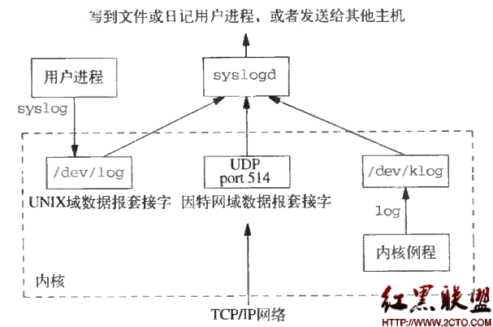

Java日志系统
============

1 日志发展历程
--------------

日志的重要性是随着系统的膨胀而显现的，在一个庞大的系统中查错没有各种日志信息是寸步难行的。所以在系统加入日志是必须的。

最原始的日志方式，就是在程序的适当地方添加System.out.println()方法，但是带来的问题是，系统稳定后，日志太大，如果要减少日志量，就需要重新修改程序，虽然只是注释掉System.out.println()方法。但是万一系统再次出错，又要改。

当然，也有一种解决办法可以实现处理这个问题，在Java中，可以这么写：
```java
public class LogUtil {

private static boolean logSwitch=true; //日志开关,默认为开

public static void log(String smg){

if(logSwitch){

System.out.println(smg);

}

}

}

public class ManualLogApp {

public static void main(String[] args){

new ManualLogApp().test();

}

public void test(){

LogUtil.log("我在手动打日志,呵呵!");

}

}
```
通过这两个类，就实现一个简单的日志工具。当你不想打印日志的时候，可以在LogUtil中改logSwitch的值为flase，那么日志打印功能就关闭了。如果你愿意，你可以将这个开关放到一个配置文件中去修改。还可以让日志打印到文件，但是当你修改实现这个功能的时候，这个日志工具会变得相当的复杂。

为了解决这个问题，程序猿们针对不同的语言平台为做了一系列日志工具包，可应用于java、.net、php、c++，这些日志包都是免费的，使用非常方便，可以极大提高编程效率。并且，为了让众多的日志工具有一个相同操作方式，还提供了一些通用的日志工具包。

最早得到广泛使用的是 log4j，许多应用程序的日志部分都交给了
log4j，不过作为组件开发者，他们希望自己的组件不要紧紧依赖某一个工具，毕竟在同一个时候还有很多其他很多日志工具，假如一个应用程序用到了两个组件，恰好两个组件使用不同的日志工具，那么应用程序就会有两份日志输出了。

为了解决这个问题，Apache Commons Logging （之前叫 Jakarta Commons
Logging，JCL）粉墨登场，JCL 只提供 log
接口，具体的实现则在运行时动态寻找。这样一来组件开发者只需要针对 JCL
接口开发，而调用组件的应用程序则可以在运行时搭配自己喜好的日志实践工具。

所以即使到现在你仍会看到很多程序应用 JCL + log4j
这种搭配，不过当程序规模越来越庞大时，JCL的动态绑定并不是总能成功，具体原因大家可以
Google
一下，这里就不再赘述了。解决方法之一就是在程序部署时静态绑定指定的日志工具，这就是
SLF4J 产生的原因。

Tips：

关于程序绑定的概念：

绑定指的是一个方法的调用与方法所在的类(方法主体)关联起来。对java来说，绑定分为静态绑定和动态绑定；或者叫做前期绑定和后期绑定.

静态绑定：

在程序执行前方法已经被绑定（也就是说在编译过程中就已经知道这个方法到底是哪个类中的方法），此时由编译器或其它连接程序实现。例如：C。针对java简单的可以理解为程序编译期的绑定；这里特别说明一点，java当中的方法只有final，static，private和构造方法是前期绑定

动态绑定：

后期绑定：在运行时根据具体对象的类型进行绑定。

跟 JCL 一样，SLF4J 也是只提供 log
接口，具体的实现是在打包应用程序时所放入的绑定器（名字为
slf4j-XXX-version.jar）来决定，XXX 可以是 log4j12, jdk14, jcl, nop
等，他们实现了跟具体日志工具（比如
log4j）的绑定及代理工作。举个例子：如果一个程序希望用 log4j
日志工具，那么程序只需针对 slf4j-api 接口编程，然后在打包时再放入
slf4j-log4j12-version.jar 和 log4j.jar 就可以了。

现在还有一个问题，假如你正在开发应用程序所调用的组件当中已经使用了 JCL
的，还有一些组件可能直接调用了 java.util.logging，这时你需要一个桥接器（名字为
XXX-over-slf4j.jar）把他们的日志输出重定向到
SLF4J，所谓桥接器就是一个假的日志实现工具，比如当你把 jcl-over-slf4j.jar 放到
CLASS_PATH 时，即使某个组件原本是通过 JCL 输出日志的，现在却会被 jcl-over-slf4j
“骗到”SLF4J 里，然后 SLF4J 又会根据绑定器把日志交给具体的日志实现工具。

2 常见的几种日志
----------------

### 2.1 Log4j

Apache的一个开放源代码项目，通过使用Log4j，我们可以控制日志信息输送的目的地是控制台、文件、GUI组件、甚至是套接口服务器、NT的事件记录器、UNIX
Syslog守护进程等；用户也可以控制每一条日志的输出格式；通过定义每一条日志信息的级别，用户能够更加细致地控制日志的生成过程。这些可以通过一个配置文件来灵活地进行配置，而不需要修改程序代码，是一种经典的日志解决方案。内部把日志系统抽象封装成Logger
、appender 、pattern
等实现。我们可以通过配置文件轻松的实现日志系统的管理和多样化配置。

### 2.2 LOGBack 

Logback是由log4j创始人设计的又一个开源日记组件。logback当前分成三个模块：logback-core,logback-
classic和logback-access。

-   logback-core是其它两个模块的基础模块。

-   logback-classic是log4j的一个 改良版本。此外logback-classic完整实现SLF4J
    API使你可以很方便地更换成其它日记系统如log4j或JDK14 Logging。

-   logback-access访问模块与Servlet容器集成提供通过Http来访问日志的功能。

LOGBack 作为一个通用可靠、快速灵活的日志框架，将作为Log4j 的替代和SLF4J
组成新的日志系统的完整实现。官网上称具有极佳的性能，在关键路径上执行速度是log4j
的10 倍，且内存消耗更少。

### 2.3 SLF4J

简单日记门面(Facade)SLF4J是为各种loging
APIs提供一个简单统一的接口，从而使得最终用户能够在部署的时候配置自己希望的loging
APIs实现。 Logging API实现既可以选择直接实现SLF4J接口的loging APIs如：
NLOG4J、SimpleLogger。也可以通过SLF4J提供的API实现来开发相应的适配器如Log4jLoggerAdapter、JDK14LoggerAdapter。

slf4j全称为Simple Logging Facade for JAVA，java简单日志门面。类似于Apache
Common-Logging，是对不同日志框架提供的一个门面封装，可以在部署的时候不修改任何配置即可接入一种日志实现方案。但是，他在编译时静态绑定真正的Log库。使用SLF4J时，如果你需要使用某一种日志实现，那么你必须选择正确的SLF4J的jar包的集合（各种桥接包）。

使用slf4j的常见代码：
```java
import org.slf4j.Logger;

import org.slf4j.LoggerFactory;

public class A {

private static Log logger = LogFactory.getLog(this.getClass());

}
```
**slf4j静态绑定原理：**

SLF4J 会在编译时会绑定import org.slf4j.impl.StaticLoggerBinder;
该类里面实现对具体日志方案的绑定接入。任何一种基于slf4j
的实现都要有一个这个类。如：org.slf4j.slf4j-log4j12-1.5.6: 提供对 log4j
的一种适配实现。注意：如果有任意两个实现slf4j 的包同时出现，那么就可能出现问题。

### 2.4 Common-Logging 

目前广泛使用的Java日志门面库。通过动态查找的机制，在程序运行时自动找出真正使用的日志库。但由于它使用了ClassLoader寻找和载入底层的日志库，导致了象OSGI[^1]这样的框架无法正常工作，由于其不同的插件使用自己的ClassLoader。尽管OSGI的这种机制保证了插件之间的互相独立，但这也使得Apache
Common-Logging无法工作。

[^1]: OSGi(Open Service Gateway
Initiative，开放服务网关协议)技术是Java动态化模块化系统的一系列规范。

还有一点，Common-logging也是apache提供的一个通用的日志接口。用户可以自由选择第三方的日志组件作为具体实现，像log4j，或者jdk自带的logging，
common-logging会通过动态查找的机制，在程序运行时自动找出真正使用的日志库。

当然，common-logging内部有一个Simple
logger的简单实现，但是功能很弱。所以使用common-logging，通常都是配合着log4j来使用。使用它的好处就是，代码依赖是common-logging而非log4j，
避免了和具体的日志方案直接耦合，在有必要时，可以更改日志实现的第三方库。

使用common-logging的常见代码：
```java
import org.apache.commons.logging.Log;

import org.apache.commons.logging.LogFactory;

public class A {

private static Log logger = LogFactory.getLog(this.getClass());

}
```
**动态查找原理**

Log 是一个接口声明。LogFactory 的内部会去装载具体的日志系统，并获得实现该Log
接口的实现类。LogFactory内部装载日志系统的流程如下：

-   首先，寻找org.apache.commons.logging.LogFactory属性配置。

-   否则，利用JDK1.3 开始提供的service 发现机制，会扫描classpah
    下的META-INF/services/org.apache.commons.logging.LogFactory文件，若找到则装载里面的配置，使用里面的配置。

-   否则，从Classpath 里寻找commons-logging.properties
    ，找到则根据里面的配置加载。

-   否则，使用默认的配置：如果能找到Log4j 则默认使用log4j
    实现，如果没有则使用JDK14Logger 实现，再没有则使用commons-logging
    内部提供的SimpleLog 实现。

从上述加载流程来看，只要引入了log4j 并在classpath 配置了log4j.xml
，则commons-logging 就会使log4j 使用正常，而代码里不需要依赖任何log4j 的代码。

Tips：

JCL在获取第一个Log时，通过LogFactory进行具体实现的加载，因为是通过类加载器进行动态加载的，所以编译时不会出错，而到运行时才发现动态加载没有成功。

3 日志系统的比较
----------------

### 3.1 Log4J与LogBack 

LOGBack作为一个通用可靠、快速灵活的日志框架，将作为Log4j的替代和SLF4J组成新的日志系统的完整实现。LOGBack声称具有极佳的性能，“某些关键操作，比如判定是否记录一条日志语句的操作，其性能得到了显著的提高。这个操作在LogBack中需要3纳秒，而在Log4J中则需要30纳秒。
LogBack创建记录器（logger）的速度也更快：13微秒，而在Log4J中需要23微秒。更重要的是，它获取已存在的记录器只需94纳秒，而
Log4J需要2234纳秒，时间减少到了1/23。跟JUL相比的性能提高也是显著的”。

另外，LOGBack的所有文档是全面免费提供的，不象Log4J那样只提供部分免费文档而需要用户去购买付费文档。

### 3.2 SLF4J和JCL

SLF4J库类似于Apache
Common-Logging。但是，他在编译时静态绑定真正的Log库。使用SLF4J时，如果你需要使用某一种日志实现，那么你必须选择正确的SLF4J的jar包的集合。
如此便可以在OSGI中使用了。

另外，SLF4J
支持参数化的log字符串，避免了之前为了减少字符串拼接的性能损耗而不得不写的

if(logger.isDebugEnable())

现在你可以直接写：

logger.debug(“current user is: {}”, user)

拼装消息被推迟到了它能够确定是不是要显示这条消息的时候，但是获取参数的代价并没有幸免。同时，日志中的参数若超过三个，则需要将参数以数组的形式传入，如：

Object[] params = {value1, value2, value3};

logger.debug(“first value: {}, second value: {} and third value: {}.”, params);

common-logging通过动态查找的机制，在程序运行时自动找出真正使用的日志库。由于它使用了ClassLoader寻找和载入底层的日志库，
导致了象OSGI这样的框架无法正常工作，因为OSGI的不同的插件使用自己的ClassLoader。
OSGI的这种机制保证了插件互相独立，然而却使Apache Common-Logging无法工作。

现在，hibernate、Jetty、spring-OSGi、Wicket和MINA等项目都已经迁移到了SLF4J，由此可见SLF4J的影响力不可忽视。

Head First Log4j
================

3 Log4j的框架
-------------

The previous chapter presented a very simple usage case for log4j. This chapter
discusses the log4j architecture and the rules governing its components. Log4j
has three main components: loggers, appenders and layouts. These three types of
components work together to enable developers to log messages according to their
level. They control the format of log messages as well as their output
destination.

Tips：

框架的三个组件：记录器、输出源和布局器。

The reader familiar with the java.util.logging API introduced in JDK 1.4, will
recognize that log4j's architecture is very similar although log4j offers much
more functionality. Log4j requires JDK 1.1 whereas java.util.logging will only
run on JDK 1.4. Most of the concepts outlined in this document are reproduced
with little variation in java.util.logging albeit with somewhat different names.
In case you had any doubts regarding log4j’s lineage[^2], the present log4j
architecture dates back to early 1999, the JDK 1.4 logging API was not even a
proposal at the time.

[^2]: lineage 英 ['lɪnɪɪdʒ] n. 血统；家系，[遗] 世系

### 3.1 Log4j的整体架构

Log4j uses the classes shown in the diagram below.


图：Log4j的框架结构

Tips：

这是从Log4j2抄过来的图，应该大致是一样的。

Applications using the Log4j 2 API will request a Logger with a specific name
from the LogManager. The LogManager will locate the appropriate LoggerContext
and then obtain the Logger from it. If the Logger must be created it will be
associated with the LoggerConfig that contains either a) the same name as the
Logger, b) the name of a parent package, or c) the root LoggerConfig.
LoggerConfig objects are created from Logger declarations in the configuration.
The LoggerConfig is associated with the Appenders that actually deliver the
LogEvents.

9 深入Logger的源码
------------------

### 9.1 日志的级别

下面是日志级别类的继承结构：

图：日志的继承结构

从上面可以看出，日志的级别Level中共包含三个字段：

-   level：Log4j的日志级别，Debug是10000，Info是20000，Warn是30000，Error是40000，Fatal是50000，Trace是5000，All是最小的Int值，Off是最大的Int值；

-   levelStr：Log4j的日志级别名字，如INFO；

-   syslogEquivalent：对应Syslog日志的级别。

**关于Syslog**

系统日志（Syslog）协议是在一个IP网络中转发系统日志信息的标准，它是在美国加州大学伯克利软件分布研究中心（BSD）的TCP/IP系统实施中开发的，目前已成为工业标准协议，可用它记录设备的日志。Syslog记录着系统中的任何事件，管理者可以通过查看系统记录随时掌握系统状况。系统日志通过Syslog进程记录系统的有关事件，也可以记录应用程序运作事件。通过适当配置，还可以实现运行Syslog协议的机器之间的通信。通过分析这些网络行为日志，可追踪和掌握与设备和网络有关的情况。

Unix/Linux系统中的大部分日志都是通过一种叫做syslog的机制产生和维护的。syslog是一种标准的协议，分为客户端和服务器端，客户端是产生日志消息的一方，而服务器端负责接收客户端发送来的日志消息，并做出保存到特定的日志文件中或者其他方式的处理。

在Linux中，常见的syslog服务器端程序是syslogd守护程序。这个程序可以从三个地方接收日志消息：（1）Unix域套接字
/dev/log；（2）UDP端口514；（3）特殊的设备/dev/klog（读取内核发出的消息）。相应地，产生日志消息的程序就需要通过上述三种方式写入消息，对于大多数程序而言就是向/dev/log这个套接字发送日志消息。



图：

这里说下Syslog中的级别的定义。

Severity的定义如下：


| Numerical Severity Code                                                                                                                                                                                                                                                            |
|------------------------------------------------------------------------------------------------------------------------------------------------------------------------------------------------------------------------------------------------------------------------------------|
| 0 Emergency: system is unusable 1 Alert: action must be taken immediately 2 Critical: critical conditions 3 Error: error conditions 4 Warning: warning conditions 5 Notice: normal but significant condition 6 Informational: informational messages 7 Debug: debug-level messages |

从上表中可以看出，其级别和syslogEquivalent中是对应的，也就是说，在Level类中不仅指定了Log4j的级别，还定义了和Syslog中的级别对应的级别。

### 9.2 LogManager

Use the LogManager class to retreive Logger instances or to operate on the
current LoggerRepository. When the LogManager class is loaded into memory the
default initalzation procedure is inititated. The default intialization
procedure is described in the short log4j manual.

Tips:

LogManager要注意三点：一是，该全局只有一个，在第一次加载到内存的时候进行初始化；二是，加载配置文件是在初始化时完成的；三是，通过该类可以控制logger；

下图是LogManager的结构：

图：继承结构

从上面的继承结构中可以看出Log4j的工作原理：

-   LogManager全局唯一并进行初始化；

-   LogManager保存了一个RepositorySelector对象，用来选择保存日志的仓库；默认情况下使用DefaultRepositorySelector作为选择器；

-   默认的仓库是Hierarchy，它实现了LoggerRepository接口；

-   仓库中保存的对象是日志Logger；

-   LogManager中的大部分操作都是通过间接获取LoggerRepository对象，从而被LoggerRepository类代理完成的。

#### 9.2.1 初始化过程

读取初始化配置文件并进行配置。分为两个步骤：

首先从System.getProperty()中获取系统的配置：log4j.defaultInitOverride、log4j.configuration和log4j.configuratorClass是虚拟机系统初始化时提供的日志配置；configuratorClass用于指明使用哪个类来加载配置，缺省情况下，xml文件使用DOMConfigurator来加载，属性配置文件property通过PropertyConfigurator来加载；

另一是获取用户类路径下的log4j.xml和log4j.properties两个配置文件；

注意，上述文件是按照顺序加载的。如果虚拟机系统已经配置了日志的输出，则下面的两个配置将不起作用。

| **try** { OptionConverter.*selectAndConfigure*(url, configuratorClassName, LogManager.*getLoggerRepository*()); } **catch** (NoClassDefFoundError e) { LogLog.*warn*("Error during default initialization", e); } |
|-------------------------------------------------------------------------------------------------------------------------------------------------------------------------------------------------------------------|


上面是LogManager中完成初始化的语句，可见，其是通过OptionConverter类中提供的工具方法完成的初始化工作。
```java
| **static public void** selectAndConfigure(URL url, String clazz, LoggerRepository hierarchy) { Configurator configurator = **null**; String filename = url.getFile(); **if**(clazz == **null** && filename != **null** && filename.endsWith(".xml")) { clazz = "org.apache.log4j.xml.DOMConfigurator"; } **if**(clazz != **null**) { LogLog.*debug*("Preferred configurator class: " + clazz); configurator = (Configurator) *instantiateByClassName*(clazz, Configurator.**class**, **null**); **if**(configurator == **null**) { LogLog.*error*("Could not instantiate configurator ["+clazz+"]."); **return**; } } **else** { configurator = **new** PropertyConfigurator(); } configurator.doConfigure(url, hierarchy); } |
|-------------------------------------------------------------------------------------------------------------------------------------------------------------------------------------------------------------------------------------------------------------------------------------------------------------------------------------------------------------------------------------------------------------------------------------------------------------------------------------------------------------------------------------------------------------------------------------------------------------------------------------------------------------------------------------------------------------------------------|
```

该方法最终通过确定配置文件的类型，用配置工具类完成了初始化配置工作。关于Dom或Properties的相关内容，请参考配置的部分。

#### 9.2.2 初始化过程译文

Log4j类库没有对它的环境作任何假设。特别是，log4j没有默认的输出源。然而，在某些定义明确的环境下，日志记录器类的静态的初始化器将尝试自动配置log4j。java语言保证在往内存中装载类时，类的静态初始化器仅仅可以被调用一次。不同类装载器可能装载相同类的不同拷贝，记住这是很重要的。Java虚拟机认为这些相同类的拷贝是完全不相关的。

在依赖运行环境的应用程序的正确入口处，默认的初始化是非常有用的。例如，在web服务器(web-server)的控制下，相同的应用程序可以被当作一个独立的应用程序、applet或者servlet。

下面定义的是确切的默认注视化算法：

-   设定log4j.defaultInitO覆盖系统属性的为任何其它值，“false”将导致log4j忽略默认的初始化过程(这个过程)。

-   设定资源字符串变量为log4j.configuration的系统属性值。指定默认初始化文件的最好方法是通过log4j.configuration的系统属性。万一系统属性log4j.configuration没有定义，可以设定字符串变量资源到它默认值“log4j.properties”。

-   尝试转换资源变量为URL

-   假如资源变量不能转换为URL，例如由于一个MalformedURLException异常，然后通过调用返回值为URL的org.apache.log4j.helpers.Loader.getResource(resource,
    Logger.class)方法在classpath中查找资源。注意，字符串"log4j.properties"包含(constitutes)一个丑陋的URL。

>   参考Loader.getResource(java.lang.String)方法，获得查找路径的列表。

-   假如没有URL，忽略默认的初始化。其它，通过URL来配置log4j。

常常使用PropertyConfigurator类解析URL来配置log4j，若URL以“.xml”后缀名结束，将使用DOMConfigurator来解释。你可以有选择指定自定义的配置器。log4j.configuratorClass的系统属性值被当作你自定义配置器的完整类名。你所指定的自定义配置器必须实现Configurator接口。

#### 9.2.3 解析配置文件

上面提到，在LogManager中会去加载日志的配置文件（这里以Properties的形式进行讲解），通过解析后，会去调用PropertyConfigurator类完成初始化的配置。

首先来看一个方法：

| **void** parseCategory(Properties props, Logger logger, String optionKey, String loggerName, String value) { } props：加载的配置文件 logger：要配置的Logger，如RootLogger optionKey：配置文件中的有效的键，如log4j.rootlogger loggerName：Logger的名字，如Root value：配置文件中，对应键的值 |
|----------------------------------------------------------------------------------------------------------------------------------------------------------------------------------------------------------------------------------------------------------------------------------------------|


上面这个方法可以看做是用来加载配置的入口。程序在加载初始化的时候会先去找Root的配置，解析出来Root的Logger，然后调用上面的方法来加载Root日志的Appender和Layout等。解析顺序如下所示：

-   解析Root的相关配置；

-   解析日志工厂；

-   解析其他日志的相关配置

具体过程可以参看代码进行了解。

### 9.3 Logger

下图是Logger的继承结构：

Logger是log4j中最重要的类，通过该类可以获取唯一的日志对象，如果目前还不存在，则创建新的日志对象。

所有的Logger对象都由LogManager进行管理。Use the LogManager class to retreive
Logger instances or to operate on the current LoggerRepository. When the
LogManager class is loaded into memory the default initalzation procedure is
inititated. The default intialization procedure is described in the short log4j
manual.

下面是LogManager初始化的静态块：
```java
| **static** { // By default we use a DefaultRepositorySelector which always returns 'h'. // RootLogger继承自Logger，是一个final类，是特殊的日志。 Hierarchy h = **new** Hierarchy(**new** RootLogger((Level) Level.*DEBUG*)); *repositorySelector* = **new** DefaultRepositorySelector(h); /\*\* Search for the properties file log4j.properties in the CLASSPATH. \*/ String override =OptionConverter.*getSystemProperty*(DEFAULT_INIT_OVERRIDE_KEY, **null**); // if there is no default init override, then get the resource // specified by the user or the default config file. **if**(override == **null** \|\| "false".equalsIgnoreCase(override)) { String configurationOptionStr = OptionConverter.*getSystemProperty*( DEFAULT_CONFIGURATION_KEY, **null**); String configuratorClassName = OptionConverter.*getSystemProperty*( CONFIGURATOR_CLASS_KEY, **null**); URL url = **null**; // if the user has not specified the log4j.configuration // property, we search first for the file "log4j.xml" and then // "log4j.properties" **if**(configurationOptionStr == **null**) { url = Loader.*getResource*(*DEFAULT_XML_CONFIGURATION_FILE*); **if**(url == **null**) { url = Loader.*getResource*(DEFAULT_CONFIGURATION_FILE); } } **else** { **try** { url = **new** URL(configurationOptionStr); } **catch** (MalformedURLException ex) { // so, resource is not a URL: // attempt to get the resource from the class path url = Loader.*getResource*(configurationOptionStr); } } // If we have a non-null url, then delegate the rest of the // configuration to the OptionConverter.selectAndConfigure // method. **if**(url != **null**) { LogLog.*debug*("Using URL ["+url+"] for automatic log4j configuration."); **try** { OptionConverter.*selectAndConfigure*(url, configuratorClassName, LogManager.*getLoggerRepository*()); } **catch** (NoClassDefFoundError e) { LogLog.*warn*("Error during default initialization", e); } } **else** { LogLog.*debug*("Could not find resource: ["+configurationOptionStr+"]."); } } **else** { LogLog.*debug*("Default initialization of overridden by " + DEFAULT_INIT_OVERRIDE_KEY + "property."); } } |
|----------------------------------------------------------------------------------------------------------------------------------------------------------------------------------------------------------------------------------------------------------------------------------------------------------------------------------------------------------------------------------------------------------------------------------------------------------------------------------------------------------------------------------------------------------------------------------------------------------------------------------------------------------------------------------------------------------------------------------------------------------------------------------------------------------------------------------------------------------------------------------------------------------------------------------------------------------------------------------------------------------------------------------------------------------------------------------------------------------------------------------------------------------------------------------------------------------------------------------------------------------------------------------------------------------------------------------------------------------------------------------------------------------------------------------------------------------------------------------------------------------------------------------------------------------------------------------------------------------------------------------------------------------------------------------------------------------------------------------------------------------------------------------------------------------------------------------------------------------------------------------------------------------------------------------------------------------------------------------------------------------------------------------------------------------------------------------------------------------------------------------------------------------------------------|
```

LogManager初始化的时机：在第一次加载LogManager的时候，会调用该静态块进行一些初始化动作。

-   使用类Hierarchy作为日志的仓库，即保存日志及其父子关系；

-   初始化RepositorySelector为DefaultRepositorySelector。程序中使用这个RepositorySelector的目的是为了程序的灵活性，用户可以自定义日志的仓库，并通过该类来指定使用该仓库作为日志的仓库；

-   读取初始化配置文件并进行配置。这里分为两个步骤：

>   首先从System.getProperty()中获取系统的配置：log4j.defaultInitOverride、log4j.configuration和log4j.configuratorClass是虚拟机系统初始化时提供的日志配置；configuratorClass用于指明使用哪个类来加载配置，缺省情况下，xml文件使用DOMConfigurator来加载，属性配置文件property通过PropertyConfigurator来加载；

>   另一是获取用户类路径下的log4j.xml和log4j.properties两个配置文件；

>   注意，上述文件是按照顺序加载的。如果虚拟机系统已经配置了日志的输出，则下面的两个配置将不起作用。

Tips：

关于LogManager参考相关的内容。

下面是Logger中具有的属性：
```java
| **public class** Category **implements** AppenderAttachable { **protected** String name; // 日志的名字，必有 **volatile protected** Level level; // 日志的级别，必有 **volatile protected** Category parent; // 日志的父亲节点 **protected** ResourceBundle resourceBundle; // Xxx **protected** LoggerRepository repository; // 该日志所在的仓库 AppenderAttachableImpl aai; // 该日志的输出源 **protected boolean** additive = **true**; // 输出源的叠加性，初值为true // 方法略.. . } |
|------------------------------------------------------------------------------------------------------------------------------------------------------------------------------------------------------------------------------------------------------------------------------------------------------------------------------------------------------------------------------------------------------------------------------------------------------------------------------------------|
```

#### 9.3.1 输出源的绑定

AppenderAttachable
是一个接口，该接口定义的方法都是对logger进行绑定输出源的操作。

其API如下所示：
```java
| **public interface** AppenderAttachable { **public void** addAppender(Appender newAppender); // 添加Appender **public** Enumeration getAllAppenders(); // 获取Appender **public** Appender getAppender(String name); **public boolean** isAttached(Appender appender); // 判断是否添加过Appender **void** removeAllAppenders(); // 删除Appender  **void** removeAppender(Appender appender); **void** removeAppender(String name); } |
|--------------------------------------------------------------------------------------------------------------------------------------------------------------------------------------------------------------------------------------------------------------------------------------------------------------------------------------------------------------------------------------------------------------------------------------|
```

下面是该接口的默认实现：
```java
| **public class** AppenderAttachableImpl **implements** AppenderAttachable { /\*\* Array of appenders. \*/  **protected** Vector appenderList; // 实现的方法略 } |
|-----------------------------------------------------------------------------------------------------------------------------------------------------------------|
```

从上述方法中可以看到，保存Appender的结构是个Vector，同一个Logger上可以绑定多个输出源。

Tips：

每个Logger都有一个AppenderAttachableImpl的实现，因此，每个Logger可以各自维护各自的输出源。

#### 9.3.2 日志级别的继承

日志的添加是在Logger中通过静态的getLogger方法实现新日志的添加，此时并未给新添加的日志设置级别，这是合理的。通常用户也不需要关心具体到某个日志的级别，而是在层次关系上设置级别。那么是否可以设置具体日志的级别呢？答案是肯定的，通过Logger中的setLevel方法可以给特定的日志设置其显示级别。

未设置的日志的级别为Null值。

所谓日志级别的继承实际上是在进行打印日志时提供了一种判断策略，而不是在创建的时候直接继承其父亲的级别，此时其级别可能还是Null值。级别的继承是日志父子关系上的继承。
```java
| **public** Level getEffectiveLevel() { **for**(Category c = **this**; c != **null**; c=c.parent) { **if**(c.level != **null**) **return** c.level; } **return null**; // If reached will cause an NullPointerException. } |
|---------------------------------------------------------------------------------------------------------------------------------------------------------------------------------------------------------------------------|
```

#### 9.3.3 日志的打印过程

**第一步**

通过级别进行过滤，判断该日志是否需要进行打印输出。这个过滤分为两层，一是仓库级别的过滤；二是日志级别的过滤，通过getEffectiveLevel()方法可以获取该日志的有效级别，可能是已有的，也可能是继承自双亲的。
```java
| **public void** info(Object message) { **if**(repository.isDisabled(Level.*INFO_INT*)) **return**; **if**(Level.*INFO*.isGreaterOrEqual(**this**.getEffectiveLevel())) forcedLog(*FQCN*, Level.*INFO*, message, **null**); } |
|------------------------------------------------------------------------------------------------------------------------------------------------------------------------------------------------------------------------------|
```

**第二步**

构造日志事件，并通过调用输出源来进行日志的打印输出。日志间存在着父子关系，这个父子关系是由Hierarchy来维护的，每个日志都有其父日志（包括Root日志），这个父日志和前缀的层级关系是不同的，关于这点请参考下节的内容。

| **public void** callAppenders(LoggingEvent event) { **int** writes = 0; **for**(Category c = **this**; c != **null**; c=c.parent) { // Protected against simultaneous call to addAppender, removeAppender,... **synchronized**(c) { **if**(c.aai != **null**) { writes += c.aai.appendLoopOnAppenders(event); } **if**(!c.additive) { **break**; } } } **if**(writes == 0) { repository.emitNoAppenderWarning(**this**); } } |
|------------------------------------------------------------------------------------------------------------------------------------------------------------------------------------------------------------------------------------------------------------------------------------------------------------------------------------------------------------------------------------------------------------------------------|


Tips：

注意，在配置文件中定义的层级关系实际上会当做一个正常的日志Logger，而不是一个前缀节点。具体参考配置中的Logger的配置。

### 9.5 Hierarchy

下图是Hierarchy的继承结构：

图：Hierarchy的继承结构

在Hierarchy中具有一个唯一的构造函数，其参数是一个Root日志。在log4j中，所有的日志都是根日志的后代：

| **public** Hierarchy(Logger root) { ht = **new** Hashtable(); // 保存所有的日志，Key是日志的名字，Value是一个Logger listeners = **new** Vector(1); // 仓库的监听者，HierarchyEventListener **this**.root = root; // Enable all level levels by default. setThreshold(Level.*ALL*); // 缺省所有日志都打印 **this**.root.setHierarchy(**this**); // 保存根日志的仓库 rendererMap = **new** RendererMap(); defaultFactory = **new** DefaultCategoryFactory(); // 真正构造日志的工厂 } |
|------------------------------------------------------------------------------------------------------------------------------------------------------------------------------------------------------------------------------------------------------------------------------------------------------------------------------------------------------------------------------------------------------------------------------------------------------------------------------------|


Tips：

真正的日志构造过程是这样的，通过Logger的静态方法来获取日志
Logger的仓库（Hierarchy） 构造Logger的工厂 Logger。

下面我们分析一下日志仓库具有的功能：

| **public interface** LoggerRepository { // 在设置了仓库的级别后可以通过isDisabled()方法来判断某个级别的日志是否被丢弃了 **boolean** isDisabled(**int** level); **public void** setThreshold(Level level); **public void** setThreshold(String val); **public** Level getThreshold(); // 从仓库里获取日志等 **public** Logger getLogger(String name); **public** Logger getLogger(String name, LoggerFactory factory); **public** Logger getRootLogger(); **public abstract** Logger exists(String name); **public** Enumeration getCurrentLoggers(); // 仓库的监听器 **public void** addHierarchyEventListener(HierarchyEventListener listener); **public void** emitNoAppenderWarning(Category cat); **public abstract void** fireAddAppenderEvent(Category logger, Appender appender); // 仓库的相关控制 **public abstract void** shutdown(); **public abstract void** resetConfiguration(); } |
|--------------------------------------------------------------------------------------------------------------------------------------------------------------------------------------------------------------------------------------------------------------------------------------------------------------------------------------------------------------------------------------------------------------------------------------------------------------------------------------------------------------------------------------------------------------------------------------------------------------------------------------------------------------------------------------------------------------------------------------------------------------------------------------------------------------------------------------------------------------------------------------------------|


下面是其重要实现：

| **public class** Hierarchy **implements** LoggerRepository, RendererSupport, ThrowableRendererSupport { **private** LoggerFactory defaultFactory; **private** Vector listeners; Hashtable ht; Logger root; RendererMap rendererMap; **int** thresholdInt; Level threshold; **boolean** emittedNoAppenderWarning = **false**; **boolean** emittedNoResourceBundleWarning = **false**; **private** ThrowableRenderer throwableRenderer = **null**; // 方法略 } |
|--------------------------------------------------------------------------------------------------------------------------------------------------------------------------------------------------------------------------------------------------------------------------------------------------------------------------------------------------------------------------------------------------------------------------------------------------------------|


#### 9.5.1 LoggerFactory

LoggerFactory
是一个接口，实现该接口的目的是为了创建Logger或Logger的子类。缺省的实现类是DefaultCategoryFactory。

#### 9.5.2 父子关系更新

新增加到仓库中的日志需要对当前仓库中已有的日志进行一些更新操作，这个增加日志的动作如下所示：

| **public** Logger getLogger(String name, LoggerFactory factory) { // System.out.println("getInstance("+name+") called."); *CategoryKey* key = **new** *CategoryKey*(name); // Synchronize to prevent write conflicts. Read conflicts (in // getChainedLevel method) are possible only if variable // assignments are non-atomic. Logger logger; **synchronized** (*ht*) { Object o = ht.get(key); **if** (o == **null**) { // 新日志，则更新父节点 logger = factory.makeNewLoggerInstance(name); logger.setHierarchy(**this**); ht.put(key, logger); updateParents(logger); **return** logger; } **else if** (o **instanceof** Logger) { // 直接找到 **return** (Logger) o; } **else if** (o **instanceof** ProvisionNode) { // 是ProvisionNode，更新子节点再更新父节点 // System.out.println("("+name+") ht.get(this) returned ProvisionNode"); logger = factory.makeNewLoggerInstance(name); logger.setHierarchy(**this**); ht.put(key, logger); updateChildren((ProvisionNode) o, logger); updateParents(logger); **return** logger; } **else** { // It should be impossible to arrive here **return null**; // but let's keep the compiler happy. } } } |
|-------------------------------------------------------------------------------------------------------------------------------------------------------------------------------------------------------------------------------------------------------------------------------------------------------------------------------------------------------------------------------------------------------------------------------------------------------------------------------------------------------------------------------------------------------------------------------------------------------------------------------------------------------------------------------------------------------------------------------------------------------------------------------------------------------------------------------------------------------------------------------------------------------------------------------------------------------------------------------------------------------------------------------------------------------------------------------------------------------------------------------------------------------------|


正如我们前面看到的，在Hierarchy中有一个Hashtable来保存日志对象，其保存的方式是键值对，键为CategoryKey（可认为是Logger的名字），值为日志对象Logger。

新添加日志时，需要将其放置到Hashtable中，并调用updateParents方法来更新其父子关系。该方法的源码如下所示：

This method loops through all the \*potential\* parents of 'cat'. There 3
possible cases:

1) No entry for the potential parent of 'cat' exists We create a ProvisionNode
for this potential parent and insert 'cat' in that provision node.

2) There entry is of type Logger for the potential parent. The entry is 'cat's
nearest existing parent. We update cat's parent field with this entry. We also
break from the loop because updating our parent's parent is our parent's
responsibility.

3) There entry is of type ProvisionNode for this potential parent. We add 'cat'
to the list of children for this potential parent.

Tips：

ProvisionNode继承自Vector，用来保存子节点，没有其他功能。

| **final private void** updateParents(Logger cat) { String name = cat.*name*; **int** length = name.length(); **boolean** parentFound = **false**; // System.out.println("UpdateParents called for " + name); // if name = "w.x.y.z", loop *thourgh* "w.x.y", "w.x" and "w", but not // "w.x.y.z", 循环了3次，不是四次 **for** (**int** i = name.lastIndexOf('.', length - 1); i \>= 0; i = name .lastIndexOf('.', i - 1)) { String substr = name.substring(0, i); // System.out.println("Updating parent : " + *substr*); *CategoryKey* key = **new** *CategoryKey*(substr); // simple constructor Object o = *ht*.get(key);  // Create a provision node for a future parent. // 没有找见，创建一个ProvisionNode，用作未来的父节点 **if** (o == **null**) { // System.out.println("No parent "+*substr*+" found. Creating ProvisionNode."); *ProvisionNode* pn = **new** *ProvisionNode*(cat); *ht*.put(key, pn); } **else if** (o **instanceof** Category) { // 父节点是一个Logger parentFound = **true**; cat.*parent* = (Category) o; // System.out.println("Linking " + cat.name + " -\> " + // ((Category) o).name); **break**; // no need to update the ancestors of the closest // ancestor } **else if** (o **instanceof** *ProvisionNode*) { // 父节点是ProvisionNode *((ProvisionNode) o)*.addElement(cat); } **else** { Exception e = **new** IllegalStateException( "unexpected object type " + o.getClass() + " in ht."); e.printStackTrace(); } } // If we could not find any existing parents, then link with root. **if** (!parentFound) cat.*parent* = *root*; // 不存在父，则其父为根节点 } |
|---------------------------------------------------------------------------------------------------------------------------------------------------------------------------------------------------------------------------------------------------------------------------------------------------------------------------------------------------------------------------------------------------------------------------------------------------------------------------------------------------------------------------------------------------------------------------------------------------------------------------------------------------------------------------------------------------------------------------------------------------------------------------------------------------------------------------------------------------------------------------------------------------------------------------------------------------------------------------------------------------------------------------------------------------------------------------------------------------------------------------------------------------------------------------------------------------------------------------------------------------------------------------------------------------------------------------------------------------------------------------------------------------------------------------------------------------------------------------------------------------------------------------------------------------------------------------------------------------------------|


**更新子节点过程**

We update the links for all the children that placed themselves in the provision
node 'pn'. The second argument 'cat' is a reference for the newly created
Logger, parent of all the children in 'pn' We loop on all the children 'c' in
'pn': If the child 'c' has been already linked to a child of 'cat' then there is
no need to update 'c'. Otherwise, we set cat's parent field to c's parent and
set c's parent field to cat.

| **final private void** updateChildren(*ProvisionNode* pn, Logger logger) { // System.out.println("updateChildren called for " + logger.name); **final int** last = pn.size(); **for** (**int** i = 0; i \< last; i++) { Logger l = (Logger) pn.elementAt(i); // System.out.println("Updating child " +p.name); // Unless this child already points to a correct (lower) parent, // make cat.parent point to l.parent and l.parent to cat. **if** (!l.*parent*.name.startsWith(logger.*name*)) { logger.*parent* = l.*parent*; l.*parent* = logger; } } } |
|----------------------------------------------------------------------------------------------------------------------------------------------------------------------------------------------------------------------------------------------------------------------------------------------------------------------------------------------------------------------------------------------------------------------------------------------------------------------------------------------------------------------------------------------------------|


此时，更新的前提是，仓库中已经存在该日志，且为ProvisionNode，新加进来的日志与该已存在的日志同名。判断原来ProvisionNode下的子日志的前缀是否为新加入的日志，即判断父子关系是否已经建立正确了，否则需要修改父子关系。

Tips：

节点间的父子关系，即Logger中的parent属性，在某些时刻并不等同于类名前缀间的匹配关系。如x.y.z和x.y，如果先创建x.y.z的日志，则此时在仓库中一共有两个ProvisionNode，一个Logger，且该Logger的父亲日志是Root，而不是某个ProvisionNode，另外需要注意ProvisionNode也不能作为某个日志的父亲。

在创建x.y时，发现ProvisionNode下的x.y.z的父日志是Root，而不是x.y，因此需要修改。

#### 9.5.3 仓库的监听器

仓库的监听者都是HierarchyEventListener接口的子类，目前来看，这个监听器好像没啥用。源码如下所示：

| **public interface** HierarchyEventListener { **public void** addAppenderEvent(Category cat, Appender appender); **public void** removeAppenderEvent(Category cat, Appender appender); } |
|------------------------------------------------------------------------------------------------------------------------------------------------------------------------------------------|


### 9.6 LoggingEvent

The internal representation of logging events. When an affirmative decision is
made to log then a LoggingEvent instance is created. This instance is passed
around to the different log4j components.

This class is of concern to those wishing to extend log4j.

Tips：

LoggingEvent很重要。

LoggingEvent中有三个构造函数，其中最为重要的一个构造函数为：

| /\*\* Instantiate a LoggingEvent from the supplied parameters. \<p\>Except {\@link \#timeStamp} all the other fields of \<code\>LoggingEvent\</code\> are filled when actually needed. \<p\> **\@param** logger The logger generating this event. **\@param** level The level of this event. **\@param** message The message of this event. **\@param** throwable The throwable of this event. \*/ **public** LoggingEvent(String fqnOfCategoryClass, Category logger, Priority level, Object message, Throwable throwable) { **this**.fqnOfCategoryClass = fqnOfCategoryClass; **this**.logger = logger; **this**.categoryName = logger.getName(); **this**.level = level; **this**.message = message; **if**(throwable != **null**) { **this**.throwableInfo = **new** ThrowableInformation(throwable, logger); } timeStamp = System.*currentTimeMillis*(); } |
|-----------------------------------------------------------------------------------------------------------------------------------------------------------------------------------------------------------------------------------------------------------------------------------------------------------------------------------------------------------------------------------------------------------------------------------------------------------------------------------------------------------------------------------------------------------------------------------------------------------------------------------------------------------------------------------------------------------------------------------------------------------------------------------------------------------------------------------------------------------------|


其中：

fqnOfCategoryClass是Category.class.getName()，是固定的字符串；

logger是产生该日志事件的日志对象；

throwable决定是否有异常，可以为空。

Tips：

除该构造函数中提供的参数是必须的外，注意事件戳（创建事件时自动生成），在日志事件类LoggingEvent中的其余成员变量都不是必须的。

参考文献
--------

1.  Log4j使用手册：log4j-manual.pdf

JDK14 Logging
=============

1 日志的级别
------------

The Level class defines a set of standard logging levels that can be used to
control logging output. The logging Level objects are ordered and are specified
by ordered integers. Enabling logging at a given level also enables logging at
all higher levels.

Clients should normally use the predefined Level constants such as Level.SEVERE.

The levels in descending order are:

-   SEVERE (highest value)

-   WARNING

-   INFO

-   CONFIG

-   FINE

-   FINER

-   FINEST (lowest value) 更详细，但级别最低

In addition there is a level OFF that can be used to turn off logging, and a
level ALL that can be used to enable logging of all messages.

It is possible for third parties to define additional logging levels by
subclassing Level. In such cases subclasses should take care to chose unique
integer level values and to ensure that they maintain the Object uniqueness
property across serialization by defining a suitable readResolve method.

Java自带的日志分为以下几个级别：

| // 注意和Log4j中的：Fatal、Error、Warn、Info、Debug对比 **public static final** Level *OFF* = **new** Level("OFF",Integer.*MAX_VALUE*, *defaultBundle*); **public static final** Level *SEVERE* = **new** Level("SEVERE",1000, *defaultBundle*); **public static final** Level *WARNING* = **new** Level("WARNING", 900, *defaultBundle*); **public static final** Level *INFO* = **new** Level("INFO", 800, *defaultBundle*); **public static final** Level *CONFIG* = **new** Level("CONFIG", 700, *defaultBundle*); // 注意和Log4j中的：Trace对比，但是更详细，追踪的细节逐渐提高FINE \< FINER \< FINEST /\*\* \* FINE is a message level providing tracing information. \* \<p\> \* All of FINE, FINER, and FINEST are intended for relatively \* detailed tracing. The exact meaning of the three levels will \* vary between subsystems, but in general, FINEST should be used \* for the most voluminous detailed output, FINER for somewhat \* less detailed output, and FINE for the lowest volume (and \* most important) messages. \* \<p\> \* In general the FINE level should be used for information \* that will be broadly interesting to developers who do not have \* a specialized interest in the specific subsystem. \* \<p\> \* FINE messages might include things like minor (recoverable) \* failures. Issues indicating potential performance problems \* are also worth logging as FINE. \* This level is initialized to \<CODE\>500\</CODE\>. \*/ **public static final** Level *FINE* = **new** Level("FINE", 500, *defaultBundle*); **public static final** Level *FINER* = **new** Level("FINER", 400, *defaultBundle*); **public static final** Level *FINEST* = **new** Level("FINEST", 300, *defaultBundle*); /\*\* \* ALL indicates that all messages should be logged. \* This level is initialized to \<CODE\>Integer.MIN_VALUE\</CODE\>. \*/ **public static final** Level *ALL* = **new** Level("ALL", Integer.*MIN_VALUE*, *defaultBundle*); |
|-------------------------------------------------------------------------------------------------------------------------------------------------------------------------------------------------------------------------------------------------------------------------------------------------------------------------------------------------------------------------------------------------------------------------------------------------------------------------------------------------------------------------------------------------------------------------------------------------------------------------------------------------------------------------------------------------------------------------------------------------------------------------------------------------------------------------------------------------------------------------------------------------------------------------------------------------------------------------------------------------------------------------------------------------------------------------------------------------------------------------------------------------------------------------------------------------------------------------------------------------------------------------------------------------------------------------------------------------------------------------------------------------------------------------------------------------------------------------------------------------------------------------------------------------------------------------------------------------------------------------------------------------------------------------------------------------------------------------------------------------------------------------------------------------------------------------------------------------------------------------------------------------------------------------------------------------------------------------------------|


Tips：

7个级别。

2 LogManager
------------

### 2.1 成员变量分析

其API如下所示:

| **public class** LogManager { // The global LogManager object **private static** LogManager *manager*; // 全局唯一，保存日志及相关的控制工作。 **private final static** Handler[] *emptyHandlers* = { }; **private** Properties props = **new** Properties(); // 保存加载的配置 **private** PropertyChangeSupport changes = **new** PropertyChangeSupport(LogManager.**class**); **private final static** Level *defaultLevel* = Level.*INFO*; // Table of known loggers. Maps names to Loggers. **private** Hashtable\<String,Logger\> loggers = **new** Hashtable\<String,Logger\>(); // Tree of known loggers **private** LogNode root = **new** LogNode(**null**); **private** Logger rootLogger; // Have we done the primordial reading of the configuration file? // (Must be done after a suitable amount of java.lang.System // initialization has been done) **private volatile boolean** readPrimordialConfiguration; // 判断是否已经加载了配置 // Have we initialized global (root) handlers yet? // This gets set to false in readConfiguration **private boolean** initializedGlobalHandlers = **true**; // True if JVM death is imminent and the exit hook has been called. **private boolean** deathImminent; } |
|--------------------------------------------------------------------------------------------------------------------------------------------------------------------------------------------------------------------------------------------------------------------------------------------------------------------------------------------------------------------------------------------------------------------------------------------------------------------------------------------------------------------------------------------------------------------------------------------------------------------------------------------------------------------------------------------------------------------------------------------------------------------------------------------------------------------------------------------------------------------------------------------------------------------------------------------------------------------------------------------------------------------------------------------------------------------------------------------------------------------------------------------------------------------------------------------------------------------------------|


### 2.2 初始化过程

与Log4j一样，在java.util.logging中存在一个单一的全局 LogManager
对象，它可用于维护 Logger 和日志服务的一组共享状态。

此 LogManager 对象：

-   管理 Logger 对象的层次结构名称空间。所有指定的 Logger 均存储在此名称空间中。

-   管理一组日志控制属性。这些是供 Handler
    及其他日志对象用于自我配置的简单键-值对。

可以使用 LogManager.getLogManager() 获取全局 LogManager 对象。LogManager
对象是在类初始化过程中创建的，过后便不能更改。

在启动时，使用 java.util.logging.manager 系统属性定位 LogManager
类。其源码如下所示：

| **static** { AccessController.*doPrivileged*(**new** PrivilegedAction() { **public** Object run() { String cname = **null**; **try** { cname = System.*getProperty*("java.util.logging.manager"); **if** (cname != **null**) { **try** { Class clz = ClassLoader.*getSystemClassLoader*() .loadClass(cname); manager = (LogManager) clz.newInstance(); } **catch** (ClassNotFoundException ex) { Class clz = Thread.*currentThread*() .getContextClassLoader().loadClass(cname); manager = (LogManager) clz.newInstance(); } } } **catch** (Exception ex) { System.*err*.println("Could not load Logmanager \\"" + cname + "\\""); ex.printStackTrace(); } **if** (manager == **null**) { manager = **new** LogManager(); } // Create and retain Logger for the root of the namespace. manager.rootLogger = manager.**new** RootLogger(); manager.addLogger(manager.rootLogger); // Adding the global Logger. Doing so in the Logger.\<clinit\> // would deadlock with the LogManager.\<clinit\>. Logger.global.setLogManager(manager); manager.addLogger(Logger.global); // We don't call readConfiguration() here, as we may be running // very early in the JVM startup sequence. Instead // readConfiguration // will be called lazily in getLogManager(). **return null**; } }); } |
|-----------------------------------------------------------------------------------------------------------------------------------------------------------------------------------------------------------------------------------------------------------------------------------------------------------------------------------------------------------------------------------------------------------------------------------------------------------------------------------------------------------------------------------------------------------------------------------------------------------------------------------------------------------------------------------------------------------------------------------------------------------------------------------------------------------------------------------------------------------------------------------------------------------------------------------------------------------------------------------------------------------------------------------------------------------------------------------------------------------------------------------------------------------------------------------------------------------------------------------------------------------------------------------------|


Tips：

LogManager是可以指定的。在上面的初始化过程中在加载完LogManager后还直接初始化了一个Root日志和一个Global日志。

虽然Java的日志系统也有配置，但与Log4j不同，Java自带的日志系统的配置是在第一次使用Logger的时候才加载的；而Log4j是在初始化的时候加载和配置的。源码如下所示：

| **public static** LogManager getLogManager() { **if** (manager != **null**) { manager.readPrimordialConfiguration(); // 读取原始的配置文件 } **return** manager; } **private void** readPrimordialConfiguration() { **if** (!readPrimordialConfiguration) { // Boolean值，先判断是否读取过了配置文件 **synchronized** (**this**) { **if** (!readPrimordialConfiguration) { // If System.in/out/err are null, it's a good // indication that we're still in the // bootstrapping phase **if** (System.out == **null**) { **return**; } readPrimordialConfiguration = **true**; **try** { AccessController.doPrivileged(**new** PrivilegedExceptionAction() { **public** Object run() **throws** Exception { readConfiguration(); // 读取配置 **return null**; } }); } **catch** (Exception ex) { // System.err.println("Can't read logging configuration:"); // ex.printStackTrace(); } } } } } |
|------------------------------------------------------------------------------------------------------------------------------------------------------------------------------------------------------------------------------------------------------------------------------------------------------------------------------------------------------------------------------------------------------------------------------------------------------------------------------------------------------------------------------------------------------------------------------------------------------------------------------------------------------------------------------------------------------------------------------------------------------------------------------------------------------------------------------------------------------------------------------------------------|


默认情况下，LogManager 从 JRE 目录的属性文件 "lib/logging.properties"
中读取其初始配置。如果编辑该属性文件，则可更改此 JRE 的所有用户的默认日志配置。

另外，LogManager 使用两个可选的允许更好地控制初始配置读取的系统属性：

"java.util.logging.config.class"

"java.util.logging.config.file"

这两个属性可以通过 Preferences API 来设置，既可作为 "java"
命令的命令行属性定义，也可作为传递到 JNI_CreateJavaVM 的系统属性定义。

如果设置了 "java.util.logging.config.class"
属性，则会把属性值当作类名。给定的类将会被加载，并会实例化一个对象，该对象的构造方法负责读取初始配置。（此对象可以使用其他系统属性来控制自己的配置。）此备用配置类可使用
readConfiguration(InputStream) 来定义 LogManager 中的属性。

若未设置"java.util.logging.config.class" ，则使用
"java.util.logging.config.file" 系统属性来指定一个属性文件（以
java.util.Properties 格式）。从此文件读取初始日志配置。

如果这两个属性都没有定义，则如上所述，LogManager 将从 JRE 目录的属性文件
"lib/logging.properties" 中读取其初始配置。

| **public void** readConfiguration() **throws** IOException, SecurityException { checkAccess(); // if a configuration class is specified, load it and use it. // 通过配置类的方式加载配置 String cname = System.*getProperty*("java.util.logging.config.class"); **if** (cname != **null**) { **try** { // Instantiate the named class. It is its constructor's // responsibility to initialize the logging configuration, by // calling readConfiguration(InputStream) with a suitable stream. **try** { Class clz = ClassLoader.*getSystemClassLoader*().loadClass(cname); clz.newInstance(); **return**; } **catch** (ClassNotFoundException ex) { Class clz = Thread.*currentThread*().getContextClassLoader().loadClass(cname); clz.newInstance(); // 注意这里的用法，是在该配置类的构造函数中完成初始化 **return**; } } **catch** (Exception ex) { System.*err*.println("Logging configuration class \\"" + cname + "\\" failed"); System.*err*.println("" + ex); // keep going and useful config file. } } // 配置文件以流的方式进行加载 String fname = System.*getProperty*("java.util.logging.config.file"); **if** (fname == **null**) { fname = System.*getProperty*("java.home"); **if** (fname == **null**) { **throw new** Error("Can't find java.home ??"); } File f = **new** File(fname, "lib"); f = **new** File(f, "logging.properties"); fname = f.getCanonicalPath(); } InputStream in = **new** FileInputStream(fname); BufferedInputStream bin = **new** BufferedInputStream(in); **try** { readConfiguration(bin); } **finally** { **if** (in != **null**) { in.close(); } } } **public void** readConfiguration(InputStream ins) **throws** IOException, SecurityException { checkAccess(); reset(); // Load the properties props.load(ins); // Instantiate new configuration objects. String names[] = parseClassNames("config"); **for** (**int** i = 0; i \< names.length; i++) { String word = names[i]; **try** { Class clz = ClassLoader.*getSystemClassLoader*().loadClass(word); clz.newInstance(); } **catch** (Exception ex) { System.*err*.println("Can't load config class \\"" + word + "\\""); System.*err*.println("" + ex); // ex.printStackTrace(); } } // Set levels on any pre-existing loggers, based on the new properties. setLevelsOnExistingLoggers(); // Notify any interested parties that our properties have changed. changes.firePropertyChange(**null**, **null**, **null**); // Note that we need to reinitialize global handles when // they are first referenced. **synchronized** (**this**) { initializedGlobalHandlers = **false**; } } |
|-----------------------------------------------------------------------------------------------------------------------------------------------------------------------------------------------------------------------------------------------------------------------------------------------------------------------------------------------------------------------------------------------------------------------------------------------------------------------------------------------------------------------------------------------------------------------------------------------------------------------------------------------------------------------------------------------------------------------------------------------------------------------------------------------------------------------------------------------------------------------------------------------------------------------------------------------------------------------------------------------------------------------------------------------------------------------------------------------------------------------------------------------------------------------------------------------------------------------------------------------------------------------------------------------------------------------------------------------------------------------------------------------------------------------------------------------------------------------------------------------------------------------------------------------------------------------------------------------------------------------------------------------------------------------------------------------------------------------------------------------------------------------------------------------------------------------------------------------------------------------------------------------------------------------------------------------------------------------------------------------------------------------------------------------------------------------------------------------------------------------------------------------------------------------------------------------------------------------------------------------------------------------------------------------------------------------------------------------------------------------------------------------------------------------------------------------------------------------------------------------------------------------------------------------------------------------------------------------------|


Tips：

和Log4j类似，配置实际上在启动完成后也可以配置。

### 2.3 配置的语法格式

Logger 和 Handler 的属性名称是以圆点分隔的 Logger 或 Handler 的名称开头。

全局日志属性可以包括：

属性 "handlers"。该属性为 handler
类定义类名的空白或逗号分隔列表，以便作为处理程序在根 Logger（该 Logger 名为
""）中加载和注册。每个类名必须用于具有默认构造方法的 Handler
类。注意，刚开始使用这些 Handler 时，它们可能是以延迟方式创建的。

属性 "\<logger\>.handlers"。该属性为 handler
类定义空白分隔或逗号分隔的列表，以便作为处理程序加载和注册到指定的
logger。每个类名必须用于一个具有默认构造方法的 Handler 类。注意，刚开始使用这些
Handler 时，它们可能是以延迟方式创建的。

属性 "\<logger\>.useParentHandlers"。该属性定义一个 boolean 值。默认情况下，每个
logger 除了自己处理日志消息外，还可能调用其父级来处理，这往往也会导致根 logger
来处理消息。将此属性设置为 false 时，需要为此 logger 配置
Handler，否则不传递任何消息。

属性
"config"。此属性允许运行任意配置代码。该属性定义类名的空白或逗号分隔的列表。为每个指定类创建新实例。每个类的默认构造方法都可以执行任意代码来更新日志配置，如设置
logger 级别、添加处理程序、添加过滤器，等等。

注意，在 LogManager
配置期间加载的所有类，其搜索顺序是先从系统类路径中搜索，然后才从用户类中搜索。这包括
LogManager 类、任何 config 类和任何 handler 类。

Logger 是按其圆点分隔的名称被组织到命名层次结构中的。因此，"a.b.c" 是 "a.b"
的子级，但 "a.b1" 和 a.b2" 属于同一级。

假定所有以 ".level" 结尾的名称的属性为 Logger 定义日志级别。因此，"foo.level"
就为名称为 "foo" 的 logger
定义了日志级别，进而为指定层次结构中它的所有子级也逐个定义了日志级别。日志级别是按其在属性文件中的定义顺序应用的。因此，树中子节点的级别设置应该迟于其父级设置。属性名
".level" 可用于设置树的根级。

Tips：

LogManager 对象上的所有方法都是多线程安全的。

### 2.4 添加日志的过程

同Log4j一样，日志在LogManager中只会存在一份儿。但是，在Java的日志实现中添加日志的过程更加的复杂，用于保存全局日志的结构是Hashtable。下面是新增日志的实现过程。

**第一步**

判断日志是否已存在，已经存在则直接返回。

**第二步**

将新的日志添加到保存日志的Hashtable中。

**第三步**

根据配置文件，设置日志的级别（如果存在的话）。注意，这里仅仅是字符串的匹配过程。

**第四步**

根据配置文件，设置日志的Handler，可以存在多个Handler，并且可以为Handler配置级别和叠加性。注意，这里的Handler相当于Log4j中的Appender，同样可以设置级别和叠加性。

**第五步**

更新该日志的前缀节点的存在情况。如com.log.Slog，则先查看是否存在名为com的日志，不存在则加入并初始化；其次，查看com.log的存在性，并进行处理。

Tips：

前缀节点的存在性和日志的双亲节点是两个不同的概念。在Log4j中同样存在这样的区别，可以对比学习。

**第六步**

LogNode被用来维护日志系统中的节点的层次关系和父子关系。所有的节点都可以通过root来进行遍历，root的LogNode没有父节点。

private LogNode root = new LogNode(null);

新加入的Logger需要添加到以root为根的树中。如，日志com.log.Slog，此时会存在4个LogNode。

注意，LogNode维护的是上下级的层次关系，每个节点都是一个LogNode。注意上面说的，前缀节点见的上下级关系不等同于日志中的父子关系。通过修改，以root为根的树中的日志间的父子关系可以很好的维护起来。

下面是LogNode的结构。

| **private static class** LogNode { HashMap\<Object,Object\> children; // 所有的子LogNode Logger logger; // 当前的LogNode是否是一个日志，该属性可以为null值 LogNode parent; // 该LogNode的父亲 LogNode(LogNode parent) { **this**.parent = parent; } // Recursive method to walk the tree below a node and set // a new parent logger. **void** walkAndSetParent(Logger parent) { **if** (children == **null**) { **return**; } Iterator values = children.values().iterator(); **while** (values.hasNext()) { LogNode node = (LogNode) values.next(); **if** (node.logger == **null**) { node.walkAndSetParent(parent); } **else** { *doSetParent*(node.logger, parent); } } } } |
|----------------------------------------------------------------------------------------------------------------------------------------------------------------------------------------------------------------------------------------------------------------------------------------------------------------------------------------------------------------------------------------------------------------------------------------------------------------------------------------------------------------------------------------------------------------------------------------------------------------------------------------------------------------------------------|


**第七步**

更新日志间的父子关系。这个过程是这样的，从当前日志的跟节点开始遍历LogNode树，直到找到一个层级关系，该层的是一个日志节点。调用doSetParent()方法，将该层所在的日志当做当前日志的父亲节点。

注意：Logger间的父子关系是在Logger中维护的。

3 Logger
--------

Logger
对象用来记录特定系统或应用程序组件的日志消息。一般使用圆点分隔的层次名称空间来命名
Logger。Logger
名称可以是任意的字符串，但是它们一般应该基于被记录组件的包名或类名，如 java.net
或 javax.swing。此外，可以创建“匿名”的 Logger，其名称未存储在 Logger
名称空间中。

可通过调用某个 getLogger 工厂方法来获得 Logger 对象。这些方法要么创建一个新
Logger，要么返回一个合适的现有 Logger。

日志消息被转发到已注册的 Handler
对象，该对象可以将消息转发到各种目的地，包括控制台、文件、OS 日志等等。

每个 Logger 都跟踪一个“父”Logger，也就是 Logger 名称空间中与其最近的现有祖先。

每个 Logger 都有一个与其相关的 "Level"。这反映了此 logger 所关心的最低
Level。如果将 Logger 的级别设置为 null，那么它的有效级别继承自父
Logger，这可以通过其父 Logger 一直沿树向上递归得到。

可以根据日志配置文件的属性来配置日志级别，在 LogManager
类的描述中对此有所说明。但是也可以通过调用 Logger.setLevel
方法动态地改变它。如果日志级别改变了，则此变化也会影响它的子
logger，因为任何级别为 null 的子 logger 的有效级别都继承自它的父 Logger。

对于每次日志记录调用，Logger 最初都依照 logger 的有效日志级别对请求级别（例如
SEVERE 或
FINE）进行简单的检查。如果请求级别低于日志级别，则日志记录调用将立即返回。

通过此初始（简单）测试后，Logger 将分配一个 LogRecord
来描述日志记录消息。接着调用
Filter（如果存在）进行更详细的检查，以确定是否应该发布该记录。如果检查通过，则将
LogRecord 发布到其输出 Handler。在默认情况下，logger 也将 LogRecord
沿树递推发布到其父 Handler。

每个 Logger 都有一个与其关联的 ResourceBundle
名称。该指定的包用于本地化日志消息。如果一个 Logger 没有自己的 ResourceBundle
名称，则它将通过其父 Logger 沿树递归继承到 ResourceBundle 名称。

大多数 logger 输出方法都带有 "msg" 参数。此 msg
参数可以是一个原始值，也可以是一个本地化的键。在格式化期间，如果 logger
具有（或继承）一个本地化 ResourceBundle，并且 ResourceBundle 包含 msg
字符串的映射关系，那么用本地化值替换 msg 字符串。否则使用原来的 msg
字符串。通常，格式器使用 java.text.MessageFormat
形式的格式来格式化参数，例如，格式字符串 "{0} {1}" 将两个参数格式化为字符串。

将 ResourceBundle 名称映射到 ResourceBundle 时，Logger 首先试图使用该线程的
ContextClassLoader。如果 ContextClassLoader 为 null，则 Logger 将尝试
SystemClassLoader。作为初始实现中的临时过渡功能，如果 Logger 无法从
ContextClassLoader 或 SystemClassLoaderis 中找到一个 ResourceBundle，则 Logger
将会向上搜索类堆栈并连续调用 ClassLoader 来试图找到
ResourceBundle（此调用堆栈搜索是为了允许容器过渡到使用
ContextClassLoader，该功能可能在以后版本中取消）。

格式化（包括本地化）是输出 Handler 的责任，它通常会调用格式器。

注意：

日志的格式化输出不必同步发生。它可以延迟，直到 LogRecord
被实际写入到外部接收器。

日志记录方法划分为 5 个主要类别：

-   一系列的 "log"
    方法，这种方法带有日志级别、消息字符串，以及可选的一些消息字符串参数。

-   一系列的 "logp" 方法（即 "log precise"），其与 "log"
    方法相似，但是带有显式的源类名称和方法名称。

-   一系列的 "logrb" 方法（即 "log with resource bundle"），其与 "logp"
    方法相似，但是带有显式的在本地化日志消息中使用的资源包名称。

-   还有跟踪方法条目（"entering" 方法）、方法返回（"exiting"
    方法）和抛出异常（"throwing" 方法）的便捷方法。

-   最后，还有一系列在非常简单的情况下（如开发人员只想为给定的日志级别记录一条简单的字符串）使用的便捷方法。这些方法按标准级别名称命名（"severe"、"warning"、"info"
    等等)，并带有单个参数，即一个消息字符串。

对于不带显式源名和方法名的方法，日志记录框架将尽可能确定日志记录方法中调用了哪个类和方法。但是应认识到，这样自动推断的信息可能只是近似的，甚至可能是完全错误的。这是因为允许虚拟机在
JIT
编译时可以进行广泛的优化，并且可以完全移除栈帧，导致它无法可靠地找到调用的类和方法。

Logger 上执行的所有方法都是多线程安全的。

### 3.1 获取一个日志

在Logger类中有几个类方法getLogger，可以方便的获取Logger。其源码如下所示。

| Find or create a logger for a named subsystem. If a logger has already been created with the given name it is returned. Otherwise a new logger is created. If a new logger is created its log level will be configured based on the LogManager configuration and it will configured to also send logging output to its parent's handlers. It will be registered in the LogManager global namespace. Parameters: name A name for the logger. This should be a dot-separated name and should normally be based on the package name or class name of the subsystem, such as java.net or javax.swing **public static synchronized** Logger getLogger(String name) { LogManager manager = LogManager.*getLogManager*(); **return** manager.demandLogger(name); } |
|-------------------------------------------------------------------------------------------------------------------------------------------------------------------------------------------------------------------------------------------------------------------------------------------------------------------------------------------------------------------------------------------------------------------------------------------------------------------------------------------------------------------------------------------------------------------------------------------------------------------------------------------------------------------------------------------------------------------------------------------------------------|


可见，日志的添加过程是通过LogManager代理完成的。

在Logger中，还支持创建匿名的日志，其源码如下所示。

| **public static synchronized** Logger getAnonymousLogger() { LogManager manager = LogManager.*getLogManager*(); Logger result = **new** Logger(**null**, **null**); result.anonymous = **true**; Logger root = manager.getLogger(""); result.doSetParent(root); **return** result; } |
|--------------------------------------------------------------------------------------------------------------------------------------------------------------------------------------------------------------------------------------------------------------------------------------|


### 3.2 记录一条日志

日志记录方法划分为 5 个主要类别：

-   一系列的 "log"
    方法，这种方法带有日志级别、消息字符串，以及可选的一些消息字符串参数。

-   一系列的 "logp" 方法（即 "log precise"），其与 "log"
    方法相似，但是带有显式的源类名称和方法名称。

-   一系列的 "logrb" 方法（即 "log with resource bundle"），其与 "logp"
    方法相似，但是带有显式的在本地化日志消息中使用的资源包名称。

-   还有跟踪方法条目（"entering" 方法）、方法返回（"exiting"
    方法）和抛出异常（"throwing" 方法）的便捷方法。

-   最后，还有一系列在非常简单的情况下（如开发人员只想为给定的日志级别记录一条简单的字符串）使用的便捷方法。这些方法按标准级别名称命名（"severe"、"warning"、"info"
    等等)，并带有单个参数，即一个消息字符串。

### 3.3 Logger的扩展

程序员可以子类化Logger来对日志进行扩展。注意，对于名称空间中的任意点，LogManager
类都可以提供自身的指定 Logger 实现。因此，Logger 的任何子类（它们与新的
LogManager 类一起实现的情况除外）要注意应该从 LogManager 类获得一个 Logger
实例，并应该将诸如 "isLoggable" 和 "log(LogRecord)"
这样的操作委托给该实例。注意，为了截取所有的日志记录输出，子类只需要重写
log(LogRecord) 方法。所有其他日志记录方法作为在此 log(LogRecord)
方法上的调用而实现。

4 LogRecord
-----------

LogRecord 对象用于在日志框架和单个日志 Handler 之间传递日志请求。

将 LogRecord
传递到日志框架中后，它在逻辑上已经属于该框架，客户端应用程序不应再使用或更新它。

注意，如果客户端应用程序尚未显式指定源方法名和源类名，则 LogRecord
类将在第一次访问它们时通过解析调用堆栈来自动推导（根据对 getSourceMethodName 或
getSourceClassName 的调用）。因此，如果日志 Handler 要将 LogRecord
传递给另一个线程或者通过 RMI
传输它，并且如果它希望后续获取方法名或类名信息，则其应该调用 getSourceClassName
和 getSourceMethodName 的其中之一来强制将值填入。

作为日志请求，LogRecord是可以序列化的，但是在序列化的过程中需要注意以下事项：

-   LogRecord 类是可序列化的。

-   因为参数数组中的对象可能不可序列化，所以在序列化过程中，应该写入参数数组中所有对象的相应
    String（使用 Object.toString）。

-   ResourceBundle
    不是作为序列化形式的一部分传输的，但是资源包的名称是，而接收对象的
    readObject 方法将尝试查找合适的资源包。

5 Handler
---------

Handler 对象从 Logger
中获取日志信息，并将这些信息导出。例如，它可将这些信息写入控制台或文件中，也可以将这些信息发送到网络日志服务中，或将其转发到操作系统日志中。

可通过执行 setLevel(Level.OFF) 来禁用 Handler，并可通过执行适当级别的 setLevel
来重新启用。下面是Handler的API。

| **public abstract class** Handler { **private static final int** *offValue* = Level.*OFF*.intValue(); **private** LogManager manager = LogManager.*getLogManager*(); **private** Filter filter; **private** Formatter formatter; **private** Level logLevel = Level.*ALL*; **private** ErrorManager errorManager = **new** ErrorManager(); **private** String encoding; // Package private support for security checking. When sealed // is true, we access check updates to the class. **boolean** sealed = **true**; **public** abstract void close() // 关闭 Handler，并释放所有相关的资源。 **public** abstract void flush() //刷新所有的缓冲输出。 **public** String getEncoding() //返回该 Handler 的字符编码。 **public** void setEncoding(String encoding) //设置该 Handler 所用的字符编码。 **public** ErrorManager getErrorManager() //获取该 Handler 的 ErrorManager。 **public** Filter getFilter() //获得该 Handler 的当前 Filter。 **public** Formatter getFormatter() //返回该 Handler 的 Formatter。 **public** Level getLevel() //获得用于指定该 Handler 所记录信息的日志级别。 **public** boolean isLoggable(LogRecord record) //检查该 Handler 是否实际记录给定的 LogRecord。 **public** abstract void publish(LogRecord record) //发布 LogRecord。 **public** protected void reportError(String msg, Exception ex, int code) //用于向该 Handler 的 ErrorManager 报告错误的受保护便利方法。 **public** void setErrorManager(ErrorManager em) //为该 Handler 定义一个 ErrorManager。 **public** void setFilter(Filter newFilter) //设置 Filter，以控制该 Handler 的输出。 **public** void setFormatter(Formatter newFormatter) //设置 Formatter。 **public** void setLevel(Level newLevel) //设置日志级别，指定该 Handler 所记录的信息级别。 } |
|------------------------------------------------------------------------------------------------------------------------------------------------------------------------------------------------------------------------------------------------------------------------------------------------------------------------------------------------------------------------------------------------------------------------------------------------------------------------------------------------------------------------------------------------------------------------------------------------------------------------------------------------------------------------------------------------------------------------------------------------------------------------------------------------------------------------------------------------------------------------------------------------------------------------------------------------------------------------------------------------------------------------------------------------------------------------------------------------------------------------------------------------------------------------------------------------------------------------------------------------------------------------------------------------------------------------------------------------------------------------------------------------------------------------------------------------------------------------------------------------------------------------------------------------------------------------------------------------------------------------------------------------------------------------------------------------------------------------------------------------------------------|


Handler 类通常使用 LogManager 属性来设置 Handler 的 Filter、Formatter 和 Level
的默认值。有关每个具体的 Handler 类，请参阅指定的文档。下面是当前Handler的实现。

### 5.1 MemoryHandler

Handler 在内存中的循环缓冲区中对请求进行缓冲处理。

通常，此 Handler 只将传入的 LogRecords
存储到内存缓冲区，并丢弃原来的记录。此缓冲非常经济，并且避免了格式化开销。在一定的触发条件下，MemoryHandler
将其当前的缓冲区内容 push 到目标 Handler 中，此 Handler 通常将内容发布到外界。

有三种主要模型用于触发缓冲区的 push 操作：

-   传入的 LogRecord 类型大于预先定义的 pushLevel 级别。

-   外部类显式地调用 push 方法。

-   如果记录符合所需的某些标准，则子类重写 log 方法，并扫描每个传入的
    LogRecord，调用 push。

**配置**：

默认情况下，使用以下 LogManager 配置属性初始化每个
MemoryHandler。如果没有定义该属性（或者有无效的值），则使用指定的默认值。如果没有定义默认值，则抛出
RuntimeException。

-   java.util.logging.MemoryHandler.level 指定 Handler 的级别（默认为
    Level.ALL）。

-   java.util.logging.MemoryHandler.filter 指定要使用的 Filter
    类的名称（默认为无 Filter）。

-   java.util.logging.MemoryHandler.size 定义缓冲区的大小（默认为 1000）。

-   java.util.logging.MemoryHandler.push 定义 pushLevel（默认为 level.SEVERE）。

-   java.util.logging.MemoryHandler.target 指定目标 Handler
    类的名称（无默认值）。

Tips：

MemoryHandler起到的是缓冲的作用，就像继承自FilterInputStream的BufferedInputStream一样，在一定条件下再将日志输出到指定的Handler。

另外，由于缓存日志的数组在缓存时是循环进行的，因此，日志存在被覆盖的可能。

### 5.2 StreamHandler

StreamHandler是基于流的日志 Handler的基类。此类主要作为基类,或支持实现其他日志
Handlers 所用的类，主要用于将日志记录 LogRecords 发布到给定
java.io.OutputStream。

**配置**：

默认情况下，每个 SocketHandler 都是使用以下 StreamHandler
配置属性执行初始化的。如果未定义属性（或者属性具有无效值），则使用指定的默认值。

-   java.util.logging.StreamHandler.level 指定 Handler 的默认级别（默认值为
    Level.INFO）。

-   java.util.logging.StreamHandler.filter 指定要使用的 Filter
    类的名称（默认值非 Filter）。

-   java.util.logging.StreamHandler.formatter 指定要使用的 Formatter（默认值为
    java.util.logging.SimpleFormatter）。

-   java.util.logging.StreamHandler.encoding
    要使用的字符集编码的名称（默认值为默认平台编码）。

### 5.3 ConsoleHandler

此 Handler 向 System.err 发布日志记录。默认情况下，使用 SimpleFormatter
生成简短的摘要。

public class ConsoleHandler extends StreamHandler

**配置:**

默认情况下，每个 ConsoleHandler 都是使用以下 LogManager
配置属性执行初始化的。如果没有定义属性（或者属性具有非法值），则使用指定的默认值。

-   java.util.logging.ConsoleHandler.level 为 Handler 指定默认的级别（默认为
    Level.INFO）。

-   java.util.logging.ConsoleHandler.filter 指定要使用的 Filter
    类的名称（默认为无 Filter）。

-   java.util.logging.ConsoleHandler.formatter 指定要使用的 Formatter
    类的名称（默认为 java.util.logging.SimpleFormatter）。

-   java.util.logging.ConsoleHandler.encoding
    指定要使用的字符集编码的名称（默认为使用默认平台的编码）。

### 5.4 SocketHandler

简单的网络日志 Handler。将 LogRecords 发布到网络流连接。默认情况下，XMLFormatter
类用于格式化。

**配置：**

默认情况下，每个 SocketHandler 是使用以下 LogManager
配置属性执行初始化的。如果未定义属性（或者属性具有无效值），则使用指定的默认值。

-   java.util.logging.SocketHandler.level 指定 Handler 的默认级别（默认值为
    Level.ALL）。

-   java.util.logging.SocketHandler.filter 指定要使用的 Filter
    类的名称（默认值非 Filter）。

-   java.util.logging.SocketHandler.formatter 指定要使用的 Formatter（默认值为
    java.util.logging.XMLFormatter）。

-   java.util.logging.SocketHandler.encoding
    要使用的字符集编码的名称（默认值为默认平台编码）。

-   java.util.logging.SocketHandler.host 指定要连接到的目标主机名（无默认值）。

-   java.util.logging.SocketHandler.port 指定要使用的目标 TCP 端口（无默认值）。

输出 IO 流是缓冲的，但是在每次写入 LogRecord 后都将刷新。

### 5.5 FileHandler

简单的文件日志记录 Handler。FileHandler
可以写入指定的文件，也可以写入文件轮换集。

public class FileHandler extends StreamHandler

对于文件轮换集而言，到达每个文件的给定大小限制后，就关闭该文件，将其轮换出去，并打开新的文件。通过在基本文件名中添加
"0"、"1"、"2" 等来依次命名旧文件。

默认情况下，IO
库中启用了缓冲，但当缓冲完成时，每个日志记录都要被刷新。默认情况下，XMLFormatter
类用于格式化。

**配置:**

默认情况下，每个 FileHandler 都是使用以下 LogManager
配置属性执行初始化的。如果没有定义属性（或者属性具有非法值），则使用指定的默认值。

-   java.util.logging.FileHandler.level 为 Handler 指定默认的级别（默认为
    Level.ALL）。

-   java.util.logging.FileHandler.filter 指定要使用的 Filter 类的名称（默认为无
    Filter）。

-   java.util.logging.FileHandler.formatter 指定要使用的 Formatter
    类的名称（默认为 java.util.logging.XMLFormatter）。

-   java.util.logging.FileHandler.encoding
    指定要使用的字符集编码的名称（默认使用默认的平台编码）。

-   java.util.logging.FileHandler.limit
    指定要写入到任意文件的近似最大量（以字节为单位）。如果该数为
    0，则没有限制（默认为无限制）。

-   java.util.logging.FileHandler.count 指定有多少输出文件参与循环（默认为 1）。

-   java.util.logging.FileHandler.pattern
    为生成的输出文件名称指定一个模式。有关细节请参见以下内容（默认为
    "%h/java%u.log"）。

-   java.util.logging.FileHandler.append 指定是否应该将 FileHandler
    追加到任何现有文件上（默认为 false）。

**日志文件的模式**

日志文件的模式实际上包含两个部分，一是文件的存储路径；另一是存在文件轮换集时的处理策略。模式由包括以下特殊组件的字符串组成，则运行时要替换这些组件：

"/" 本地路径名分隔符

"%t" 系统临时目录

"%h" "user.home" 系统属性的值

"%g" 区分循环日志的生成号

"%u" 解决冲突的唯一号码

"%%" 转换为单个百分数符号"%"

如果未指定 "%g" 字段，并且文件计数大于
1，那么生成号将被添加到所生成文件名末尾的小数点后面。

例如，文件计数为 2 的 "%t/java%g.log" 模式通常导致在 Solaris
系统中将日志文件写入 /var/tmp/java0.log 和 /var/tmp/java1.log，而在 Windows 95
中，则将其写入 C:\\TEMP\\java0.log 和 C:\\TEMP\\java1.log。两者都是按照 0、1、2
等的序列安排生成号。

通常，将唯一字段 "%u" 设置为 0。但是如果 FileHandler
试图打开文件名并查找当前被另一个进程使用的文件，则增加唯一的字段号并再次重试。重复此操作直到
FileHandler 找到当前没有被使用的文件名。如果有冲突并且没有指定 "%u"
字段，则将该字段添加到文件名末尾的小数点后（它将位于所有自动添加的生成号后面）。

因此，如果三个进程都试图将日志记录到 fred%u.%g.txt，那么它们可能将
fred0.0.txt、fred1.0.txt、fred2.0.txt 作为其循环序列中的首个文件而结束。

注意，使用本地磁盘文件系统时，使用唯一的 id 以避免冲突是系统可靠运行的唯一保证。

6 Filter
--------

Filter 可用于为记录内容提供比记录级别所提供的更细粒度的控制。

每个 Logger 和 Handler 都有一个关联的过滤器。Logger 或 Handler 可以调用
isLoggable 方法来检查是否应该发布给定的 LogRecord。如果 isLoggable 返回
false，则丢弃 LogRecord。

7 Formatter
-----------

Formatter 为格式化 LogRecords 提供支持。一般来说，每个日志记录 Handler
都有关联的 Formatter。Formatter 接受 LogRecord，并将它转换为一个字符串。

有些 Formatter（如
XMLFormatter）需要围绕一组格式化记录来包装头部和尾部字符串。可以使用 getHeader
和 getTail 方法来获得这些字符串。

在JDK中提供了两个Formatter的是实现：

-   SimpleFormatter

-   XMLFormatter

8 配置
------

### 8.1 系统配置的方法

**通过配置类进行**

通过系统属性"java.util.logging.config.class"可以加载日志初始化的配置类，并通过其构造方法完成日志系统的初始化配置。

String cname = System.*getProperty*("java.util.logging.config.class");

**通过配置文件**

通过系统属性"java.util.logging.config.file"加载配置文件，完成配置。

String fname = System.*getProperty*("java.util.logging.config.file");

**通过配置文件**

上面是通过系统属性指定的配置文件路径。这里是在java.home下的配置文件：

| fname = System.*getProperty*("java.home"); **if** (fname == **null**) { **throw new** Error("Can't find java.home ??"); } File f = **new** File(fname, "lib"); f = **new** File(f, "logging.properties"); fname = f.getCanonicalPath(); |
|-----------------------------------------------------------------------------------------------------------------------------------------------------------------------------------------------------------------------------------------|


Tips：

在配置文件中可以进行的配置会在下面进行介绍。

### 8.2 嵌套配置

在配置文件中，通过"config"属性键，可以指定一个或多个配置类，其形式为配置类的完全类名，通过空格或逗号分隔。在配置的时候，遇到这样的配置会去加载对应的配置类，通过构造函数进行相应的配置工作。

### 8.3 配置日志的级别

日志级别的配置对具有如下的形式：

com.yang.log.level = info

在进行配置的时候会查看是否有名为com.yang.log的Logger存在，如果有，则将其级别设置为info。JDK14日志中不识别的日志级别会被忽略。

### 8.4 全局Handler配置

handlers = handler1 handler2, handler3

handler1.level = info

handlers是Key，Value是一堆Handler，通过空白符或逗号分隔。handler1.level用于配置第一个Handler的级别。

Tips：

JDK14日志的配置对handlers的处理是延时的，即在处理Logger的时候才会进行配置，在这之前，其配置属性维护在LogManager的Properties中

### 8.5 局部Handler配置

请查看Handler部分的讲解。

参考文献
--------

1.  官方文档及源码。

Head First JCL
==============

1 什么是JCL？
-------------

Tips:

JCL是一个通用的日志接口，可以动态绑定Log4j和JDK自带的日志，同时自己提供了一个简单的日志实现SimpleLog。对其他日志系统的支持尚不明确。

commons-logging是Apache commons类库中的一员。Apache
commons类库是一个通用的类库，提供了基础的功能，比如说commons-fileupload，commons-httpclient，commons-io，commons-codes等。

commons-logging能够选择使用Log4j还是JDK Logging，但是他不依赖Log4j，JDK
Logging的API。如果项目的classpath中包含了log4j的类库，就会使用log4j，否则就使用JDK
Logging。使用commons-logging能够灵活的选择使用那些日志方式，而且不需要修改源代码。

Commons Logging
(JCL)提供的是一个日志(Log)接口(interface)，同时兼顾轻量级和不依赖于具体的日志实现工具。它提供给中间件/日志工具开发者一个简单的日志操作抽象，允许程序开发人员使用不同的具体日志实现工具。

The Apache Commons Logging (JCL) provides a Log interface that is intended to be
both *light-weight* and an *independent* abstraction of other logging toolkits.
It provides the middleware/tooling developer with a simple logging abstraction,
that allows the user (application developer) to plug in a specific logging
implementation.

引用：dwr主页上面的一句话：

>   DWR currently depends on Apache Commons Logging. Because we use
>   commons-logging you are free to choose your logging implementation (Log4j is
>   a common choice).

JCL provides thin-wrapper Log implementations for other logging tools, including
Log4J, Avalon LogKit (the Avalon Framework's logging infrastructure), JDK 1.4,
and an implementation of JDK 1.4 logging APIs (JSR-47) for pre-1.4 systems. The
interface maps closely to Log4J and LogKit.

Familiarity with high-level details of the relevant Logging implementations is
presumed.
这句话的意思是说，要想使用JCL需要了解实现了JCL接口的日志工具的更多的细节。

2 JCL打印日志的操作
-------------------

### 2.1 日志的定义

Obtaining a Log Object. To use the JCL SPI from a Java class, include the
following import statements:

import org.apache.commons.logging.Log;

import org.apache.commons.logging.LogFactory;

Note that some components using JCL may either extend Log, or provide a
component-specific LogFactory implementation. Review the component documentation
for guidelines on how commons-logging should be used in such components.

For each class definition, declare and initialize a log attribute as follows:

public class CLASS

{

private Log log = *LogFactory*.getLog(CLASS.class);

...

;

}

Tips：

JCL的初始化是在LogFactory中的getFactory()方法中完成的。

Note that for application code, declaring the log member as "static" is more
efficient as one Log object is created per class, and is recommended. However
this is not safe to do for a class which may be deployed via a "shared"
classloader in a servlet or j2ee container or similar environment. If the class
may end up invoked with different thread-context-classloader values set then the
member must not be declared static. The use of "static" should therefore be
avoided in code within any "library" type project.

Tips：

这里需要关注类加载器的特性。通常将logger定义成静态变量有较好的效率，但是在不同的类加载器下可能有一些问题。

### 2.2 打印日志

Messages are logged to a logger, such as log by invoking a method corresponding
to priority. The org.apache.commons.logging.Log interface defines the following
methods for use in writing log/trace messages to the log:

log.fatal(Object message);

log.fatal(Object message, Throwable t);

log.error(Object message);

log.error(Object message, Throwable t);

log.warn(Object message);

log.warn(Object message, Throwable t);

log.info(Object message);

log.info(Object message, Throwable t);

log.debug(Object message);

log.debug(Object message, Throwable t);

log.trace(Object message);

log.trace(Object message, Throwable t);

Semantics for these methods are such that it is expected that the severity, from
highest to lowest, of messages is ordered as above.

In addition to the logging methods, the following are provided for code guards:

log.isFatalEnabled();

log.isErrorEnabled();

log.isWarnEnabled();

log.isInfoEnabled();

log.isDebugEnabled();

log.isTraceEnabled();

Tips:

和Log4j一样，JCL提供了6个级别的日志。

### 2.3 Serialization Issues

略。

3 初始化过程分析
----------------

As far as possible, JCL tries to be as unobtrusive[^3] as possible. In most
cases, including the (full) commons-logging.jar in the classpath should result
in JCL configuring itself in a reasonable manner. There's a good chance that
it'll guess (discover) your preferred logging system and you won't need to do
any configuration of JCL at all!

[^3]: unobtrusive 英 [ʌnəb'truːsɪv] adj. 不唐突的；谦虚的；不引人注目的

Tips：

在类路径下加入commons-logging.jar后，在系统启动时，JCL会自动检测来选择合适的日志系统。

Note, however, that if you have a particular preference then providing a simple
commons-logging.properties file which specifies the concrete logging library to
be used is recommended, since (in this case) JCL will log only to that system
and will report any configuration problems that prevent that system being used.

When no particular logging library is specified then JCL will silently ignore
any logging library that it finds but cannot initialise and continue to look for
other alternatives. This is a deliberate design decision; no application should
fail to run because a "guessed" logging library cannot be used. To ensure an
exception is reported when a particular logging library cannot be used, use one
of the available JCL configuration mechanisms to force that library to be
selected (ie disable JCL's discovery process).

Tips：

通过commons-logging.properties配置文件可以指定要使用的日志系统。当通过配置文件和自动检测两种方式都失败的时候，会使用JCL自带的日志系统。通过JCL的日志可以看到检测的整个过程。

### 3.1 日志工厂初始化

下面是获取日志的过程：

| private Log log = LogFactory.getLog(CLASS.class); **public static** Log getLog(Class clazz) **throws** LogConfigurationException { **return** *getFactory*().getInstance(clazz); } |
|------------------------------------------------------------------------------------------------------------------------------------------------------------------------------------|


从这个定义看出getFactory()方法给出了当前使用的日志工厂LogFactory，而在LogFactory中，缓存已经找到的LogFactory的对象是Hashtable，是通过键值对的方式存储的，其Key为加载该LogFactory的类加载器，Value是加载进来的LogFactory。

加载进来的LogFactory会得到缓存。

如果根据加载器来获取LogFactory不成功的话，需要使用该加载器进行加载LogFactory。其策略如下所示。

Tips：

在通过类加载器进行加载LogFactory之前会先尝试获取commons-logging.properties，来确定加载时用到的加载器和其他的配置属性。

-   The org.apache.commons.logging.LogFactory system property.

>   属性键org.apache.commons.logging.LogFactory是一个参数的键，其值是一个LogFactory的完全类名，指明通过该工厂来生成日志。如果没有该属性，则返回null值，进行下面的查找。注意和后面的区别，这里是用系统参数的方式，后面是用配置文件的方式。

-   The JDK 1.3 Service Discovery mechanism

>   基于JDK
>   1.3的服务发现机制来记载生成日志的工厂。其原理是将路径"META-INF/services/org.apache.commons.logging.LogFactory"下的文件以流的形式加载到系统中，并读取构造日志的工厂的类名，然后用类加载器加载该工厂类。

-   Use the properties file commons-logging.properties file, if found in the
    class path of this class. The configuration file is in standard
    java.util.Properties format and contains the fully qualified name of the
    implementation class with the key being the system property defined above.

>   配置文件中的键值对，org.apache.commons.logging.LogFactory为键，具体的实现类为值。

-   Fall back to a default implementation class
    (org.apache.commons.logging.impl.LogFactoryImpl).

>   若上面都没找到，则用org.apache.commons.logging.impl.LogFactoryImpl作为工厂的实现类。该类是JCL自带的。

If the properties file method of identifying the LogFactory implementation class
is utilized, all of the properties defined in this file will be set as
configuration attributes on the corresponding LogFactory instance.

In a multi-threaded environment it is possible that two different instances will
be returned for the same classloader environment.

Tips：

在commons-logging.properties文件中不仅仅可以指定日志的工厂类，还可以有其他的配置项，但这些配置项只针对配置的指定日志工厂类。

### 3.2 日志工厂的缓存

上面日志工厂的初始化过程中提到，日志工厂是通过类加载器和工厂实现的方式缓存在Hashtable中的。实际上，究竟使用什么样的Hashtable是可以定制的，但必须是Hashtable的子类。

在系统参数中配置"org.apache.commons.logging.LogFactory.HashtableImpl"可以指定自己的Hashtable实现类来作为存储日志工厂的存在。注意这里的配置是系统的配置，而不是配置文件中的配置。

缺省情况下，使用"org.apache.commons.logging.impl.WeakHashtable"类作为存储日志工厂的实现。该类是JCL实现Hashtable的子类。

### 3.3 LogFactoryImpl

LogFactoryImpl是JCL提供的日志工厂的默认实现，通常使用JCL时使用该默认的日志工厂实现即可。但是通过配置是可以使用其他的日志工厂实现的。其继承结构如下所示：

LogFactory用于创建Log实例，Log是日志的基接口。

图：LogFactoryImpl的继承结构

#### 3.3.1 初始化容错策略

JCL提供了三个配置项来确定在日志工厂类加载失败，具体日志实现加载失败和日志仓库加载失败时的处理策略，其简单介绍如下所示：

表：容错策略

| **public static final** String *ALLOW_FLAWED_CONTEXT_PROPERTY* = "org.apache.commons.logging.Log.allowFlawedContext";                                                                                                                                                                                                                                                                                                                                                                                                                                            |
|------------------------------------------------------------------------------------------------------------------------------------------------------------------------------------------------------------------------------------------------------------------------------------------------------------------------------------------------------------------------------------------------------------------------------------------------------------------------------------------------------------------------------------------------------------------|
| The name (org.apache.commons.logging.Log.allowFlawedContext) of the system property which can be set true/false to determine system behaviour when a bad context-classloader is encountered. When set to false, a LogConfigurationException is thrown if LogFactoryImpl is loaded via a child classloader of the TCCL (this should never happen in sane systems). Default behaviour: true (tolerates bad context classloaders) See also method setAttribute.                                                                                                     |
| 缺省为true                                                                                                                                                                                                                                                                                                                                                                                                                                                                                                                                                       |
| **public static final** String *ALLOW_FLAWED_DISCOVERY_PROPERTY* = "org.apache.commons.logging.Log.allowFlawedDiscovery";                                                                                                                                                                                                                                                                                                                                                                                                                                        |
| The name (org.apache.commons.logging.Log.allowFlawedDiscovery) of the system property which can be set true/false to determine system behaviour when a bad logging adapter class is encountered during logging discovery. When set to false, an exception will be thrown and the app will fail to start. When set to true, discovery will continue (though the user might end up with a different logging implementation than they expected). Default behaviour: true (tolerates bad logging adapters) See also method setAttribute.                             |
| **public static final** String *ALLOW_FLAWED_HIERARCHY_PROPERTY* = "org.apache.commons.logging.Log.allowFlawedHierarchy";                                                                                                                                                                                                                                                                                                                                                                                                                                        |
| The name (org.apache.commons.logging.Log.allowFlawedHierarchy) of the system property which can be set true/false to determine system behaviour when a logging adapter class is encountered which has bound to the wrong Log class implementation. When set to false, an exception will be thrown and the app will fail to start. When set to true, discovery will continue (though the user might end up with a different logging implementation than they expected). Default behaviour: true (tolerates bad Log class hierarchy) See also method setAttribute. |

Tips：

这三种策略在置为false时，都会抛出异常；而置为true时，则由JCL来进行容错处理。

#### 3.3.2 日志的发现策略

首先要注意的一点是，在JCL中日志工厂和日志并不是简单的生产者和产品之间的关系。JCL中的工厂的作用有两点，首先是确定日志工厂的实现，这个实现的确定由配置指明，由抽象类LogFactory实现日志工厂实现的加载，缺省的实现是LogFactoryImpl；其次是由实现类确定日志的发现策略，并生成相应的日志。

日志的发现策略如下：

-   先从配置文件中读取org.apache.commons.logging.Log的配置项，如果有，说明用户指明了具体的日志实现，使用之；或者是读取配置文件中旧的配置项org.apache.commons.logging.log，这个已经弃用了；

-   在配置文件读取后没有找到对应的日志实现，则在系统的属性中读取上述两个的配置项，如果还未找到，则继续查找；

-   此时，进入自动查找流程，依次按照下面的顺序进行查找：

>   "org.apache.commons.logging.impl.Log4JLogger"

>   "org.apache.commons.logging.impl.Jdk14Logger",

>   "org.apache.commons.logging.impl.Jdk13LumberjackLogger",

>   "org.apache.commons.logging.impl.SimpleLog"

>   上面这些类都实现了JCL的Log接口，在自动查找的时候会依次使用上面的适配类（即通过该类可以在对应的日志系统中同时创建日志），适配类的查找成功与否是通过异常检测进行的。

#### 3.3.3 日志的发现策略

有必要详细说明一下调用LogFactory.getLog()时发生的事情。调用该函数会启动一个发现过程，即找出必需的底层日志记录功能的实现，具体的发现过程在下面列出。注意，不管底层的日志工具是怎么找到的，它都必须是一个实现了Log接口的类，且必须在CLASSPATH之中。Commons
Logging
API直接提供对下列底层日志记录工具的支持：Jdk14Logger，Log4JLogger，LogKitLogger，NoOpLogger
（直接丢弃所有日志信息），还有一个SimpleLog。

⑴
Commons的Logging首先在CLASSPATH中查找commons-logging.properties文件。这个属性文件至少定义org.apache.commons.logging.Log属性，它的值应该是上述任意Log接口实现的完整限定名称。如果找到org.apache.commons.logging.Log属相，则使用该属相对应的日志组件。结束发现过程。

⑵
如果上面的步骤失败（文件不存在或属相不存在），Commons的Logging接着检查系统属性org.apache.commons.logging.Log。
如果找到org.apache.commons.logging.Log系统属性，则使用该系统属性对应的日志组件。结束发现过程。

⑶
如果找不到org.apache.commons.logging.Log系统属性，Logging接着在CLASSPATH中寻找log4j的类。如果找到了，Logging就假定应用要使用的是log4j。不过这时log4j本身的属性仍要通过log4j.properties文件正确配置。结束发现过程。

⑷ 如果上述查找均不能找到适当的Logging API，但应用程序正运行在JRE
1.4或更高版本上，则默认使用JRE 1.4的日志记录功能。结束发现过程。

⑸ 最后，如果上述操作都失败（JRE
版本也低于1.4），则应用将使用内建的SimpleLog。SimpleLog把所有日志信息直接输出到System.err。结束发现过程。

获得适当的底层日志工具之后，接下来就可以开始记录日志信息。作为一种标准的API，Commons
Logging
API主要的好处是在底层日志机制的基础上建立了一个抽象层，通过抽象层把调用转换成与具体实现有关的日志记录命令。
本文提供的示例程序会输出一个提示信息，告诉你当前正在使用哪一种底层的日志工具。

import org.apache.commons.logging.Log;

import org.apache.commons.logging.LogFactory;

public class CommonLogTest {

private static Log log = LogFactory.getLog(CommonLogTest.class);

public static void main(String[] args) {

log.error("ERROR");

log.debug("DEBUG");

log.warn("WARN");

log.info("INFO");

log.trace("TRACE");

System.out.println(log.getClass());

}

}

请试着在不同的环境配置下运行这个程序。例如，

1. 在不指定任何属性的情况下运行这个程序，这时默认将使用Jdk14Logger；

2. 然后指定系统属性
-Dorg.apache.commons.logging.Log=org.apache.commons.logging.impl.SimpleLog再运行程序，这时日志记录工具将是SimpleLog；

3.
把Log4J的类放入CLASSPATH，默认情况下log4j会在类路径上寻找log4j.properties，如果找到就加载，否则查找系统属性log4j.properties，若还是没有找到，则报告错误。因此只要正确设置了log4j的log4j.properties配置文件并放在合适位置，就可以得到Log4JLogger输出的信息。

如果没有设置log4j.properties配置文件，则会输出以下提示：

class org.apache.commons.logging.impl.Log4JLogger

log4j:WARN No appenders could be found for logger (CommonLogTest).

log4j:WARN Please initialize the log4j system properly.

4 JCL提供的日志
---------------

Tips：

JCL中的日志需要实现Log接口。

### 4.1 基本记录器

org.apache.commons.logging.Log接口是JCL的基本记录器，其中定义的方法,按严重性由高到低的顺序有：

log.fatal(Object message);

log.fatal(Object message, Throwable t);

log.error(Object message);

log.error(Object message, Throwable t);

log.warn(Object message);

log.warn(Object message, Throwable t);

log.info(Object message);

log.info(Object message, Throwable t);

log.debug(Object message);

log.debug(Object message, Throwable t);

log.trace(Object message);

log.trace(Object message, Throwable t);

除此以外，还提供下列方法以便代码保护。

log.isFatalEnabled();

log.isErrorEnabled();

log.isWarnEnabled();

log.isInfoEnabled();

log.isDebugEnabled();

log.isTraceEnabled();

### 4.2 Log的实现类

org.apache.commons.logging.Log的具体实现有如下：

| org.apache.commons.logging.impl.Jdk14Logger  | 使用JDK1.4                                                                                 |
|----------------------------------------------|--------------------------------------------------------------------------------------------|
| org.apache.commons.logging.impl.Log4JLogger  | 使用Log4J                                                                                  |
| org.apache.commons.logging.impl.LogKitLogger | 使用 avalon-Logkit                                                                         |
| org.apache.commons.logging.impl.SimpleLog    | common-logging自带日志实现类。它实现了Log接口，把日志消息都输出到系统错误流System.err 中。 |
| org.apache.commons.logging.impl.NoOpLog      | common-logging自带日志实现类。它实现了Log接口。 其输出日志的方法中不进行任何操作。         |

Tips：

JCL中的实际日志类是JCL中Log接口的实现类，在实现类中定义具体的日志实现，如Log4j中的Logger，Logger的创建由Log4j负责，并建立二者之间一一对应的关系。同时，在工厂实现中需要缓存JCL的Log，以便于查找，通常这个缓存日志的结构是Hashtable。

### 4.3 SimpleLog

JCL is distributed with a very simple Log implementation named
org.apache.commons.logging.impl.SimpleLog. This is intended to be a minimal
implementation and those requiring a fully functional open source logging system
are directed to Log4J.

SimpleLog sends all (enabled) log messages, for all defined loggers, to
System.err. The following system properties are supported to configure the
behavior of this logger:

**配置打印的日志级别**

org.apache.commons.logging.simplelog.defaultlog - Default logging detail level
for all instances of SimpleLog. Must be one of:

trace

debug

info

warn

error

fatal

If not specified, defaults to info.

**配置某日志的打印级别**

org.apache.commons.logging.simplelog.log.xxxxx - Logging detail level for a
SimpleLog instance named "xxxxx". Must be one of:

trace

debug

info

warn

error

fatal

If not specified, the default logging detail level is used.

**打印日志的完全类名**

org.apache.commons.logging.simplelog.showlogname - Set to true if you want the
Log instance name to be included in output messages. Defaults to false.

**打印日志的名字**

org.apache.commons.logging.simplelog.showShortLogname - Set to true if you want
the last component of the name to be included in output messages. Defaults to
true.

**打印日期及其格式化**

org.apache.commons.logging.simplelog.showdatetime - Set to true if you want the
current date and time to be included in output messages. Default is false.

org.apache.commons.logging.simplelog.dateTimeFormat - The date and time format
to be used in the output messages. The pattern describing the date and time
format is the same that is used in java.text.SimpleDateFormat. If the format is
not specified or is invalid, the default format is used. The default format is
yyyy/MM/dd HH:mm:ss:SSS zzz.

In addition to looking for system properties with the names specified above,
this implementation also checks for a class loader resource named
"simplelog.properties", and includes any matching definitions from this resource
(if it exists).

Tips：

与Log4j类似，SimpleLog也有一个配置文件，其名为simplelog.properties，用于上述的配置。

5 JCL Best Practices
--------------------

Best practices for JCL are presented in two categories: General and Enterprise.
The general principles are fairly clear. Enterprise practices are a bit more
involved and it is not always as clear as to why they are important.

Enterprise best-practice principles apply to middleware components and tooling
that is expected to execute in an "Enterprise" level environment. These issues
relate to Logging as Internationalization, and fault detection. Enterprise
requires more effort and planning, but are strongly encouraged (if not required)
in production level systems. Different corporate enterprises/environments have
different requirements, so being flexible always helps.

Tips：

前三个最佳实践在通常情况下都应该坚守，后面是企业实践应该坚持的。

### 5.1 Code Guards

Code guards are typically used to guard code that only needs to execute in
support of logging, that otherwise introduces undesirable runtime overhead in
the general case (logging disabled). Examples are multiple parameters, or
expressions (e.g. string + " more") for parameters. Use the guard methods of the
form log.is\<Priority\>() to verify that logging should be performed, before
incurring the overhead of the logging method call. Yes, the logging methods will
perform the same check, but only after resolving parameters.

Tips：

这段的意思是可以在打印日志之前先判断下是否支持该级别的打印。

### 5.2 日志的级别

Message Priorities/Levels. It is important to ensure that log message are
appropriate in content and severity. The following guidelines are suggested:

-   fatal - Severe errors that cause premature termination. Expect these to be
    immediately visible on a status console. See also Internationalization.

-   error - Other runtime errors or unexpected conditions. Expect these to be
    immediately visible on a status console. See also Internationalization.

-   warn - Use of deprecated APIs, poor use of API, 'almost' errors, other
    runtime situations that are undesirable or unexpected, but not necessarily
    "wrong". Expect these to be immediately visible on a status console. See
    also Internationalization.

-   info - Interesting runtime events (startup/shutdown). Expect these to be
    immediately visible on a console, so be conservative and keep to a minimum.
    See also Internationalization.

-   debug - detailed information on the flow through the system. Expect these to
    be written to logs only.

-   trace - more detailed information. Expect these to be written to logs only.

### 5.3 缺省日志级别

Default Message Priority/Level. By default the message priority should be no
lower than info. That is, by default debug message should not be seen in the
logs.

Tips：

缺省情况下日志最好显示在info级别及其以上。

### 5.4 记录异常 

略。

6 JCL的扩展
-----------

JCL is designed to encourage extensions to be created that add functionality.
Typically, extensions to JCL fall into two categories:

-   new Log implementations that provide new bridges to logging systems

-   new LogFactory implementations that provide alternative discovery strategies

参考文献
--------

1.  官方文档：<http://commons.apache.org/proper/commons-logging/guide.html>

Head First SLF4J
================

The Simple Logging Facade for Java (SLF4J) serves as a simple facade or
abstraction for various logging frameworks (e.g. java.util.logging, logback,
log4j) allowing the end user to plug in the desired logging framework at
deployment time.

SLF4J，即简单日志门面（Simple Logging Facade for
Java），不是具体的日志解决方案，它只服务于各种各样的日志系统。按照官方的说法，SLF4J是一个用于日志系统的简单Facade，允许最终用户在部署其应用时使用其所希望的日志系统。

Slf4j是对不同日志框架提供的一个门面封装。可以在部署的时候不修改任何配置即可接入一种日志实现方案。和commons-loging
应该有一样的初衷。个人感觉设从计上更好一些，没有commons 那么多潜规则。

Tips：

参考和JCL的比较。本质上都是为了提供一种日志的接入方案，能够像数据库一样，兼容不同的日志系统。

Note that SLF4J-enabling your library implies the addition of only a single
mandatory dependency, namely slf4j-api.jar. If no binding is found on the class
path, then SLF4J will default to a no-operation implementation.

Tips：

程序中加入Slf4j，在缺省情况下不会有任何输出。从其他日志迁移到Slf4j很简单，还有迁移工具可供使用。

7 适配器实现原理
----------------

下图是Slf4j的API和它的适配器之间的关系。

图：Slf4j和Log4j的适配器

Slf4j通过StaticLoggerBinder唯一性的加载来确认具体的适配器，在这个StaticLoggerBinder中来获取对应的日志工厂实现。这里最重要的是，在Slf4j中，只有StaticLoggerBinder实现LoggerFactoryBinder接口，且实现了单例模式，并且放在固定的目录下，即org.slf4j.impl中。因此可以通过类的静态方法直接访问到。

### 7.1 初始化时的状态变迁

Slf4j的初始化过程是一个状态变迁的过程，在通过Slf4j的接口第一次获取日志的时候Slf4j开始启动过程。Slf4j的具有的状态如下所示：

| **static final int** *UNINITIALIZED* = 0; // 未初始化 **static final int** *ONGOING_INITIALIZATION* = 1; // 正在进行初始化 **static final int** *FAILED_INITIALIZATION* = 2; // 初始化失败 **static final int** *SUCCESSFUL_INITIALIZATION* = 3; // 初始化成功 **static final int** *NOP_FALLBACK_INITIALIZATION* = 4; // 没有找到需要的实现，用NOP替代 **static int** *INITIALIZATION_STATE* = *UNINITIALIZED*; // 初始状态为未初始化 |
|----------------------------------------------------------------------------------------------------------------------------------------------------------------------------------------------------------------------------------------------------------------------------------------------------------------------------------------------------------------------------------------------------------------------------------------|


Slf4j只会初始化一次，并获取生成日志的工厂。下面是Slf4j中LoggerFactory类下获取日志工厂的方法。

| **public static** ILoggerFactory getILoggerFactory() { **if** (*INITIALIZATION_STATE* == *UNINITIALIZED*) { *INITIALIZATION_STATE* = *ONGOING_INITIALIZATION*; *performInitialization*(); } **switch** (*INITIALIZATION_STATE*) { **case** *SUCCESSFUL_INITIALIZATION*: **return** StaticLoggerBinder.getSingleton().getLoggerFactory(); **case** *NOP_FALLBACK_INITIALIZATION*: **return** *NOP_FALLBACK_FACTORY*; **case** *FAILED_INITIALIZATION*: **throw new** IllegalStateException(*UNSUCCESSFUL_INIT_MSG*); **case** *ONGOING_INITIALIZATION*: // support re-entrant behavior. // See also http://bugzilla.slf4j.org/show_bug.cgi?id=106 **return** *TEMP_FACTORY*; } **throw new** IllegalStateException("Unreachable code"); } |
|------------------------------------------------------------------------------------------------------------------------------------------------------------------------------------------------------------------------------------------------------------------------------------------------------------------------------------------------------------------------------------------------------------------------------------------------------------------------------------------------------------------------------------------------------------------------------------------------------------------------------------------------------------------------------------------------------------------------------------------|


从中可以看出，只有在第一次初始化的时候才会执行初始化动作，并将初始化状态修改为“正在初始化”。再次通过getLogger()方法进来获取工厂的时候会走到下面Switch里，分情况而定：

-   初始化成功，返回单例的日志工厂实现StaticLoggerBinder。（这里使用了单例模式和代理模式）；

-   失败情况，抛出异常；

-   正在初始化，使用临时的工厂，并暂存新建的日志；在日志初始化成功后将临时工厂里的日志迁移到真实的实现，并清空临时工厂里的数据；

-   找不到Binding的情况，即在类路径下没有找到日志的实现时，使用NOPLoggerFactory工厂进行日志的打印，实际上是什么都不输出。

### 7.2 适配器绑定

上面提到，Slf4j在LoggerFactory中只会初始化一次，其实现方式是通过类加载器来加载对应的适配程序。所有的适配程序都实现了LoggerFactoryBinder接口，该接口的作用是帮助LoggerFactory类来获取对应ILoggerFactory
接口的实例实现。

下面是LoggerFactoryBinder接口的API：

| **public interface** LoggerFactoryBinder { **public** ILoggerFactory getLoggerFactory(); **public** String getLoggerFactoryClassStr(); } |
|------------------------------------------------------------------------------------------------------------------------------------------|


所有的适配程序都实现了LoggerFactoryBinder接口，且实现的类名及路径都是固定不变的，都位于org/slf4j/impl/StaticLoggerBinder.class下，因此在初始化日志工厂的时候，就通过类加载器去找这个实现类，这个实现类可能存在多个。但最终使用哪一个实现是随机的，是由类加载器的加载顺序决定的。当存在多个实现时，类加载器实际上加载了多次，并将最先加载的类给冲掉，因此通过方法StaticLoggerBinder.getSingleton();只能得到一个LoggerFactoryBinder的实现。

Tips：

LoggerFactoryBinder接口是在Slf4j-api.jar的包中，而StaticLoggerBinder是在适配器的各自实现中。

比如Slf4j至Log4j的适配器包，slf4j-log4j12-1.7.21.jar，下面的一个绑定端口实现如下所示：

| **public class** StaticLoggerBinder **implements** LoggerFactoryBinder { // 单例模式 **private static final** StaticLoggerBinder *SINGLETON* = **new** StaticLoggerBinder(); **public static final** StaticLoggerBinder getSingleton() { **return** *SINGLETON*; } **public static** String *REQUESTED_API_VERSION* = "1.6.99"; // !final **private static final** String *loggerFactoryClassStr* = Log4jLoggerFactory.**class**.getName(); /\*\* \* The ILoggerFactory instance returned by the {\@link \#getLoggerFactory} \* method should always be the same object \*/ **private final** ILoggerFactory loggerFactory; **private** StaticLoggerBinder() { loggerFactory = **new** Log4jLoggerFactory(); **try** { \@SuppressWarnings("unused") Level level = Level.*TRACE*; } **catch** (NoSuchFieldError nsfe) { Util.*report*("This version of SLF4J requires log4j version 1.2.12 or later. See also http://www.slf4j.org/codes.html\#log4j_version"); } } **public** ILoggerFactory getLoggerFactory() { **return** loggerFactory; } **public** String getLoggerFactoryClassStr() { **return** *loggerFactoryClassStr*; } } |
|--------------------------------------------------------------------------------------------------------------------------------------------------------------------------------------------------------------------------------------------------------------------------------------------------------------------------------------------------------------------------------------------------------------------------------------------------------------------------------------------------------------------------------------------------------------------------------------------------------------------------------------------------------------------------------------------------------------------------------------------------------------------------------------------------------------------------------------------------------------------------------------------------------------------------------------------------------------------------------------------------------------------------------------------------------------------------------------------------------------------------------------|


这个类中提供了一个无参数的构造函数，提供给JVM进行加载时的初始化，以绑定真正的日志工厂。通过程序可见，工厂的真正实现是Log4jLoggerFactory，这个类是适配器中实现了Slf4j中日志工厂接口ILoggerFactory的实现类。通过该类，可以将Slf4j中创建日志的操作代理给这个类，使得该类调用Log4j中创建日志方法的类进行日志的创建。

### 7.3 日志工厂实现

下面是日志工厂的接口。

| **public interface** ILoggerFactory { **public** Logger getLogger(String name); } |
|-----------------------------------------------------------------------------------|


下面是适配器中实现了日志工厂接口的实现，其源码如下所示。

| **public class** Log4jLoggerFactory **implements** ILoggerFactory { // key: name (String), value: a Log4jLoggerAdapter; ConcurrentMap\<String, Logger\> loggerMap; **public** Log4jLoggerFactory() { loggerMap = **new** ConcurrentHashMap\<String, Logger\>(); // force log4j to initialize org.apache.log4j.LogManager.*getRootLogger*(); } **public** Logger getLogger(String name) { Logger slf4jLogger = loggerMap.get(name); **if** (slf4jLogger != **null**) { **return** slf4jLogger; } **else** { org.apache.log4j.Logger log4jLogger; **if** (name.equalsIgnoreCase(Logger.*ROOT_LOGGER_NAME*)) log4jLogger = LogManager.*getRootLogger*(); **else** log4jLogger = LogManager.*getLogger*(name); Logger newInstance = **new** Log4jLoggerAdapter(log4jLogger); Logger oldInstance = loggerMap.putIfAbsent(name, newInstance); **return** oldInstance == **null** ? newInstance : oldInstance; } } } |
|---------------------------------------------------------------------------------------------------------------------------------------------------------------------------------------------------------------------------------------------------------------------------------------------------------------------------------------------------------------------------------------------------------------------------------------------------------------------------------------------------------------------------------------------------------------------------------------------------------------------------------------------------------------------------------------------------------------------------------------------------------------------------------------------------------------------------------------------------------------------------------------------------------------|


管中窥豹，在日志工厂中有一个保存日志的ConcurrentMap，保存的是Map，其Key是日志的名字，Value是一个日志的适配Log4jLoggerAdapter。日志的创建过程是：

-   先在这个缓存的Map中查找，找到直接返回；

-   否则，通过Log4j创建真实的日志，并构建Slf4j的日志（包装器模式），缓存在工厂的实现中。

创建一个新的日志，其创建过程进行了两次，一是由真正的工厂类实现日志的创建；二是封装一个Slf4j的日志。

### 7.4 Slf4j的日志类

下面是Logger的接口API：

| **public interface** Logger { **final public** String *ROOT_LOGGER_NAME* = "ROOT"; **public** String getName(); // 获取日志的名字 **public boolean** isTraceEnabled(); // 是否支持追踪 **public void** trace(String msg); // 下面是5个打印日志的方法，支持占位符和自适应参数 **public void** trace(String format, Object arg); **public void** trace(String format, Object arg1, Object arg2); **public void** trace(String format, Object... arguments); **public void** trace(String msg, Throwable t); **public boolean** isTraceEnabled(Marker marker); // 是否支持Marker追踪 **public void** trace(Marker marker, String msg); **public void** trace(Marker marker, String format, Object arg); **public void** trace(Marker marker, String format, Object arg1, Object arg2); **public void** trace(Marker marker, String format, Object... argArray); **public void** trace(Marker marker, String msg, Throwable t); // 略 … } |
|---------------------------------------------------------------------------------------------------------------------------------------------------------------------------------------------------------------------------------------------------------------------------------------------------------------------------------------------------------------------------------------------------------------------------------------------------------------------------------------------------------------------------------------------------------------------------------------------------------------------------------------------------------------------------------------------------------------------------------------------------------------------------------------------------------------------------------------------------------------------------------------------------------------------------------------|


Log4jLoggerAdapter是适配Log4j的一个实现类，该类实现了Slf4j的Logger接口，并且保存了实际实现日志记录的Log4j中的Logger实现，可以将所有让Slf4j工作的日志经过代理让Log4j实现。

| **public final class** Log4jLoggerAdapter **extends** MarkerIgnoringBase **implements** LocationAwareLogger, Serializable { **private static final long** *serialVersionUID* = 6182834493563598289L; **final transient** org.apache.log4j.Logger logger; /\*\* \* Following the pattern discussed in pages 162 through 168 of "The complete \* log4j manual". \*/ **final static** String *FQCN* = Log4jLoggerAdapter.**class**.getName(); // Does the log4j version in use recognize the TRACE level? // The trace level was introduced in log4j 1.2.12. **final boolean** traceCapable; // WARN: Log4jLoggerAdapter constructor should have only package access so // that // only Log4jLoggerFactory be able to create one. Log4jLoggerAdapter(org.apache.log4j.Logger logger) { **this**.logger = logger; **this**.name = logger.getName(); traceCapable = isTraceCapable(); } // 略 … … } |
|------------------------------------------------------------------------------------------------------------------------------------------------------------------------------------------------------------------------------------------------------------------------------------------------------------------------------------------------------------------------------------------------------------------------------------------------------------------------------------------------------------------------------------------------------------------------------------------------------------------------------------------------------------------------------------------------------------------------------------------------------------------------------------------------------------------------------------------------------------------------------------------------|


8 桥接器的实现原理
------------------

### 8.1 什么是桥接器

桥接模式解决的问题是将日志进行统一的输出，即将其他系统中的日志，通过Slf4j的桥接器转到一个统一的日志输出系统。起到的是日志系统之间的相互连接。

下面以JCL到Slf4j的桥接实现为例，简单看下是怎么实现的。

### 8.2 实现Log接口

桥接器的实现实际上是对JCL的扩展，需要实现JCL的Log接口。如下所示，是Slf4j的接口实现。

| **public class** SLF4JLog **implements** Log, Serializable { **private static final long** *serialVersionUID* = 680728617011167209L; // used to store this logger's name to recreate it after serialization **protected** String name; // in both Log4jLogger and Jdk14Logger classes in the original JCL, the // logger instance is transient **private transient** Logger logger; SLF4JLog(Logger logger) { **this**.logger = logger; **this**.name = logger.getName(); } // 略… } |
|--------------------------------------------------------------------------------------------------------------------------------------------------------------------------------------------------------------------------------------------------------------------------------------------------------------------------------------------------------------------------------------------------------------------------------------------------------------------------------------|


### 8.3 实现日志工厂

首先看下Slf4j对JCL日志工厂的实现。

| \@SuppressWarnings("rawtypes") **public class** SLF4JLogFactory **extends** LogFactory { /\*\* \* The {\@link org.apache.commons.logging.Log}instances that have already been \* created, keyed by logger name. \*/ ConcurrentMap\<String, Log\> loggerMap; **public** SLF4JLogFactory() { loggerMap = **new** ConcurrentHashMap\<String, Log\>(); } **public static final** String *LOG_PROPERTY* = "org.apache.commons.logging.Log"; **protected** Hashtable attributes = **new** Hashtable(); // 略 … … // 通过日志工厂获取日志的实例 **public** Log getInstance(String name) **throws** LogConfigurationException { Log instance = loggerMap.get(name); **if** (instance != **null**) { **return** instance; } **else** { Log newInstance; Logger slf4jLogger = LoggerFactory.*getLogger*(name); **if** (slf4jLogger **instanceof** LocationAwareLogger) { newInstance = **new** SLF4JLocationAwareLog((LocationAwareLogger) slf4jLogger); } **else** { newInstance = **new** SLF4JLog(slf4jLogger); } Log oldInstance = loggerMap.putIfAbsent(name, newInstance); **return** oldInstance == **null** ? newInstance : oldInstance; } } } |
|----------------------------------------------------------------------------------------------------------------------------------------------------------------------------------------------------------------------------------------------------------------------------------------------------------------------------------------------------------------------------------------------------------------------------------------------------------------------------------------------------------------------------------------------------------------------------------------------------------------------------------------------------------------------------------------------------------------------------------------------------------------------------------------------------------------------------------------------------------------------------------------------------------------------------------------------------------------------------------------------------------------------------------------------------------------------------------------------------------------------------------------------|


参考JCL的扩展部分，通过配置文件可以指定日志的工厂实现和日志类的具体实现，进而通过JCL的动态绑定机制加载对应的工厂实现来创建日志。同时通过loggerMap缓存真正的日志实现，即建立起Slf4j日志和JCL日志之间的一一对应的关系。

参考文献
--------

1.  官网：<https://www.slf4j.org/>

2.  官网手册：<https://www.slf4j.org/docs.html>
